Rotavirus power calculations
================

-   [Simulation study design](#simulation-study-design)
    -   [Case-cohort sampling design for measuring *S*:](#case-cohort-sampling-design-for-measuring-s)
    -   [Hypothesis of interest](#hypothesis-of-interest)
-   [Simulation results](#simulation-results)
    -   [Tables of results on all 54 scenarios](#tables-of-results-on-all-54-scenarios)
        -   [Vaccines cohort inclusion probability = 0.25](#vaccines-cohort-inclusion-probability-0.25)
            -   [Crossover rate = 0.25](#crossover-rate-0.25)
                -   [Cor(S1,W) = 0.25](#cors1w-0.25)
                -   [Cor(S1,W) = 0.5](#cors1w-0.5)
                -   [Cor(S1,W) = 0.75](#cors1w-0.75)
            -   [Crossover rate = 0.5](#crossover-rate-0.5)
                -   [Cor(S1,W) = 0.25](#cors1w-0.25-1)
                -   [Cor(S1,W) = 0.5](#cors1w-0.5-1)
                -   [Cor(S1,W) = 0.75](#cors1w-0.75-1)
            -   [Crossover rate = 1](#crossover-rate-1)
                -   [Cor(S1,W) = 0.25](#cors1w-0.25-2)
                -   [Cor(S1,W) = 0.5](#cors1w-0.5-2)
                -   [Cor(S1,W) = 0.75](#cors1w-0.75-2)
        -   [Vaccines cohort inclusion probability = 0.5](#vaccines-cohort-inclusion-probability-0.5)
            -   [Crossover rate = 0.25](#crossover-rate-0.25-1)
                -   [Cor(S1,W) = 0.25](#cors1w-0.25-3)
                -   [Cor(S1,W) = 0.5](#cors1w-0.5-3)
                -   [Cor(S1,W) = 0.75](#cors1w-0.75-3)
            -   [Crossover rate = 0.5](#crossover-rate-0.5-1)
                -   [Cor(S1,W) = 0.25](#cors1w-0.25-4)
                -   [Cor(S1,W) = 0.5](#cors1w-0.5-4)
                -   [Cor(S1,W) = 0.75](#cors1w-0.75-4)
            -   [Crossover rate = 1](#crossover-rate-1-1)
                -   [Cor(S1,W) = 0.25](#cors1w-0.25-5)
                -   [Cor(S1,W) = 0.5](#cors1w-0.5-5)
                -   [Cor(S1,W) = 0.75](#cors1w-0.75-5)
        -   [Vaccines cohort inclusion probability = 1](#vaccines-cohort-inclusion-probability-1)
            -   [Crossover rate = 0.25](#crossover-rate-0.25-2)
                -   [Cor(S1,W) = 0.25](#cors1w-0.25-6)
                -   [Cor(S1,W) = 0.5](#cors1w-0.5-6)
                -   [Cor(S1,W) = 0.75](#cors1w-0.75-6)
            -   [Crossover rate = 0.5](#crossover-rate-0.5-2)
                -   [Cor(S1,W) = 0.25](#cors1w-0.25-7)
                -   [Cor(S1,W) = 0.5](#cors1w-0.5-7)
                -   [Cor(S1,W) = 0.75](#cors1w-0.75-7)
            -   [Crossover rate = 1](#crossover-rate-1-2)
                -   [Cor(S1,W) = 0.25](#cors1w-0.25-8)
                -   [Cor(S1,W) = 0.5](#cors1w-0.5-8)
                -   [Cor(S1,W) = 0.75](#cors1w-0.75-8)
    -   [Figures of results on all 54 scenarios](#figures-of-results-on-all-54-scenarios)
        -   [Vaccines cohort inclusion probability = 0.25](#vaccines-cohort-inclusion-probability-0.25-1)
            -   [Crossover rate = 0.25](#crossover-rate-0.25-3)
                -   [Cor(S1,W) = 0.25](#cors1w-0.25-9)
                -   [Cor(S1,W) = 0.5](#cors1w-0.5-9)
                -   [Cor(S1,W) = 0.75](#cors1w-0.75-9)
            -   [Crossover rate = 0.5](#crossover-rate-0.5-3)
                -   [Cor(S1,W) = 0.25](#cors1w-0.25-10)
                -   [Cor(S1,W) = 0.5](#cors1w-0.5-10)
                -   [Cor(S1,W) = 0.75](#cors1w-0.75-10)
            -   [Crossover rate = 1](#crossover-rate-1-3)
                -   [Cor(S1,W) = 0.25](#cors1w-0.25-11)
                -   [Cor(S1,W) = 0.5](#cors1w-0.5-11)
                -   [Cor(S1,W) = 0.75](#cors1w-0.75-11)
        -   [Vaccines cohort inclusion probability = 0.5](#vaccines-cohort-inclusion-probability-0.5-1)
            -   [Crossover rate = 0.25](#crossover-rate-0.25-4)
                -   [Cor(S1,W) = 0.25](#cors1w-0.25-12)
                -   [Cor(S1,W) = 0.5](#cors1w-0.5-12)
                -   [Cor(S1,W) = 0.75](#cors1w-0.75-12)
            -   [Crossover rate = 0.5](#crossover-rate-0.5-4)
                -   [Cor(S1,W) = 0.25](#cors1w-0.25-13)
                -   [Cor(S1,W) = 0.5](#cors1w-0.5-13)
                -   [Cor(S1,W) = 0.75](#cors1w-0.75-13)
            -   [Crossover rate = 1](#crossover-rate-1-4)
                -   [Cor(S1,W) = 0.25](#cors1w-0.25-14)
                -   [Cor(S1,W) = 0.5](#cors1w-0.5-14)
                -   [Cor(S1,W) = 0.75](#cors1w-0.75-14)
        -   [Vaccines cohort inclusion probability = 1](#vaccines-cohort-inclusion-probability-1-1)
            -   [Crossover rate = 0.25](#crossover-rate-0.25-5)
                -   [Cor(S1,W) = 0.25](#cors1w-0.25-15)
                -   [Cor(S1,W) = 0.5](#cors1w-0.5-15)
                -   [Cor(S1,W) = 0.75](#cors1w-0.75-15)
            -   [Crossover rate = 0.5](#crossover-rate-0.5-5)
                -   [Cor(S1,W) = 0.25](#cors1w-0.25-16)
                -   [Cor(S1,W) = 0.5](#cors1w-0.5-16)
                -   [Cor(S1,W) = 0.75](#cors1w-0.75-16)
            -   [Crossover rate = 1](#crossover-rate-1-5)
                -   [Cor(S1,W) = 0.25](#cors1w-0.25-17)
                -   [Cor(S1,W) = 0.5](#cors1w-0.5-17)
                -   [Cor(S1,W) = 0.75](#cors1w-0.75-17)

Simulation study design
-----------------------

*A* := 2-arm randomized trial.

-   *N**v* = 4200 in the vaccine group (*A* = 1).
-   *N**p* = 3000 in the placebo group (*A* = 0).

*S* := the immune response marker of interest measured at month 3 (observed).

-   *S*1:= the potential outcome of *S* if assigned to the vaccine arm (*A* = 1).
-   *S*0:= the potential outcome of *S* if assigned to the placebo arm (*A* = 0), not used in this analysis.

*W* := the baseline predictor

-   (*W*, *S*1) ~ bivariate normal with var(*W*)=var(*S*1)=1 and *ρ*=cor(*W*, *S*1)=0.25, 0.5, 0.75.

*Y* := occurrence of the rotavirus disease by 2 years post enrollment (i.e. after a 1.75-year follow-up period after *S* is measured at month 3).

Ideal population for inference is subjects at-risk for *Y* = 1 at month 3. (i.e., did not experience the primary rotavirus disease endpoint by month 3).

Practically, the implementation of the method would only include subjects who are observed to attend the month 3 visit without occurrence of the rotavirus by month 3.

Marginal disease rate post marker measurement (from month 3 to month 24):

-   *P*(*Y* = 1|*A* = 0)=0.04 × (1.75/2) for the placebo group.
-   *P*(*Y* = 1|*A* = 1)=0.01 × (1.75/2) for the vaccine group (75% vaccine efficacy(VE)).

#### Case-cohort sampling design for measuring *S*:

-   *S* measured in all *A* = 1 subjects with *Y* = 1 observed,
-   *S* also measured in a simple random sample of all *A* = 1 subjects. (vaccines cohort inclusion probability = 25%,50%,100%)

For placebo recipients *A* = 0 who complete follow-up with *Y* = 0, cross-over 25%,50%,100% to receive the vaccine and have S measured 3 months after the cross-over. This is used only for filling in *S* = *S*1, and we assume that no crossed-over subjects experience the primary rotavirus endpoint between month 24 and month 27.

#### Hypothesis of interest

-   Null *H*0 : VE*s*=VE (i.e., no modification of VE by the marker *S*1).
-   Alternative *H*1 : VE*s*≠VE (some effect modification).

Generation of *Y*: (with marginals kept)

-   Null case: *Y* generated with *W* and *S*1.
-   Alternative case: *Y* generated with *W* alone.

The above set-up gives 54 scenarios:

-   Correlation *ρ* = (0.25, 0.5, 0.75) × vaccines cohort inclusion probability = (25%,50%,100%) × cross-over fraction =(25%,50%,100%) × hypothesis = (null, alternative).

Simulation results
------------------

### Tables of results on all 54 scenarios

#### Vaccines cohort inclusion probability = 0.25

##### Crossover rate = 0.25

###### Cor(S1,W) = 0.25

-   Alternative

<table>
<caption>
Results for alternative case where vaccines cohort inclusion probability =0.25, crossover rate=0.25 cor(S1,W)=0.25
</caption>
<thead>
<tr>
<th style="text-align:right;">
log.RR.
</th>
<th style="text-align:right;">
SE
</th>
<th style="text-align:right;">
Initial.Estimate
</th>
<th style="text-align:right;">
Bandwith
</th>
<th style="text-align:right;">
Smooth.Truth
</th>
<th style="text-align:right;">
Truth
</th>
<th style="text-align:right;">
s1star
</th>
<th style="text-align:right;">
Missing
</th>
<th style="text-align:right;">
Power
</th>
</tr>
</thead>
<tbody>
<tr>
<td style="text-align:right;">
-1.333
</td>
<td style="text-align:right;">
6.549
</td>
<td style="text-align:right;">
-4.303
</td>
<td style="text-align:right;">
0.8
</td>
<td style="text-align:right;">
-1.559
</td>
<td style="text-align:right;">
-1.598
</td>
<td style="text-align:right;">
0.0
</td>
<td style="text-align:right;">
0.11
</td>
<td style="text-align:right;">
0.40
</td>
</tr>
<tr>
<td style="text-align:right;">
-1.415
</td>
<td style="text-align:right;">
2.319
</td>
<td style="text-align:right;">
-4.391
</td>
<td style="text-align:right;">
0.8
</td>
<td style="text-align:right;">
-1.597
</td>
<td style="text-align:right;">
-1.689
</td>
<td style="text-align:right;">
0.1
</td>
<td style="text-align:right;">
0.11
</td>
<td style="text-align:right;">
0.39
</td>
</tr>
<tr>
<td style="text-align:right;">
-1.496
</td>
<td style="text-align:right;">
4.405
</td>
<td style="text-align:right;">
-4.472
</td>
<td style="text-align:right;">
0.8
</td>
<td style="text-align:right;">
-1.600
</td>
<td style="text-align:right;">
-1.779
</td>
<td style="text-align:right;">
0.2
</td>
<td style="text-align:right;">
0.12
</td>
<td style="text-align:right;">
0.33
</td>
</tr>
<tr>
<td style="text-align:right;">
-1.610
</td>
<td style="text-align:right;">
2.222
</td>
<td style="text-align:right;">
-4.551
</td>
<td style="text-align:right;">
0.8
</td>
<td style="text-align:right;">
-1.615
</td>
<td style="text-align:right;">
-1.866
</td>
<td style="text-align:right;">
0.3
</td>
<td style="text-align:right;">
0.13
</td>
<td style="text-align:right;">
0.32
</td>
</tr>
<tr>
<td style="text-align:right;">
-1.558
</td>
<td style="text-align:right;">
3.608
</td>
<td style="text-align:right;">
-4.620
</td>
<td style="text-align:right;">
0.8
</td>
<td style="text-align:right;">
-1.691
</td>
<td style="text-align:right;">
-1.956
</td>
<td style="text-align:right;">
0.4
</td>
<td style="text-align:right;">
0.11
</td>
<td style="text-align:right;">
0.31
</td>
</tr>
<tr>
<td style="text-align:right;">
-1.616
</td>
<td style="text-align:right;">
2.561
</td>
<td style="text-align:right;">
-4.687
</td>
<td style="text-align:right;">
0.8
</td>
<td style="text-align:right;">
-1.865
</td>
<td style="text-align:right;">
-2.050
</td>
<td style="text-align:right;">
0.5
</td>
<td style="text-align:right;">
0.10
</td>
<td style="text-align:right;">
0.29
</td>
</tr>
<tr>
<td style="text-align:right;">
-1.712
</td>
<td style="text-align:right;">
2.228
</td>
<td style="text-align:right;">
-4.744
</td>
<td style="text-align:right;">
0.8
</td>
<td style="text-align:right;">
-1.821
</td>
<td style="text-align:right;">
-2.138
</td>
<td style="text-align:right;">
0.6
</td>
<td style="text-align:right;">
0.11
</td>
<td style="text-align:right;">
0.33
</td>
</tr>
<tr>
<td style="text-align:right;">
-1.823
</td>
<td style="text-align:right;">
2.450
</td>
<td style="text-align:right;">
-4.795
</td>
<td style="text-align:right;">
0.8
</td>
<td style="text-align:right;">
-1.830
</td>
<td style="text-align:right;">
-2.228
</td>
<td style="text-align:right;">
0.7
</td>
<td style="text-align:right;">
0.13
</td>
<td style="text-align:right;">
0.31
</td>
</tr>
<tr>
<td style="text-align:right;">
-1.829
</td>
<td style="text-align:right;">
10.552
</td>
<td style="text-align:right;">
-4.838
</td>
<td style="text-align:right;">
0.8
</td>
<td style="text-align:right;">
-1.996
</td>
<td style="text-align:right;">
-2.317
</td>
<td style="text-align:right;">
0.8
</td>
<td style="text-align:right;">
0.12
</td>
<td style="text-align:right;">
0.34
</td>
</tr>
<tr>
<td style="text-align:right;">
-1.813
</td>
<td style="text-align:right;">
20.131
</td>
<td style="text-align:right;">
-4.884
</td>
<td style="text-align:right;">
0.8
</td>
<td style="text-align:right;">
-2.005
</td>
<td style="text-align:right;">
-2.412
</td>
<td style="text-align:right;">
0.9
</td>
<td style="text-align:right;">
0.12
</td>
<td style="text-align:right;">
0.33
</td>
</tr>
<tr>
<td style="text-align:right;">
-1.986
</td>
<td style="text-align:right;">
11.132
</td>
<td style="text-align:right;">
-4.932
</td>
<td style="text-align:right;">
0.8
</td>
<td style="text-align:right;">
-2.191
</td>
<td style="text-align:right;">
-2.496
</td>
<td style="text-align:right;">
1.0
</td>
<td style="text-align:right;">
0.15
</td>
<td style="text-align:right;">
0.33
</td>
</tr>
</tbody>
</table>
-   Null

<table>
<caption>
Results for null case where vaccines cohort inclusion probability =0.25, crossover rate=0.25, cor(S1,W)=0.25
</caption>
<thead>
<tr>
<th style="text-align:right;">
log.RR.
</th>
<th style="text-align:right;">
SE
</th>
<th style="text-align:right;">
Initial.Estimate
</th>
<th style="text-align:right;">
Bandwith
</th>
<th style="text-align:right;">
Smooth.Truth
</th>
<th style="text-align:right;">
Truth
</th>
<th style="text-align:right;">
s1star
</th>
<th style="text-align:right;">
Missing
</th>
<th style="text-align:right;">
CI.coverage
</th>
</tr>
</thead>
<tbody>
<tr>
<td style="text-align:right;">
-1.290
</td>
<td style="text-align:right;">
2.315
</td>
<td style="text-align:right;">
-4.194
</td>
<td style="text-align:right;">
0.8
</td>
<td style="text-align:right;">
-1.456
</td>
<td style="text-align:right;">
-1.401
</td>
<td style="text-align:right;">
0.0
</td>
<td style="text-align:right;">
0.08
</td>
<td style="text-align:right;">
0.957
</td>
</tr>
<tr>
<td style="text-align:right;">
-1.262
</td>
<td style="text-align:right;">
4.228
</td>
<td style="text-align:right;">
-4.255
</td>
<td style="text-align:right;">
0.8
</td>
<td style="text-align:right;">
-1.417
</td>
<td style="text-align:right;">
-1.403
</td>
<td style="text-align:right;">
0.1
</td>
<td style="text-align:right;">
0.08
</td>
<td style="text-align:right;">
0.967
</td>
</tr>
<tr>
<td style="text-align:right;">
-1.312
</td>
<td style="text-align:right;">
6.707
</td>
<td style="text-align:right;">
-4.310
</td>
<td style="text-align:right;">
0.8
</td>
<td style="text-align:right;">
-1.314
</td>
<td style="text-align:right;">
-1.405
</td>
<td style="text-align:right;">
0.2
</td>
<td style="text-align:right;">
0.10
</td>
<td style="text-align:right;">
0.978
</td>
</tr>
<tr>
<td style="text-align:right;">
-1.340
</td>
<td style="text-align:right;">
1.468
</td>
<td style="text-align:right;">
-4.363
</td>
<td style="text-align:right;">
0.8
</td>
<td style="text-align:right;">
-1.508
</td>
<td style="text-align:right;">
-1.407
</td>
<td style="text-align:right;">
0.3
</td>
<td style="text-align:right;">
0.10
</td>
<td style="text-align:right;">
0.967
</td>
</tr>
<tr>
<td style="text-align:right;">
-1.248
</td>
<td style="text-align:right;">
2.413
</td>
<td style="text-align:right;">
-4.405
</td>
<td style="text-align:right;">
0.8
</td>
<td style="text-align:right;">
-1.394
</td>
<td style="text-align:right;">
-1.409
</td>
<td style="text-align:right;">
0.4
</td>
<td style="text-align:right;">
0.09
</td>
<td style="text-align:right;">
0.967
</td>
</tr>
<tr>
<td style="text-align:right;">
-1.215
</td>
<td style="text-align:right;">
3.893
</td>
<td style="text-align:right;">
-4.442
</td>
<td style="text-align:right;">
0.8
</td>
<td style="text-align:right;">
-1.433
</td>
<td style="text-align:right;">
-1.411
</td>
<td style="text-align:right;">
0.5
</td>
<td style="text-align:right;">
0.10
</td>
<td style="text-align:right;">
0.956
</td>
</tr>
<tr>
<td style="text-align:right;">
-1.210
</td>
<td style="text-align:right;">
2.443
</td>
<td style="text-align:right;">
-4.481
</td>
<td style="text-align:right;">
0.8
</td>
<td style="text-align:right;">
-1.379
</td>
<td style="text-align:right;">
-1.413
</td>
<td style="text-align:right;">
0.6
</td>
<td style="text-align:right;">
0.11
</td>
<td style="text-align:right;">
0.933
</td>
</tr>
<tr>
<td style="text-align:right;">
-1.271
</td>
<td style="text-align:right;">
4.204
</td>
<td style="text-align:right;">
-4.505
</td>
<td style="text-align:right;">
0.8
</td>
<td style="text-align:right;">
-1.404
</td>
<td style="text-align:right;">
-1.414
</td>
<td style="text-align:right;">
0.7
</td>
<td style="text-align:right;">
0.15
</td>
<td style="text-align:right;">
0.953
</td>
</tr>
<tr>
<td style="text-align:right;">
-1.382
</td>
<td style="text-align:right;">
2.571
</td>
<td style="text-align:right;">
-4.522
</td>
<td style="text-align:right;">
0.8
</td>
<td style="text-align:right;">
-1.407
</td>
<td style="text-align:right;">
-1.415
</td>
<td style="text-align:right;">
0.8
</td>
<td style="text-align:right;">
0.19
</td>
<td style="text-align:right;">
0.938
</td>
</tr>
<tr>
<td style="text-align:right;">
-1.407
</td>
<td style="text-align:right;">
2.776
</td>
<td style="text-align:right;">
-4.540
</td>
<td style="text-align:right;">
0.8
</td>
<td style="text-align:right;">
-1.474
</td>
<td style="text-align:right;">
-1.417
</td>
<td style="text-align:right;">
0.9
</td>
<td style="text-align:right;">
0.21
</td>
<td style="text-align:right;">
0.924
</td>
</tr>
<tr>
<td style="text-align:right;">
-1.456
</td>
<td style="text-align:right;">
2.463
</td>
<td style="text-align:right;">
-4.547
</td>
<td style="text-align:right;">
0.8
</td>
<td style="text-align:right;">
-1.526
</td>
<td style="text-align:right;">
-1.418
</td>
<td style="text-align:right;">
1.0
</td>
<td style="text-align:right;">
0.23
</td>
<td style="text-align:right;">
0.922
</td>
</tr>
</tbody>
</table>
###### Cor(S1,W) = 0.5

-   Alternative

<table>
<caption>
Results for alternative case where vaccines cohort inclusion probability =0.25, crossover rate=0.25 cor(S1,W)=0.5
</caption>
<thead>
<tr>
<th style="text-align:right;">
log.RR.
</th>
<th style="text-align:right;">
SE
</th>
<th style="text-align:right;">
Initial.Estimate
</th>
<th style="text-align:right;">
Bandwith
</th>
<th style="text-align:right;">
Smooth.Truth
</th>
<th style="text-align:right;">
Truth
</th>
<th style="text-align:right;">
s1star
</th>
<th style="text-align:right;">
Missing
</th>
<th style="text-align:right;">
Power
</th>
</tr>
</thead>
<tbody>
<tr>
<td style="text-align:right;">
-1.592
</td>
<td style="text-align:right;">
1.100
</td>
<td style="text-align:right;">
-4.366
</td>
<td style="text-align:right;">
0.8
</td>
<td style="text-align:right;">
-1.632
</td>
<td style="text-align:right;">
-1.701
</td>
<td style="text-align:right;">
0.0
</td>
<td style="text-align:right;">
0.10
</td>
<td style="text-align:right;">
0.34
</td>
</tr>
<tr>
<td style="text-align:right;">
-1.609
</td>
<td style="text-align:right;">
1.261
</td>
<td style="text-align:right;">
-4.452
</td>
<td style="text-align:right;">
0.8
</td>
<td style="text-align:right;">
-1.610
</td>
<td style="text-align:right;">
-1.792
</td>
<td style="text-align:right;">
0.1
</td>
<td style="text-align:right;">
0.10
</td>
<td style="text-align:right;">
0.34
</td>
</tr>
<tr>
<td style="text-align:right;">
-1.622
</td>
<td style="text-align:right;">
2.049
</td>
<td style="text-align:right;">
-4.535
</td>
<td style="text-align:right;">
0.8
</td>
<td style="text-align:right;">
-1.736
</td>
<td style="text-align:right;">
-1.883
</td>
<td style="text-align:right;">
0.2
</td>
<td style="text-align:right;">
0.10
</td>
<td style="text-align:right;">
0.32
</td>
</tr>
<tr>
<td style="text-align:right;">
-1.689
</td>
<td style="text-align:right;">
8.621
</td>
<td style="text-align:right;">
-4.627
</td>
<td style="text-align:right;">
0.8
</td>
<td style="text-align:right;">
-1.773
</td>
<td style="text-align:right;">
-1.975
</td>
<td style="text-align:right;">
0.3
</td>
<td style="text-align:right;">
0.11
</td>
<td style="text-align:right;">
0.25
</td>
</tr>
<tr>
<td style="text-align:right;">
-1.714
</td>
<td style="text-align:right;">
2.050
</td>
<td style="text-align:right;">
-4.695
</td>
<td style="text-align:right;">
0.8
</td>
<td style="text-align:right;">
-1.790
</td>
<td style="text-align:right;">
-2.067
</td>
<td style="text-align:right;">
0.4
</td>
<td style="text-align:right;">
0.10
</td>
<td style="text-align:right;">
0.32
</td>
</tr>
<tr>
<td style="text-align:right;">
-1.825
</td>
<td style="text-align:right;">
1.789
</td>
<td style="text-align:right;">
-4.758
</td>
<td style="text-align:right;">
0.8
</td>
<td style="text-align:right;">
-1.799
</td>
<td style="text-align:right;">
-2.158
</td>
<td style="text-align:right;">
0.5
</td>
<td style="text-align:right;">
0.12
</td>
<td style="text-align:right;">
0.30
</td>
</tr>
<tr>
<td style="text-align:right;">
-1.736
</td>
<td style="text-align:right;">
3.227
</td>
<td style="text-align:right;">
-4.828
</td>
<td style="text-align:right;">
0.8
</td>
<td style="text-align:right;">
-1.968
</td>
<td style="text-align:right;">
-2.248
</td>
<td style="text-align:right;">
0.6
</td>
<td style="text-align:right;">
0.10
</td>
<td style="text-align:right;">
0.32
</td>
</tr>
<tr>
<td style="text-align:right;">
-1.835
</td>
<td style="text-align:right;">
2.605
</td>
<td style="text-align:right;">
-4.895
</td>
<td style="text-align:right;">
0.8
</td>
<td style="text-align:right;">
-1.829
</td>
<td style="text-align:right;">
-2.340
</td>
<td style="text-align:right;">
0.7
</td>
<td style="text-align:right;">
0.11
</td>
<td style="text-align:right;">
0.31
</td>
</tr>
<tr>
<td style="text-align:right;">
-1.964
</td>
<td style="text-align:right;">
1.770
</td>
<td style="text-align:right;">
-4.966
</td>
<td style="text-align:right;">
0.8
</td>
<td style="text-align:right;">
-1.970
</td>
<td style="text-align:right;">
-2.426
</td>
<td style="text-align:right;">
0.8
</td>
<td style="text-align:right;">
0.13
</td>
<td style="text-align:right;">
0.32
</td>
</tr>
<tr>
<td style="text-align:right;">
-1.982
</td>
<td style="text-align:right;">
3.728
</td>
<td style="text-align:right;">
-5.012
</td>
<td style="text-align:right;">
0.8
</td>
<td style="text-align:right;">
-2.133
</td>
<td style="text-align:right;">
-2.519
</td>
<td style="text-align:right;">
0.9
</td>
<td style="text-align:right;">
0.14
</td>
<td style="text-align:right;">
0.33
</td>
</tr>
<tr>
<td style="text-align:right;">
-2.136
</td>
<td style="text-align:right;">
2.353
</td>
<td style="text-align:right;">
-5.094
</td>
<td style="text-align:right;">
0.8
</td>
<td style="text-align:right;">
-2.100
</td>
<td style="text-align:right;">
-2.610
</td>
<td style="text-align:right;">
1.0
</td>
<td style="text-align:right;">
0.18
</td>
<td style="text-align:right;">
0.34
</td>
</tr>
</tbody>
</table>
-   Null

<table>
<caption>
Results for null case where vaccines cohort inclusion probability =0.25, crossover rate=0.25, cor(S1,W)=0.5
</caption>
<thead>
<tr>
<th style="text-align:right;">
log.RR.
</th>
<th style="text-align:right;">
SE
</th>
<th style="text-align:right;">
Initial.Estimate
</th>
<th style="text-align:right;">
Bandwith
</th>
<th style="text-align:right;">
Smooth.Truth
</th>
<th style="text-align:right;">
Truth
</th>
<th style="text-align:right;">
s1star
</th>
<th style="text-align:right;">
Missing
</th>
<th style="text-align:right;">
CI.coverage
</th>
</tr>
</thead>
<tbody>
<tr>
<td style="text-align:right;">
-1.375
</td>
<td style="text-align:right;">
1.883
</td>
<td style="text-align:right;">
-4.236
</td>
<td style="text-align:right;">
0.8
</td>
<td style="text-align:right;">
-1.383
</td>
<td style="text-align:right;">
-1.410
</td>
<td style="text-align:right;">
0.0
</td>
<td style="text-align:right;">
0.06
</td>
<td style="text-align:right;">
0.936
</td>
</tr>
<tr>
<td style="text-align:right;">
-1.342
</td>
<td style="text-align:right;">
3.448
</td>
<td style="text-align:right;">
-4.300
</td>
<td style="text-align:right;">
0.8
</td>
<td style="text-align:right;">
-1.394
</td>
<td style="text-align:right;">
-1.412
</td>
<td style="text-align:right;">
0.1
</td>
<td style="text-align:right;">
0.07
</td>
<td style="text-align:right;">
0.946
</td>
</tr>
<tr>
<td style="text-align:right;">
-1.256
</td>
<td style="text-align:right;">
3.434
</td>
<td style="text-align:right;">
-4.358
</td>
<td style="text-align:right;">
0.8
</td>
<td style="text-align:right;">
-1.411
</td>
<td style="text-align:right;">
-1.414
</td>
<td style="text-align:right;">
0.2
</td>
<td style="text-align:right;">
0.06
</td>
<td style="text-align:right;">
0.936
</td>
</tr>
<tr>
<td style="text-align:right;">
-1.295
</td>
<td style="text-align:right;">
15.626
</td>
<td style="text-align:right;">
-4.428
</td>
<td style="text-align:right;">
0.8
</td>
<td style="text-align:right;">
-1.280
</td>
<td style="text-align:right;">
-1.417
</td>
<td style="text-align:right;">
0.3
</td>
<td style="text-align:right;">
0.07
</td>
<td style="text-align:right;">
0.935
</td>
</tr>
<tr>
<td style="text-align:right;">
-1.345
</td>
<td style="text-align:right;">
2.530
</td>
<td style="text-align:right;">
-4.464
</td>
<td style="text-align:right;">
0.8
</td>
<td style="text-align:right;">
-1.445
</td>
<td style="text-align:right;">
-1.419
</td>
<td style="text-align:right;">
0.4
</td>
<td style="text-align:right;">
0.10
</td>
<td style="text-align:right;">
0.922
</td>
</tr>
<tr>
<td style="text-align:right;">
-1.255
</td>
<td style="text-align:right;">
5.803
</td>
<td style="text-align:right;">
-4.510
</td>
<td style="text-align:right;">
0.8
</td>
<td style="text-align:right;">
-1.425
</td>
<td style="text-align:right;">
-1.420
</td>
<td style="text-align:right;">
0.5
</td>
<td style="text-align:right;">
0.11
</td>
<td style="text-align:right;">
0.933
</td>
</tr>
<tr>
<td style="text-align:right;">
-1.284
</td>
<td style="text-align:right;">
2.947
</td>
<td style="text-align:right;">
-4.554
</td>
<td style="text-align:right;">
0.8
</td>
<td style="text-align:right;">
-1.451
</td>
<td style="text-align:right;">
-1.422
</td>
<td style="text-align:right;">
0.6
</td>
<td style="text-align:right;">
0.13
</td>
<td style="text-align:right;">
0.931
</td>
</tr>
<tr>
<td style="text-align:right;">
-1.378
</td>
<td style="text-align:right;">
2.338
</td>
<td style="text-align:right;">
-4.588
</td>
<td style="text-align:right;">
0.8
</td>
<td style="text-align:right;">
-1.442
</td>
<td style="text-align:right;">
-1.424
</td>
<td style="text-align:right;">
0.7
</td>
<td style="text-align:right;">
0.17
</td>
<td style="text-align:right;">
0.928
</td>
</tr>
<tr>
<td style="text-align:right;">
-1.392
</td>
<td style="text-align:right;">
2.421
</td>
<td style="text-align:right;">
-4.617
</td>
<td style="text-align:right;">
0.8
</td>
<td style="text-align:right;">
-1.411
</td>
<td style="text-align:right;">
-1.425
</td>
<td style="text-align:right;">
0.8
</td>
<td style="text-align:right;">
0.19
</td>
<td style="text-align:right;">
0.914
</td>
</tr>
<tr>
<td style="text-align:right;">
-1.358
</td>
<td style="text-align:right;">
7.138
</td>
<td style="text-align:right;">
-4.648
</td>
<td style="text-align:right;">
0.8
</td>
<td style="text-align:right;">
-1.463
</td>
<td style="text-align:right;">
-1.427
</td>
<td style="text-align:right;">
0.9
</td>
<td style="text-align:right;">
0.21
</td>
<td style="text-align:right;">
0.924
</td>
</tr>
<tr>
<td style="text-align:right;">
-1.257
</td>
<td style="text-align:right;">
4.045
</td>
<td style="text-align:right;">
-4.671
</td>
<td style="text-align:right;">
0.8
</td>
<td style="text-align:right;">
-1.412
</td>
<td style="text-align:right;">
-1.428
</td>
<td style="text-align:right;">
1.0
</td>
<td style="text-align:right;">
0.23
</td>
<td style="text-align:right;">
0.935
</td>
</tr>
</tbody>
</table>
###### Cor(S1,W) = 0.75

-   Alternative

<table>
<caption>
Results for alternative case where vaccines cohort inclusion probability =0.25, crossover rate=0.25 cor(S1,W)=0.75
</caption>
<thead>
<tr>
<th style="text-align:right;">
log.RR.
</th>
<th style="text-align:right;">
SE
</th>
<th style="text-align:right;">
Initial.Estimate
</th>
<th style="text-align:right;">
Bandwith
</th>
<th style="text-align:right;">
Smooth.Truth
</th>
<th style="text-align:right;">
Truth
</th>
<th style="text-align:right;">
s1star
</th>
<th style="text-align:right;">
Missing
</th>
<th style="text-align:right;">
Power
</th>
</tr>
</thead>
<tbody>
<tr>
<td style="text-align:right;">
-1.669
</td>
<td style="text-align:right;">
1.250
</td>
<td style="text-align:right;">
-4.466
</td>
<td style="text-align:right;">
0.8
</td>
<td style="text-align:right;">
-1.672
</td>
<td style="text-align:right;">
-1.809
</td>
<td style="text-align:right;">
0.0
</td>
<td style="text-align:right;">
0.07
</td>
<td style="text-align:right;">
0.28
</td>
</tr>
<tr>
<td style="text-align:right;">
-1.622
</td>
<td style="text-align:right;">
3.599
</td>
<td style="text-align:right;">
-4.567
</td>
<td style="text-align:right;">
0.8
</td>
<td style="text-align:right;">
-1.577
</td>
<td style="text-align:right;">
-1.901
</td>
<td style="text-align:right;">
0.1
</td>
<td style="text-align:right;">
0.06
</td>
<td style="text-align:right;">
0.28
</td>
</tr>
<tr>
<td style="text-align:right;">
-1.704
</td>
<td style="text-align:right;">
2.184
</td>
<td style="text-align:right;">
-4.656
</td>
<td style="text-align:right;">
0.8
</td>
<td style="text-align:right;">
-1.746
</td>
<td style="text-align:right;">
-1.988
</td>
<td style="text-align:right;">
0.2
</td>
<td style="text-align:right;">
0.06
</td>
<td style="text-align:right;">
0.30
</td>
</tr>
<tr>
<td style="text-align:right;">
-1.789
</td>
<td style="text-align:right;">
2.285
</td>
<td style="text-align:right;">
-4.728
</td>
<td style="text-align:right;">
0.8
</td>
<td style="text-align:right;">
-1.775
</td>
<td style="text-align:right;">
-2.081
</td>
<td style="text-align:right;">
0.3
</td>
<td style="text-align:right;">
0.09
</td>
<td style="text-align:right;">
0.27
</td>
</tr>
<tr>
<td style="text-align:right;">
-1.840
</td>
<td style="text-align:right;">
1.536
</td>
<td style="text-align:right;">
-4.810
</td>
<td style="text-align:right;">
0.8
</td>
<td style="text-align:right;">
-1.811
</td>
<td style="text-align:right;">
-2.175
</td>
<td style="text-align:right;">
0.4
</td>
<td style="text-align:right;">
0.08
</td>
<td style="text-align:right;">
0.28
</td>
</tr>
<tr>
<td style="text-align:right;">
-1.872
</td>
<td style="text-align:right;">
1.976
</td>
<td style="text-align:right;">
-4.886
</td>
<td style="text-align:right;">
0.8
</td>
<td style="text-align:right;">
-2.013
</td>
<td style="text-align:right;">
-2.260
</td>
<td style="text-align:right;">
0.5
</td>
<td style="text-align:right;">
0.08
</td>
<td style="text-align:right;">
0.30
</td>
</tr>
<tr>
<td style="text-align:right;">
-1.935
</td>
<td style="text-align:right;">
12.084
</td>
<td style="text-align:right;">
-4.954
</td>
<td style="text-align:right;">
0.8
</td>
<td style="text-align:right;">
-2.013
</td>
<td style="text-align:right;">
-2.354
</td>
<td style="text-align:right;">
0.6
</td>
<td style="text-align:right;">
0.11
</td>
<td style="text-align:right;">
0.29
</td>
</tr>
<tr>
<td style="text-align:right;">
-1.945
</td>
<td style="text-align:right;">
2.243
</td>
<td style="text-align:right;">
-5.010
</td>
<td style="text-align:right;">
0.8
</td>
<td style="text-align:right;">
-2.001
</td>
<td style="text-align:right;">
-2.447
</td>
<td style="text-align:right;">
0.7
</td>
<td style="text-align:right;">
0.08
</td>
<td style="text-align:right;">
0.31
</td>
</tr>
<tr>
<td style="text-align:right;">
-1.922
</td>
<td style="text-align:right;">
2.400
</td>
<td style="text-align:right;">
-5.081
</td>
<td style="text-align:right;">
0.8
</td>
<td style="text-align:right;">
-2.087
</td>
<td style="text-align:right;">
-2.537
</td>
<td style="text-align:right;">
0.8
</td>
<td style="text-align:right;">
0.08
</td>
<td style="text-align:right;">
0.37
</td>
</tr>
<tr>
<td style="text-align:right;">
-2.041
</td>
<td style="text-align:right;">
2.221
</td>
<td style="text-align:right;">
-5.174
</td>
<td style="text-align:right;">
0.8
</td>
<td style="text-align:right;">
-2.146
</td>
<td style="text-align:right;">
-2.631
</td>
<td style="text-align:right;">
0.9
</td>
<td style="text-align:right;">
0.12
</td>
<td style="text-align:right;">
0.35
</td>
</tr>
<tr>
<td style="text-align:right;">
-2.101
</td>
<td style="text-align:right;">
2.565
</td>
<td style="text-align:right;">
-5.217
</td>
<td style="text-align:right;">
0.8
</td>
<td style="text-align:right;">
-2.370
</td>
<td style="text-align:right;">
-2.719
</td>
<td style="text-align:right;">
1.0
</td>
<td style="text-align:right;">
0.14
</td>
<td style="text-align:right;">
0.37
</td>
</tr>
</tbody>
</table>
-   Null

<table>
<caption>
Results for null case where vaccines cohort inclusion probability =0.25, crossover rate=0.25, cor(S1,W)=0.75
</caption>
<thead>
<tr>
<th style="text-align:right;">
log.RR.
</th>
<th style="text-align:right;">
SE
</th>
<th style="text-align:right;">
Initial.Estimate
</th>
<th style="text-align:right;">
Bandwith
</th>
<th style="text-align:right;">
Smooth.Truth
</th>
<th style="text-align:right;">
Truth
</th>
<th style="text-align:right;">
s1star
</th>
<th style="text-align:right;">
Missing
</th>
<th style="text-align:right;">
CI.coverage
</th>
</tr>
</thead>
<tbody>
<tr>
<td style="text-align:right;">
-1.272
</td>
<td style="text-align:right;">
1.214
</td>
<td style="text-align:right;">
-4.322
</td>
<td style="text-align:right;">
0.8
</td>
<td style="text-align:right;">
-1.442
</td>
<td style="text-align:right;">
-1.420
</td>
<td style="text-align:right;">
0.0
</td>
<td style="text-align:right;">
0.06
</td>
<td style="text-align:right;">
0.936
</td>
</tr>
<tr>
<td style="text-align:right;">
-1.246
</td>
<td style="text-align:right;">
1.566
</td>
<td style="text-align:right;">
-4.382
</td>
<td style="text-align:right;">
0.8
</td>
<td style="text-align:right;">
-1.403
</td>
<td style="text-align:right;">
-1.422
</td>
<td style="text-align:right;">
0.1
</td>
<td style="text-align:right;">
0.05
</td>
<td style="text-align:right;">
0.937
</td>
</tr>
<tr>
<td style="text-align:right;">
-1.255
</td>
<td style="text-align:right;">
1.430
</td>
<td style="text-align:right;">
-4.437
</td>
<td style="text-align:right;">
0.8
</td>
<td style="text-align:right;">
-1.382
</td>
<td style="text-align:right;">
-1.425
</td>
<td style="text-align:right;">
0.2
</td>
<td style="text-align:right;">
0.06
</td>
<td style="text-align:right;">
0.936
</td>
</tr>
<tr>
<td style="text-align:right;">
-1.296
</td>
<td style="text-align:right;">
1.909
</td>
<td style="text-align:right;">
-4.500
</td>
<td style="text-align:right;">
0.8
</td>
<td style="text-align:right;">
-1.471
</td>
<td style="text-align:right;">
-1.427
</td>
<td style="text-align:right;">
0.3
</td>
<td style="text-align:right;">
0.09
</td>
<td style="text-align:right;">
0.934
</td>
</tr>
<tr>
<td style="text-align:right;">
-1.286
</td>
<td style="text-align:right;">
4.719
</td>
<td style="text-align:right;">
-4.538
</td>
<td style="text-align:right;">
0.8
</td>
<td style="text-align:right;">
-1.456
</td>
<td style="text-align:right;">
-1.429
</td>
<td style="text-align:right;">
0.4
</td>
<td style="text-align:right;">
0.12
</td>
<td style="text-align:right;">
0.920
</td>
</tr>
<tr>
<td style="text-align:right;">
-1.298
</td>
<td style="text-align:right;">
2.405
</td>
<td style="text-align:right;">
-4.602
</td>
<td style="text-align:right;">
0.8
</td>
<td style="text-align:right;">
-1.513
</td>
<td style="text-align:right;">
-1.430
</td>
<td style="text-align:right;">
0.5
</td>
<td style="text-align:right;">
0.12
</td>
<td style="text-align:right;">
0.898
</td>
</tr>
<tr>
<td style="text-align:right;">
-1.385
</td>
<td style="text-align:right;">
3.263
</td>
<td style="text-align:right;">
-4.645
</td>
<td style="text-align:right;">
0.8
</td>
<td style="text-align:right;">
-1.309
</td>
<td style="text-align:right;">
-1.432
</td>
<td style="text-align:right;">
0.6
</td>
<td style="text-align:right;">
0.15
</td>
<td style="text-align:right;">
0.918
</td>
</tr>
<tr>
<td style="text-align:right;">
-1.338
</td>
<td style="text-align:right;">
2.888
</td>
<td style="text-align:right;">
-4.689
</td>
<td style="text-align:right;">
0.8
</td>
<td style="text-align:right;">
-1.395
</td>
<td style="text-align:right;">
-1.434
</td>
<td style="text-align:right;">
0.7
</td>
<td style="text-align:right;">
0.16
</td>
<td style="text-align:right;">
0.917
</td>
</tr>
<tr>
<td style="text-align:right;">
-1.501
</td>
<td style="text-align:right;">
34.456
</td>
<td style="text-align:right;">
-4.727
</td>
<td style="text-align:right;">
0.8
</td>
<td style="text-align:right;">
-1.534
</td>
<td style="text-align:right;">
-1.435
</td>
<td style="text-align:right;">
0.8
</td>
<td style="text-align:right;">
0.21
</td>
<td style="text-align:right;">
0.911
</td>
</tr>
<tr>
<td style="text-align:right;">
-1.593
</td>
<td style="text-align:right;">
2.986
</td>
<td style="text-align:right;">
-4.770
</td>
<td style="text-align:right;">
0.8
</td>
<td style="text-align:right;">
-1.427
</td>
<td style="text-align:right;">
-1.437
</td>
<td style="text-align:right;">
0.9
</td>
<td style="text-align:right;">
0.24
</td>
<td style="text-align:right;">
0.882
</td>
</tr>
<tr>
<td style="text-align:right;">
-1.565
</td>
<td style="text-align:right;">
2.386
</td>
<td style="text-align:right;">
-4.809
</td>
<td style="text-align:right;">
0.8
</td>
<td style="text-align:right;">
-1.371
</td>
<td style="text-align:right;">
-1.438
</td>
<td style="text-align:right;">
1.0
</td>
<td style="text-align:right;">
0.24
</td>
<td style="text-align:right;">
0.908
</td>
</tr>
</tbody>
</table>
##### Crossover rate = 0.5

###### Cor(S1,W) = 0.25

-   Alternative

<table>
<caption>
Results for alternative case where vaccines cohort inclusion probability =0.25, crossover rate=0.5 cor(S1,W)=0.25
</caption>
<thead>
<tr>
<th style="text-align:right;">
log.RR.
</th>
<th style="text-align:right;">
SE
</th>
<th style="text-align:right;">
Initial.Estimate
</th>
<th style="text-align:right;">
Bandwith
</th>
<th style="text-align:right;">
Smooth.Truth
</th>
<th style="text-align:right;">
Truth
</th>
<th style="text-align:right;">
s1star
</th>
<th style="text-align:right;">
Missing
</th>
<th style="text-align:right;">
Power
</th>
</tr>
</thead>
<tbody>
<tr>
<td style="text-align:right;">
-1.446
</td>
<td style="text-align:right;">
1.159
</td>
<td style="text-align:right;">
-4.303
</td>
<td style="text-align:right;">
0.8
</td>
<td style="text-align:right;">
-1.532
</td>
<td style="text-align:right;">
-1.596
</td>
<td style="text-align:right;">
0.0
</td>
<td style="text-align:right;">
0.08
</td>
<td style="text-align:right;">
0.39
</td>
</tr>
<tr>
<td style="text-align:right;">
-1.476
</td>
<td style="text-align:right;">
1.348
</td>
<td style="text-align:right;">
-4.391
</td>
<td style="text-align:right;">
0.8
</td>
<td style="text-align:right;">
-1.577
</td>
<td style="text-align:right;">
-1.687
</td>
<td style="text-align:right;">
0.1
</td>
<td style="text-align:right;">
0.08
</td>
<td style="text-align:right;">
0.39
</td>
</tr>
<tr>
<td style="text-align:right;">
-1.469
</td>
<td style="text-align:right;">
5.682
</td>
<td style="text-align:right;">
-4.473
</td>
<td style="text-align:right;">
0.8
</td>
<td style="text-align:right;">
-1.627
</td>
<td style="text-align:right;">
-1.778
</td>
<td style="text-align:right;">
0.2
</td>
<td style="text-align:right;">
0.08
</td>
<td style="text-align:right;">
0.32
</td>
</tr>
<tr>
<td style="text-align:right;">
-1.508
</td>
<td style="text-align:right;">
1.765
</td>
<td style="text-align:right;">
-4.547
</td>
<td style="text-align:right;">
0.8
</td>
<td style="text-align:right;">
-1.670
</td>
<td style="text-align:right;">
-1.866
</td>
<td style="text-align:right;">
0.3
</td>
<td style="text-align:right;">
0.07
</td>
<td style="text-align:right;">
0.29
</td>
</tr>
<tr>
<td style="text-align:right;">
-1.512
</td>
<td style="text-align:right;">
3.312
</td>
<td style="text-align:right;">
-4.621
</td>
<td style="text-align:right;">
0.8
</td>
<td style="text-align:right;">
-1.815
</td>
<td style="text-align:right;">
-1.956
</td>
<td style="text-align:right;">
0.4
</td>
<td style="text-align:right;">
0.06
</td>
<td style="text-align:right;">
0.29
</td>
</tr>
<tr>
<td style="text-align:right;">
-1.650
</td>
<td style="text-align:right;">
2.439
</td>
<td style="text-align:right;">
-4.685
</td>
<td style="text-align:right;">
0.8
</td>
<td style="text-align:right;">
-1.784
</td>
<td style="text-align:right;">
-2.048
</td>
<td style="text-align:right;">
0.5
</td>
<td style="text-align:right;">
0.08
</td>
<td style="text-align:right;">
0.25
</td>
</tr>
<tr>
<td style="text-align:right;">
-1.695
</td>
<td style="text-align:right;">
1.401
</td>
<td style="text-align:right;">
-4.742
</td>
<td style="text-align:right;">
0.8
</td>
<td style="text-align:right;">
-1.904
</td>
<td style="text-align:right;">
-2.140
</td>
<td style="text-align:right;">
0.6
</td>
<td style="text-align:right;">
0.08
</td>
<td style="text-align:right;">
0.27
</td>
</tr>
<tr>
<td style="text-align:right;">
-1.797
</td>
<td style="text-align:right;">
10.291
</td>
<td style="text-align:right;">
-4.792
</td>
<td style="text-align:right;">
0.8
</td>
<td style="text-align:right;">
-1.843
</td>
<td style="text-align:right;">
-2.228
</td>
<td style="text-align:right;">
0.7
</td>
<td style="text-align:right;">
0.10
</td>
<td style="text-align:right;">
0.23
</td>
</tr>
<tr>
<td style="text-align:right;">
-1.817
</td>
<td style="text-align:right;">
3.839
</td>
<td style="text-align:right;">
-4.851
</td>
<td style="text-align:right;">
0.8
</td>
<td style="text-align:right;">
-1.927
</td>
<td style="text-align:right;">
-2.319
</td>
<td style="text-align:right;">
0.8
</td>
<td style="text-align:right;">
0.10
</td>
<td style="text-align:right;">
0.28
</td>
</tr>
<tr>
<td style="text-align:right;">
-1.798
</td>
<td style="text-align:right;">
4.132
</td>
<td style="text-align:right;">
-4.897
</td>
<td style="text-align:right;">
0.8
</td>
<td style="text-align:right;">
-2.095
</td>
<td style="text-align:right;">
-2.409
</td>
<td style="text-align:right;">
0.9
</td>
<td style="text-align:right;">
0.09
</td>
<td style="text-align:right;">
0.33
</td>
</tr>
<tr>
<td style="text-align:right;">
-1.919
</td>
<td style="text-align:right;">
1.978
</td>
<td style="text-align:right;">
-4.925
</td>
<td style="text-align:right;">
0.8
</td>
<td style="text-align:right;">
-2.022
</td>
<td style="text-align:right;">
-2.498
</td>
<td style="text-align:right;">
1.0
</td>
<td style="text-align:right;">
0.11
</td>
<td style="text-align:right;">
0.32
</td>
</tr>
</tbody>
</table>
-   Null

<table>
<caption>
Results for null case where vaccines cohort inclusion probability =0.25, crossover rate=0.5, cor(S1,W)=0.25
</caption>
<thead>
<tr>
<th style="text-align:right;">
log.RR.
</th>
<th style="text-align:right;">
SE
</th>
<th style="text-align:right;">
Initial.Estimate
</th>
<th style="text-align:right;">
Bandwith
</th>
<th style="text-align:right;">
Smooth.Truth
</th>
<th style="text-align:right;">
Truth
</th>
<th style="text-align:right;">
s1star
</th>
<th style="text-align:right;">
Missing
</th>
<th style="text-align:right;">
CI.coverage
</th>
</tr>
</thead>
<tbody>
<tr>
<td style="text-align:right;">
-1.446
</td>
<td style="text-align:right;">
1.159
</td>
<td style="text-align:right;">
-4.303
</td>
<td style="text-align:right;">
0.8
</td>
<td style="text-align:right;">
-1.532
</td>
<td style="text-align:right;">
-1.401
</td>
<td style="text-align:right;">
0.0
</td>
<td style="text-align:right;">
0.08
</td>
<td style="text-align:right;">
0.891
</td>
</tr>
<tr>
<td style="text-align:right;">
-1.476
</td>
<td style="text-align:right;">
1.348
</td>
<td style="text-align:right;">
-4.391
</td>
<td style="text-align:right;">
0.8
</td>
<td style="text-align:right;">
-1.577
</td>
<td style="text-align:right;">
-1.403
</td>
<td style="text-align:right;">
0.1
</td>
<td style="text-align:right;">
0.08
</td>
<td style="text-align:right;">
0.870
</td>
</tr>
<tr>
<td style="text-align:right;">
-1.469
</td>
<td style="text-align:right;">
5.682
</td>
<td style="text-align:right;">
-4.473
</td>
<td style="text-align:right;">
0.8
</td>
<td style="text-align:right;">
-1.627
</td>
<td style="text-align:right;">
-1.405
</td>
<td style="text-align:right;">
0.2
</td>
<td style="text-align:right;">
0.08
</td>
<td style="text-align:right;">
0.870
</td>
</tr>
<tr>
<td style="text-align:right;">
-1.508
</td>
<td style="text-align:right;">
1.765
</td>
<td style="text-align:right;">
-4.547
</td>
<td style="text-align:right;">
0.8
</td>
<td style="text-align:right;">
-1.670
</td>
<td style="text-align:right;">
-1.407
</td>
<td style="text-align:right;">
0.3
</td>
<td style="text-align:right;">
0.07
</td>
<td style="text-align:right;">
0.849
</td>
</tr>
<tr>
<td style="text-align:right;">
-1.512
</td>
<td style="text-align:right;">
3.312
</td>
<td style="text-align:right;">
-4.621
</td>
<td style="text-align:right;">
0.8
</td>
<td style="text-align:right;">
-1.815
</td>
<td style="text-align:right;">
-1.409
</td>
<td style="text-align:right;">
0.4
</td>
<td style="text-align:right;">
0.06
</td>
<td style="text-align:right;">
0.862
</td>
</tr>
<tr>
<td style="text-align:right;">
-1.650
</td>
<td style="text-align:right;">
2.439
</td>
<td style="text-align:right;">
-4.685
</td>
<td style="text-align:right;">
0.8
</td>
<td style="text-align:right;">
-1.784
</td>
<td style="text-align:right;">
-1.411
</td>
<td style="text-align:right;">
0.5
</td>
<td style="text-align:right;">
0.08
</td>
<td style="text-align:right;">
0.826
</td>
</tr>
<tr>
<td style="text-align:right;">
-1.695
</td>
<td style="text-align:right;">
1.401
</td>
<td style="text-align:right;">
-4.742
</td>
<td style="text-align:right;">
0.8
</td>
<td style="text-align:right;">
-1.904
</td>
<td style="text-align:right;">
-1.413
</td>
<td style="text-align:right;">
0.6
</td>
<td style="text-align:right;">
0.08
</td>
<td style="text-align:right;">
0.826
</td>
</tr>
<tr>
<td style="text-align:right;">
-1.797
</td>
<td style="text-align:right;">
10.291
</td>
<td style="text-align:right;">
-4.792
</td>
<td style="text-align:right;">
0.8
</td>
<td style="text-align:right;">
-1.843
</td>
<td style="text-align:right;">
-1.414
</td>
<td style="text-align:right;">
0.7
</td>
<td style="text-align:right;">
0.10
</td>
<td style="text-align:right;">
0.811
</td>
</tr>
<tr>
<td style="text-align:right;">
-1.817
</td>
<td style="text-align:right;">
3.839
</td>
<td style="text-align:right;">
-4.851
</td>
<td style="text-align:right;">
0.8
</td>
<td style="text-align:right;">
-1.927
</td>
<td style="text-align:right;">
-1.416
</td>
<td style="text-align:right;">
0.8
</td>
<td style="text-align:right;">
0.10
</td>
<td style="text-align:right;">
0.800
</td>
</tr>
<tr>
<td style="text-align:right;">
-1.798
</td>
<td style="text-align:right;">
4.132
</td>
<td style="text-align:right;">
-4.897
</td>
<td style="text-align:right;">
0.8
</td>
<td style="text-align:right;">
-2.095
</td>
<td style="text-align:right;">
-1.417
</td>
<td style="text-align:right;">
0.9
</td>
<td style="text-align:right;">
0.09
</td>
<td style="text-align:right;">
0.802
</td>
</tr>
<tr>
<td style="text-align:right;">
-1.919
</td>
<td style="text-align:right;">
1.978
</td>
<td style="text-align:right;">
-4.925
</td>
<td style="text-align:right;">
0.8
</td>
<td style="text-align:right;">
-2.022
</td>
<td style="text-align:right;">
-1.418
</td>
<td style="text-align:right;">
1.0
</td>
<td style="text-align:right;">
0.11
</td>
<td style="text-align:right;">
0.775
</td>
</tr>
</tbody>
</table>
###### Cor(S1,W) = 0.5

-   Alternative

<table>
<caption>
Results for alternative case where vaccines cohort inclusion probability =0.25, crossover rate=0.5 cor(S1,W)=0.5
</caption>
<thead>
<tr>
<th style="text-align:right;">
log.RR.
</th>
<th style="text-align:right;">
SE
</th>
<th style="text-align:right;">
Initial.Estimate
</th>
<th style="text-align:right;">
Bandwith
</th>
<th style="text-align:right;">
Smooth.Truth
</th>
<th style="text-align:right;">
Truth
</th>
<th style="text-align:right;">
s1star
</th>
<th style="text-align:right;">
Missing
</th>
<th style="text-align:right;">
Power
</th>
</tr>
</thead>
<tbody>
<tr>
<td style="text-align:right;">
-1.603
</td>
<td style="text-align:right;">
0.959
</td>
<td style="text-align:right;">
-4.366
</td>
<td style="text-align:right;">
0.8
</td>
<td style="text-align:right;">
-1.511
</td>
<td style="text-align:right;">
-1.702
</td>
<td style="text-align:right;">
0.0
</td>
<td style="text-align:right;">
0.08
</td>
<td style="text-align:right;">
0.28
</td>
</tr>
<tr>
<td style="text-align:right;">
-1.688
</td>
<td style="text-align:right;">
1.717
</td>
<td style="text-align:right;">
-4.454
</td>
<td style="text-align:right;">
0.8
</td>
<td style="text-align:right;">
-1.603
</td>
<td style="text-align:right;">
-1.792
</td>
<td style="text-align:right;">
0.1
</td>
<td style="text-align:right;">
0.09
</td>
<td style="text-align:right;">
0.27
</td>
</tr>
<tr>
<td style="text-align:right;">
-1.707
</td>
<td style="text-align:right;">
1.049
</td>
<td style="text-align:right;">
-4.541
</td>
<td style="text-align:right;">
0.8
</td>
<td style="text-align:right;">
-1.650
</td>
<td style="text-align:right;">
-1.883
</td>
<td style="text-align:right;">
0.2
</td>
<td style="text-align:right;">
0.08
</td>
<td style="text-align:right;">
0.27
</td>
</tr>
<tr>
<td style="text-align:right;">
-1.762
</td>
<td style="text-align:right;">
1.036
</td>
<td style="text-align:right;">
-4.618
</td>
<td style="text-align:right;">
0.8
</td>
<td style="text-align:right;">
-1.802
</td>
<td style="text-align:right;">
-1.977
</td>
<td style="text-align:right;">
0.3
</td>
<td style="text-align:right;">
0.08
</td>
<td style="text-align:right;">
0.30
</td>
</tr>
<tr>
<td style="text-align:right;">
-1.707
</td>
<td style="text-align:right;">
2.616
</td>
<td style="text-align:right;">
-4.702
</td>
<td style="text-align:right;">
0.8
</td>
<td style="text-align:right;">
-1.765
</td>
<td style="text-align:right;">
-2.067
</td>
<td style="text-align:right;">
0.4
</td>
<td style="text-align:right;">
0.06
</td>
<td style="text-align:right;">
0.32
</td>
</tr>
<tr>
<td style="text-align:right;">
-1.837
</td>
<td style="text-align:right;">
1.606
</td>
<td style="text-align:right;">
-4.767
</td>
<td style="text-align:right;">
0.8
</td>
<td style="text-align:right;">
-1.834
</td>
<td style="text-align:right;">
-2.154
</td>
<td style="text-align:right;">
0.5
</td>
<td style="text-align:right;">
0.08
</td>
<td style="text-align:right;">
0.29
</td>
</tr>
<tr>
<td style="text-align:right;">
-1.763
</td>
<td style="text-align:right;">
1.757
</td>
<td style="text-align:right;">
-4.831
</td>
<td style="text-align:right;">
0.8
</td>
<td style="text-align:right;">
-1.997
</td>
<td style="text-align:right;">
-2.246
</td>
<td style="text-align:right;">
0.6
</td>
<td style="text-align:right;">
0.05
</td>
<td style="text-align:right;">
0.33
</td>
</tr>
<tr>
<td style="text-align:right;">
-1.835
</td>
<td style="text-align:right;">
1.532
</td>
<td style="text-align:right;">
-4.887
</td>
<td style="text-align:right;">
0.8
</td>
<td style="text-align:right;">
-1.874
</td>
<td style="text-align:right;">
-2.335
</td>
<td style="text-align:right;">
0.7
</td>
<td style="text-align:right;">
0.06
</td>
<td style="text-align:right;">
0.33
</td>
</tr>
<tr>
<td style="text-align:right;">
-1.922
</td>
<td style="text-align:right;">
1.704
</td>
<td style="text-align:right;">
-4.944
</td>
<td style="text-align:right;">
0.8
</td>
<td style="text-align:right;">
-1.996
</td>
<td style="text-align:right;">
-2.428
</td>
<td style="text-align:right;">
0.8
</td>
<td style="text-align:right;">
0.09
</td>
<td style="text-align:right;">
0.32
</td>
</tr>
<tr>
<td style="text-align:right;">
-1.947
</td>
<td style="text-align:right;">
3.572
</td>
<td style="text-align:right;">
-5.011
</td>
<td style="text-align:right;">
0.8
</td>
<td style="text-align:right;">
-2.048
</td>
<td style="text-align:right;">
-2.522
</td>
<td style="text-align:right;">
0.9
</td>
<td style="text-align:right;">
0.10
</td>
<td style="text-align:right;">
0.30
</td>
</tr>
<tr>
<td style="text-align:right;">
-2.079
</td>
<td style="text-align:right;">
2.132
</td>
<td style="text-align:right;">
-5.080
</td>
<td style="text-align:right;">
0.8
</td>
<td style="text-align:right;">
-2.222
</td>
<td style="text-align:right;">
-2.612
</td>
<td style="text-align:right;">
1.0
</td>
<td style="text-align:right;">
0.12
</td>
<td style="text-align:right;">
0.31
</td>
</tr>
</tbody>
</table>
-   Null

<table>
<caption>
Results for null case where vaccines cohort inclusion probability =0.25, crossover rate=0.5, cor(S1,W)=0.5
</caption>
<thead>
<tr>
<th style="text-align:right;">
log.RR.
</th>
<th style="text-align:right;">
SE
</th>
<th style="text-align:right;">
Initial.Estimate
</th>
<th style="text-align:right;">
Bandwith
</th>
<th style="text-align:right;">
Smooth.Truth
</th>
<th style="text-align:right;">
Truth
</th>
<th style="text-align:right;">
s1star
</th>
<th style="text-align:right;">
Missing
</th>
<th style="text-align:right;">
CI.coverage
</th>
</tr>
</thead>
<tbody>
<tr>
<td style="text-align:right;">
-1.321
</td>
<td style="text-align:right;">
1.176
</td>
<td style="text-align:right;">
-4.239
</td>
<td style="text-align:right;">
0.8
</td>
<td style="text-align:right;">
-1.429
</td>
<td style="text-align:right;">
-1.409
</td>
<td style="text-align:right;">
0.0
</td>
<td style="text-align:right;">
0.03
</td>
<td style="text-align:right;">
0.959
</td>
</tr>
<tr>
<td style="text-align:right;">
-1.340
</td>
<td style="text-align:right;">
1.282
</td>
<td style="text-align:right;">
-4.300
</td>
<td style="text-align:right;">
0.8
</td>
<td style="text-align:right;">
-1.464
</td>
<td style="text-align:right;">
-1.412
</td>
<td style="text-align:right;">
0.1
</td>
<td style="text-align:right;">
0.04
</td>
<td style="text-align:right;">
0.958
</td>
</tr>
<tr>
<td style="text-align:right;">
-1.400
</td>
<td style="text-align:right;">
1.132
</td>
<td style="text-align:right;">
-4.374
</td>
<td style="text-align:right;">
0.8
</td>
<td style="text-align:right;">
-1.398
</td>
<td style="text-align:right;">
-1.414
</td>
<td style="text-align:right;">
0.2
</td>
<td style="text-align:right;">
0.06
</td>
<td style="text-align:right;">
0.915
</td>
</tr>
<tr>
<td style="text-align:right;">
-1.397
</td>
<td style="text-align:right;">
1.106
</td>
<td style="text-align:right;">
-4.415
</td>
<td style="text-align:right;">
0.8
</td>
<td style="text-align:right;">
-1.443
</td>
<td style="text-align:right;">
-1.416
</td>
<td style="text-align:right;">
0.3
</td>
<td style="text-align:right;">
0.06
</td>
<td style="text-align:right;">
0.904
</td>
</tr>
<tr>
<td style="text-align:right;">
-1.421
</td>
<td style="text-align:right;">
1.111
</td>
<td style="text-align:right;">
-4.461
</td>
<td style="text-align:right;">
0.8
</td>
<td style="text-align:right;">
-1.365
</td>
<td style="text-align:right;">
-1.419
</td>
<td style="text-align:right;">
0.4
</td>
<td style="text-align:right;">
0.07
</td>
<td style="text-align:right;">
0.903
</td>
</tr>
<tr>
<td style="text-align:right;">
-1.435
</td>
<td style="text-align:right;">
1.154
</td>
<td style="text-align:right;">
-4.507
</td>
<td style="text-align:right;">
0.8
</td>
<td style="text-align:right;">
-1.455
</td>
<td style="text-align:right;">
-1.420
</td>
<td style="text-align:right;">
0.5
</td>
<td style="text-align:right;">
0.08
</td>
<td style="text-align:right;">
0.891
</td>
</tr>
<tr>
<td style="text-align:right;">
-1.371
</td>
<td style="text-align:right;">
1.500
</td>
<td style="text-align:right;">
-4.544
</td>
<td style="text-align:right;">
0.8
</td>
<td style="text-align:right;">
-1.481
</td>
<td style="text-align:right;">
-1.422
</td>
<td style="text-align:right;">
0.6
</td>
<td style="text-align:right;">
0.08
</td>
<td style="text-align:right;">
0.913
</td>
</tr>
<tr>
<td style="text-align:right;">
-1.338
</td>
<td style="text-align:right;">
1.861
</td>
<td style="text-align:right;">
-4.581
</td>
<td style="text-align:right;">
0.8
</td>
<td style="text-align:right;">
-1.579
</td>
<td style="text-align:right;">
-1.424
</td>
<td style="text-align:right;">
0.7
</td>
<td style="text-align:right;">
0.09
</td>
<td style="text-align:right;">
0.912
</td>
</tr>
<tr>
<td style="text-align:right;">
-1.350
</td>
<td style="text-align:right;">
3.715
</td>
<td style="text-align:right;">
-4.613
</td>
<td style="text-align:right;">
0.8
</td>
<td style="text-align:right;">
-1.485
</td>
<td style="text-align:right;">
-1.425
</td>
<td style="text-align:right;">
0.8
</td>
<td style="text-align:right;">
0.13
</td>
<td style="text-align:right;">
0.908
</td>
</tr>
<tr>
<td style="text-align:right;">
-1.378
</td>
<td style="text-align:right;">
2.422
</td>
<td style="text-align:right;">
-4.643
</td>
<td style="text-align:right;">
0.8
</td>
<td style="text-align:right;">
-1.381
</td>
<td style="text-align:right;">
-1.426
</td>
<td style="text-align:right;">
0.9
</td>
<td style="text-align:right;">
0.16
</td>
<td style="text-align:right;">
0.905
</td>
</tr>
<tr>
<td style="text-align:right;">
-1.331
</td>
<td style="text-align:right;">
571.647
</td>
<td style="text-align:right;">
-4.666
</td>
<td style="text-align:right;">
0.8
</td>
<td style="text-align:right;">
-1.426
</td>
<td style="text-align:right;">
-1.428
</td>
<td style="text-align:right;">
1.0
</td>
<td style="text-align:right;">
0.19
</td>
<td style="text-align:right;">
0.914
</td>
</tr>
</tbody>
</table>
###### Cor(S1,W) = 0.75

-   Alternative

<table>
<caption>
Results for alternative case where vaccines cohort inclusion probability =0.25, crossover rate=0.5 cor(S1,W)=0.75
</caption>
<thead>
<tr>
<th style="text-align:right;">
log.RR.
</th>
<th style="text-align:right;">
SE
</th>
<th style="text-align:right;">
Initial.Estimate
</th>
<th style="text-align:right;">
Bandwith
</th>
<th style="text-align:right;">
Smooth.Truth
</th>
<th style="text-align:right;">
Truth
</th>
<th style="text-align:right;">
s1star
</th>
<th style="text-align:right;">
Missing
</th>
<th style="text-align:right;">
Power
</th>
</tr>
</thead>
<tbody>
<tr>
<td style="text-align:right;">
-1.625
</td>
<td style="text-align:right;">
1.040
</td>
<td style="text-align:right;">
-4.464
</td>
<td style="text-align:right;">
0.8
</td>
<td style="text-align:right;">
-1.637
</td>
<td style="text-align:right;">
-1.805
</td>
<td style="text-align:right;">
0.0
</td>
<td style="text-align:right;">
0.04
</td>
<td style="text-align:right;">
0.25
</td>
</tr>
<tr>
<td style="text-align:right;">
-1.658
</td>
<td style="text-align:right;">
0.793
</td>
<td style="text-align:right;">
-4.560
</td>
<td style="text-align:right;">
0.8
</td>
<td style="text-align:right;">
-1.656
</td>
<td style="text-align:right;">
-1.897
</td>
<td style="text-align:right;">
0.1
</td>
<td style="text-align:right;">
0.04
</td>
<td style="text-align:right;">
0.27
</td>
</tr>
<tr>
<td style="text-align:right;">
-1.709
</td>
<td style="text-align:right;">
0.872
</td>
<td style="text-align:right;">
-4.636
</td>
<td style="text-align:right;">
0.8
</td>
<td style="text-align:right;">
-1.805
</td>
<td style="text-align:right;">
-1.990
</td>
<td style="text-align:right;">
0.2
</td>
<td style="text-align:right;">
0.04
</td>
<td style="text-align:right;">
0.22
</td>
</tr>
<tr>
<td style="text-align:right;">
-1.755
</td>
<td style="text-align:right;">
1.319
</td>
<td style="text-align:right;">
-4.737
</td>
<td style="text-align:right;">
0.8
</td>
<td style="text-align:right;">
-1.816
</td>
<td style="text-align:right;">
-2.083
</td>
<td style="text-align:right;">
0.3
</td>
<td style="text-align:right;">
0.05
</td>
<td style="text-align:right;">
0.23
</td>
</tr>
<tr>
<td style="text-align:right;">
-1.755
</td>
<td style="text-align:right;">
1.384
</td>
<td style="text-align:right;">
-4.794
</td>
<td style="text-align:right;">
0.8
</td>
<td style="text-align:right;">
-1.869
</td>
<td style="text-align:right;">
-2.173
</td>
<td style="text-align:right;">
0.4
</td>
<td style="text-align:right;">
0.04
</td>
<td style="text-align:right;">
0.28
</td>
</tr>
<tr>
<td style="text-align:right;">
-1.803
</td>
<td style="text-align:right;">
1.748
</td>
<td style="text-align:right;">
-4.873
</td>
<td style="text-align:right;">
0.8
</td>
<td style="text-align:right;">
-1.920
</td>
<td style="text-align:right;">
-2.265
</td>
<td style="text-align:right;">
0.5
</td>
<td style="text-align:right;">
0.06
</td>
<td style="text-align:right;">
0.27
</td>
</tr>
<tr>
<td style="text-align:right;">
-1.779
</td>
<td style="text-align:right;">
1.967
</td>
<td style="text-align:right;">
-4.951
</td>
<td style="text-align:right;">
0.8
</td>
<td style="text-align:right;">
-1.954
</td>
<td style="text-align:right;">
-2.355
</td>
<td style="text-align:right;">
0.6
</td>
<td style="text-align:right;">
0.04
</td>
<td style="text-align:right;">
0.31
</td>
</tr>
<tr>
<td style="text-align:right;">
-1.837
</td>
<td style="text-align:right;">
1.619
</td>
<td style="text-align:right;">
-5.033
</td>
<td style="text-align:right;">
0.8
</td>
<td style="text-align:right;">
-2.136
</td>
<td style="text-align:right;">
-2.446
</td>
<td style="text-align:right;">
0.7
</td>
<td style="text-align:right;">
0.05
</td>
<td style="text-align:right;">
0.35
</td>
</tr>
<tr>
<td style="text-align:right;">
-1.886
</td>
<td style="text-align:right;">
6.083
</td>
<td style="text-align:right;">
-5.103
</td>
<td style="text-align:right;">
0.8
</td>
<td style="text-align:right;">
-2.064
</td>
<td style="text-align:right;">
-2.536
</td>
<td style="text-align:right;">
0.8
</td>
<td style="text-align:right;">
0.10
</td>
<td style="text-align:right;">
0.32
</td>
</tr>
<tr>
<td style="text-align:right;">
-2.031
</td>
<td style="text-align:right;">
2.879
</td>
<td style="text-align:right;">
-5.149
</td>
<td style="text-align:right;">
0.8
</td>
<td style="text-align:right;">
-2.087
</td>
<td style="text-align:right;">
-2.626
</td>
<td style="text-align:right;">
0.9
</td>
<td style="text-align:right;">
0.12
</td>
<td style="text-align:right;">
0.29
</td>
</tr>
<tr>
<td style="text-align:right;">
-2.123
</td>
<td style="text-align:right;">
2.534
</td>
<td style="text-align:right;">
-5.223
</td>
<td style="text-align:right;">
0.8
</td>
<td style="text-align:right;">
-2.257
</td>
<td style="text-align:right;">
-2.720
</td>
<td style="text-align:right;">
1.0
</td>
<td style="text-align:right;">
0.14
</td>
<td style="text-align:right;">
0.31
</td>
</tr>
</tbody>
</table>
-   Null

<table>
<caption>
Results for null case where vaccines cohort inclusion probability =0.25, crossover rate=0.5, cor(S1,W)=0.75
</caption>
<thead>
<tr>
<th style="text-align:right;">
log.RR.
</th>
<th style="text-align:right;">
SE
</th>
<th style="text-align:right;">
Initial.Estimate
</th>
<th style="text-align:right;">
Bandwith
</th>
<th style="text-align:right;">
Smooth.Truth
</th>
<th style="text-align:right;">
Truth
</th>
<th style="text-align:right;">
s1star
</th>
<th style="text-align:right;">
Missing
</th>
<th style="text-align:right;">
CI.coverage
</th>
</tr>
</thead>
<tbody>
<tr>
<td style="text-align:right;">
-1.325
</td>
<td style="text-align:right;">
0.974
</td>
<td style="text-align:right;">
-4.314
</td>
<td style="text-align:right;">
0.8
</td>
<td style="text-align:right;">
-1.370
</td>
<td style="text-align:right;">
-1.420
</td>
<td style="text-align:right;">
0.0
</td>
<td style="text-align:right;">
0.04
</td>
<td style="text-align:right;">
0.958
</td>
</tr>
<tr>
<td style="text-align:right;">
-1.321
</td>
<td style="text-align:right;">
0.956
</td>
<td style="text-align:right;">
-4.375
</td>
<td style="text-align:right;">
0.8
</td>
<td style="text-align:right;">
-1.406
</td>
<td style="text-align:right;">
-1.422
</td>
<td style="text-align:right;">
0.1
</td>
<td style="text-align:right;">
0.04
</td>
<td style="text-align:right;">
0.948
</td>
</tr>
<tr>
<td style="text-align:right;">
-1.320
</td>
<td style="text-align:right;">
1.159
</td>
<td style="text-align:right;">
-4.436
</td>
<td style="text-align:right;">
0.8
</td>
<td style="text-align:right;">
-1.314
</td>
<td style="text-align:right;">
-1.425
</td>
<td style="text-align:right;">
0.2
</td>
<td style="text-align:right;">
0.05
</td>
<td style="text-align:right;">
0.937
</td>
</tr>
<tr>
<td style="text-align:right;">
-1.315
</td>
<td style="text-align:right;">
1.105
</td>
<td style="text-align:right;">
-4.493
</td>
<td style="text-align:right;">
0.8
</td>
<td style="text-align:right;">
-1.441
</td>
<td style="text-align:right;">
-1.427
</td>
<td style="text-align:right;">
0.3
</td>
<td style="text-align:right;">
0.04
</td>
<td style="text-align:right;">
0.927
</td>
</tr>
<tr>
<td style="text-align:right;">
-1.302
</td>
<td style="text-align:right;">
1.713
</td>
<td style="text-align:right;">
-4.562
</td>
<td style="text-align:right;">
0.8
</td>
<td style="text-align:right;">
-1.414
</td>
<td style="text-align:right;">
-1.429
</td>
<td style="text-align:right;">
0.4
</td>
<td style="text-align:right;">
0.05
</td>
<td style="text-align:right;">
0.937
</td>
</tr>
<tr>
<td style="text-align:right;">
-1.320
</td>
<td style="text-align:right;">
2.475
</td>
<td style="text-align:right;">
-4.594
</td>
<td style="text-align:right;">
0.8
</td>
<td style="text-align:right;">
-1.479
</td>
<td style="text-align:right;">
-1.431
</td>
<td style="text-align:right;">
0.5
</td>
<td style="text-align:right;">
0.07
</td>
<td style="text-align:right;">
0.935
</td>
</tr>
<tr>
<td style="text-align:right;">
-1.315
</td>
<td style="text-align:right;">
1.541
</td>
<td style="text-align:right;">
-4.651
</td>
<td style="text-align:right;">
0.8
</td>
<td style="text-align:right;">
-1.486
</td>
<td style="text-align:right;">
-1.433
</td>
<td style="text-align:right;">
0.6
</td>
<td style="text-align:right;">
0.07
</td>
<td style="text-align:right;">
0.903
</td>
</tr>
<tr>
<td style="text-align:right;">
-1.406
</td>
<td style="text-align:right;">
3.630
</td>
<td style="text-align:right;">
-4.683
</td>
<td style="text-align:right;">
0.8
</td>
<td style="text-align:right;">
-1.518
</td>
<td style="text-align:right;">
-1.434
</td>
<td style="text-align:right;">
0.7
</td>
<td style="text-align:right;">
0.11
</td>
<td style="text-align:right;">
0.910
</td>
</tr>
<tr>
<td style="text-align:right;">
-1.362
</td>
<td style="text-align:right;">
2.083
</td>
<td style="text-align:right;">
-4.728
</td>
<td style="text-align:right;">
0.8
</td>
<td style="text-align:right;">
-1.417
</td>
<td style="text-align:right;">
-1.435
</td>
<td style="text-align:right;">
0.8
</td>
<td style="text-align:right;">
0.10
</td>
<td style="text-align:right;">
0.911
</td>
</tr>
<tr>
<td style="text-align:right;">
-1.290
</td>
<td style="text-align:right;">
10.844
</td>
<td style="text-align:right;">
-4.767
</td>
<td style="text-align:right;">
0.8
</td>
<td style="text-align:right;">
-1.381
</td>
<td style="text-align:right;">
-1.437
</td>
<td style="text-align:right;">
0.9
</td>
<td style="text-align:right;">
0.10
</td>
<td style="text-align:right;">
0.911
</td>
</tr>
<tr>
<td style="text-align:right;">
-1.385
</td>
<td style="text-align:right;">
3.012
</td>
<td style="text-align:right;">
-4.804
</td>
<td style="text-align:right;">
0.8
</td>
<td style="text-align:right;">
-1.461
</td>
<td style="text-align:right;">
-1.438
</td>
<td style="text-align:right;">
1.0
</td>
<td style="text-align:right;">
0.15
</td>
<td style="text-align:right;">
0.882
</td>
</tr>
</tbody>
</table>
##### Crossover rate = 1

###### Cor(S1,W) = 0.25

-   Alternative

<table>
<caption>
Results for alternative case where vaccines cohort inclusion probability =0.25, crossover rate=1 cor(S1,W)=0.25
</caption>
<thead>
<tr>
<th style="text-align:right;">
log.RR.
</th>
<th style="text-align:right;">
SE
</th>
<th style="text-align:right;">
Initial.Estimate
</th>
<th style="text-align:right;">
Bandwith
</th>
<th style="text-align:right;">
Smooth.Truth
</th>
<th style="text-align:right;">
Truth
</th>
<th style="text-align:right;">
s1star
</th>
<th style="text-align:right;">
Missing
</th>
<th style="text-align:right;">
Power
</th>
</tr>
</thead>
<tbody>
<tr>
<td style="text-align:right;">
-1.500
</td>
<td style="text-align:right;">
1.489
</td>
<td style="text-align:right;">
-4.303
</td>
<td style="text-align:right;">
0.8
</td>
<td style="text-align:right;">
-1.569
</td>
<td style="text-align:right;">
-1.597
</td>
<td style="text-align:right;">
0.0
</td>
<td style="text-align:right;">
0.07
</td>
<td style="text-align:right;">
0.31
</td>
</tr>
<tr>
<td style="text-align:right;">
-1.485
</td>
<td style="text-align:right;">
1.138
</td>
<td style="text-align:right;">
-4.390
</td>
<td style="text-align:right;">
0.8
</td>
<td style="text-align:right;">
-1.521
</td>
<td style="text-align:right;">
-1.687
</td>
<td style="text-align:right;">
0.1
</td>
<td style="text-align:right;">
0.05
</td>
<td style="text-align:right;">
0.26
</td>
</tr>
<tr>
<td style="text-align:right;">
-1.537
</td>
<td style="text-align:right;">
1.368
</td>
<td style="text-align:right;">
-4.471
</td>
<td style="text-align:right;">
0.8
</td>
<td style="text-align:right;">
-1.597
</td>
<td style="text-align:right;">
-1.779
</td>
<td style="text-align:right;">
0.2
</td>
<td style="text-align:right;">
0.05
</td>
<td style="text-align:right;">
0.22
</td>
</tr>
<tr>
<td style="text-align:right;">
-1.526
</td>
<td style="text-align:right;">
2.427
</td>
<td style="text-align:right;">
-4.550
</td>
<td style="text-align:right;">
0.8
</td>
<td style="text-align:right;">
-1.711
</td>
<td style="text-align:right;">
-1.867
</td>
<td style="text-align:right;">
0.3
</td>
<td style="text-align:right;">
0.03
</td>
<td style="text-align:right;">
0.25
</td>
</tr>
<tr>
<td style="text-align:right;">
-1.589
</td>
<td style="text-align:right;">
1.326
</td>
<td style="text-align:right;">
-4.619
</td>
<td style="text-align:right;">
0.8
</td>
<td style="text-align:right;">
-1.798
</td>
<td style="text-align:right;">
-1.956
</td>
<td style="text-align:right;">
0.4
</td>
<td style="text-align:right;">
0.03
</td>
<td style="text-align:right;">
0.23
</td>
</tr>
<tr>
<td style="text-align:right;">
-1.686
</td>
<td style="text-align:right;">
1.315
</td>
<td style="text-align:right;">
-4.687
</td>
<td style="text-align:right;">
0.8
</td>
<td style="text-align:right;">
-1.711
</td>
<td style="text-align:right;">
-2.046
</td>
<td style="text-align:right;">
0.5
</td>
<td style="text-align:right;">
0.05
</td>
<td style="text-align:right;">
0.22
</td>
</tr>
<tr>
<td style="text-align:right;">
-1.779
</td>
<td style="text-align:right;">
1.051
</td>
<td style="text-align:right;">
-4.742
</td>
<td style="text-align:right;">
0.8
</td>
<td style="text-align:right;">
-1.860
</td>
<td style="text-align:right;">
-2.137
</td>
<td style="text-align:right;">
0.6
</td>
<td style="text-align:right;">
0.06
</td>
<td style="text-align:right;">
0.22
</td>
</tr>
<tr>
<td style="text-align:right;">
-1.795
</td>
<td style="text-align:right;">
1.453
</td>
<td style="text-align:right;">
-4.797
</td>
<td style="text-align:right;">
0.8
</td>
<td style="text-align:right;">
-1.849
</td>
<td style="text-align:right;">
-2.227
</td>
<td style="text-align:right;">
0.7
</td>
<td style="text-align:right;">
0.06
</td>
<td style="text-align:right;">
0.25
</td>
</tr>
<tr>
<td style="text-align:right;">
-1.829
</td>
<td style="text-align:right;">
1.301
</td>
<td style="text-align:right;">
-4.833
</td>
<td style="text-align:right;">
0.8
</td>
<td style="text-align:right;">
-1.972
</td>
<td style="text-align:right;">
-2.318
</td>
<td style="text-align:right;">
0.8
</td>
<td style="text-align:right;">
0.06
</td>
<td style="text-align:right;">
0.28
</td>
</tr>
<tr>
<td style="text-align:right;">
-1.805
</td>
<td style="text-align:right;">
1.805
</td>
<td style="text-align:right;">
-4.887
</td>
<td style="text-align:right;">
0.8
</td>
<td style="text-align:right;">
-1.922
</td>
<td style="text-align:right;">
-2.410
</td>
<td style="text-align:right;">
0.9
</td>
<td style="text-align:right;">
0.05
</td>
<td style="text-align:right;">
0.33
</td>
</tr>
<tr>
<td style="text-align:right;">
-1.868
</td>
<td style="text-align:right;">
2.090
</td>
<td style="text-align:right;">
-4.929
</td>
<td style="text-align:right;">
0.8
</td>
<td style="text-align:right;">
-2.033
</td>
<td style="text-align:right;">
-2.501
</td>
<td style="text-align:right;">
1.0
</td>
<td style="text-align:right;">
0.07
</td>
<td style="text-align:right;">
0.34
</td>
</tr>
</tbody>
</table>
-   Null

<table>
<caption>
Results for null case where vaccines cohort inclusion probability =0.25, crossover rate=1, cor(S1,W)=0.25
</caption>
<thead>
<tr>
<th style="text-align:right;">
log.RR.
</th>
<th style="text-align:right;">
SE
</th>
<th style="text-align:right;">
Initial.Estimate
</th>
<th style="text-align:right;">
Bandwith
</th>
<th style="text-align:right;">
Smooth.Truth
</th>
<th style="text-align:right;">
Truth
</th>
<th style="text-align:right;">
s1star
</th>
<th style="text-align:right;">
Missing
</th>
<th style="text-align:right;">
CI.coverage
</th>
</tr>
</thead>
<tbody>
<tr>
<td style="text-align:right;">
-1.247
</td>
<td style="text-align:right;">
2.272
</td>
<td style="text-align:right;">
-4.194
</td>
<td style="text-align:right;">
0.8
</td>
<td style="text-align:right;">
-1.448
</td>
<td style="text-align:right;">
-1.401
</td>
<td style="text-align:right;">
0.0
</td>
<td style="text-align:right;">
0.04
</td>
<td style="text-align:right;">
0.948
</td>
</tr>
<tr>
<td style="text-align:right;">
-1.310
</td>
<td style="text-align:right;">
1.478
</td>
<td style="text-align:right;">
-4.254
</td>
<td style="text-align:right;">
0.8
</td>
<td style="text-align:right;">
-1.438
</td>
<td style="text-align:right;">
-1.403
</td>
<td style="text-align:right;">
0.1
</td>
<td style="text-align:right;">
0.05
</td>
<td style="text-align:right;">
0.958
</td>
</tr>
<tr>
<td style="text-align:right;">
-1.288
</td>
<td style="text-align:right;">
1.551
</td>
<td style="text-align:right;">
-4.309
</td>
<td style="text-align:right;">
0.8
</td>
<td style="text-align:right;">
-1.437
</td>
<td style="text-align:right;">
-1.405
</td>
<td style="text-align:right;">
0.2
</td>
<td style="text-align:right;">
0.05
</td>
<td style="text-align:right;">
0.958
</td>
</tr>
<tr>
<td style="text-align:right;">
-1.215
</td>
<td style="text-align:right;">
3.097
</td>
<td style="text-align:right;">
-4.362
</td>
<td style="text-align:right;">
0.8
</td>
<td style="text-align:right;">
-1.480
</td>
<td style="text-align:right;">
-1.407
</td>
<td style="text-align:right;">
0.3
</td>
<td style="text-align:right;">
0.04
</td>
<td style="text-align:right;">
0.958
</td>
</tr>
<tr>
<td style="text-align:right;">
-1.308
</td>
<td style="text-align:right;">
1.763
</td>
<td style="text-align:right;">
-4.402
</td>
<td style="text-align:right;">
0.8
</td>
<td style="text-align:right;">
-1.508
</td>
<td style="text-align:right;">
-1.409
</td>
<td style="text-align:right;">
0.4
</td>
<td style="text-align:right;">
0.06
</td>
<td style="text-align:right;">
0.947
</td>
</tr>
<tr>
<td style="text-align:right;">
-1.339
</td>
<td style="text-align:right;">
1.252
</td>
<td style="text-align:right;">
-4.443
</td>
<td style="text-align:right;">
0.8
</td>
<td style="text-align:right;">
-1.421
</td>
<td style="text-align:right;">
-1.411
</td>
<td style="text-align:right;">
0.5
</td>
<td style="text-align:right;">
0.07
</td>
<td style="text-align:right;">
0.935
</td>
</tr>
<tr>
<td style="text-align:right;">
-1.351
</td>
<td style="text-align:right;">
12.074
</td>
<td style="text-align:right;">
-4.477
</td>
<td style="text-align:right;">
0.8
</td>
<td style="text-align:right;">
-1.486
</td>
<td style="text-align:right;">
-1.412
</td>
<td style="text-align:right;">
0.6
</td>
<td style="text-align:right;">
0.08
</td>
<td style="text-align:right;">
0.902
</td>
</tr>
<tr>
<td style="text-align:right;">
-1.367
</td>
<td style="text-align:right;">
1.796
</td>
<td style="text-align:right;">
-4.501
</td>
<td style="text-align:right;">
0.8
</td>
<td style="text-align:right;">
-1.406
</td>
<td style="text-align:right;">
-1.414
</td>
<td style="text-align:right;">
0.7
</td>
<td style="text-align:right;">
0.10
</td>
<td style="text-align:right;">
0.911
</td>
</tr>
<tr>
<td style="text-align:right;">
-1.339
</td>
<td style="text-align:right;">
2.007
</td>
<td style="text-align:right;">
-4.524
</td>
<td style="text-align:right;">
0.8
</td>
<td style="text-align:right;">
-1.435
</td>
<td style="text-align:right;">
-1.416
</td>
<td style="text-align:right;">
0.8
</td>
<td style="text-align:right;">
0.11
</td>
<td style="text-align:right;">
0.933
</td>
</tr>
<tr>
<td style="text-align:right;">
-1.286
</td>
<td style="text-align:right;">
3.420
</td>
<td style="text-align:right;">
-4.537
</td>
<td style="text-align:right;">
0.8
</td>
<td style="text-align:right;">
-1.388
</td>
<td style="text-align:right;">
-1.417
</td>
<td style="text-align:right;">
0.9
</td>
<td style="text-align:right;">
0.12
</td>
<td style="text-align:right;">
0.909
</td>
</tr>
<tr>
<td style="text-align:right;">
-1.336
</td>
<td style="text-align:right;">
8.119
</td>
<td style="text-align:right;">
-4.545
</td>
<td style="text-align:right;">
0.8
</td>
<td style="text-align:right;">
-1.501
</td>
<td style="text-align:right;">
-1.418
</td>
<td style="text-align:right;">
1.0
</td>
<td style="text-align:right;">
0.15
</td>
<td style="text-align:right;">
0.906
</td>
</tr>
</tbody>
</table>
###### Cor(S1,W) = 0.5

-   Alternative

<table>
<caption>
Results for alternative case where vaccines cohort inclusion probability =0.25, crossover rate=1 cor(S1,W)=0.5
</caption>
<thead>
<tr>
<th style="text-align:right;">
log.RR.
</th>
<th style="text-align:right;">
SE
</th>
<th style="text-align:right;">
Initial.Estimate
</th>
<th style="text-align:right;">
Bandwith
</th>
<th style="text-align:right;">
Smooth.Truth
</th>
<th style="text-align:right;">
Truth
</th>
<th style="text-align:right;">
s1star
</th>
<th style="text-align:right;">
Missing
</th>
<th style="text-align:right;">
Power
</th>
</tr>
</thead>
<tbody>
<tr>
<td style="text-align:right;">
-1.498
</td>
<td style="text-align:right;">
0.930
</td>
<td style="text-align:right;">
-4.367
</td>
<td style="text-align:right;">
0.8
</td>
<td style="text-align:right;">
-1.558
</td>
<td style="text-align:right;">
-1.703
</td>
<td style="text-align:right;">
0.0
</td>
<td style="text-align:right;">
0.04
</td>
<td style="text-align:right;">
0.27
</td>
</tr>
<tr>
<td style="text-align:right;">
-1.553
</td>
<td style="text-align:right;">
0.888
</td>
<td style="text-align:right;">
-4.456
</td>
<td style="text-align:right;">
0.8
</td>
<td style="text-align:right;">
-1.668
</td>
<td style="text-align:right;">
-1.794
</td>
<td style="text-align:right;">
0.1
</td>
<td style="text-align:right;">
0.04
</td>
<td style="text-align:right;">
0.25
</td>
</tr>
<tr>
<td style="text-align:right;">
-1.605
</td>
<td style="text-align:right;">
0.945
</td>
<td style="text-align:right;">
-4.553
</td>
<td style="text-align:right;">
0.8
</td>
<td style="text-align:right;">
-1.745
</td>
<td style="text-align:right;">
-1.884
</td>
<td style="text-align:right;">
0.2
</td>
<td style="text-align:right;">
0.04
</td>
<td style="text-align:right;">
0.24
</td>
</tr>
<tr>
<td style="text-align:right;">
-1.611
</td>
<td style="text-align:right;">
0.950
</td>
<td style="text-align:right;">
-4.625
</td>
<td style="text-align:right;">
0.8
</td>
<td style="text-align:right;">
-1.737
</td>
<td style="text-align:right;">
-1.973
</td>
<td style="text-align:right;">
0.3
</td>
<td style="text-align:right;">
0.02
</td>
<td style="text-align:right;">
0.24
</td>
</tr>
<tr>
<td style="text-align:right;">
-1.598
</td>
<td style="text-align:right;">
3.672
</td>
<td style="text-align:right;">
-4.712
</td>
<td style="text-align:right;">
0.8
</td>
<td style="text-align:right;">
-1.715
</td>
<td style="text-align:right;">
-2.064
</td>
<td style="text-align:right;">
0.4
</td>
<td style="text-align:right;">
0.02
</td>
<td style="text-align:right;">
0.24
</td>
</tr>
<tr>
<td style="text-align:right;">
-1.788
</td>
<td style="text-align:right;">
1.033
</td>
<td style="text-align:right;">
-4.760
</td>
<td style="text-align:right;">
0.8
</td>
<td style="text-align:right;">
-1.872
</td>
<td style="text-align:right;">
-2.159
</td>
<td style="text-align:right;">
0.5
</td>
<td style="text-align:right;">
0.05
</td>
<td style="text-align:right;">
0.23
</td>
</tr>
<tr>
<td style="text-align:right;">
-1.844
</td>
<td style="text-align:right;">
0.928
</td>
<td style="text-align:right;">
-4.831
</td>
<td style="text-align:right;">
0.8
</td>
<td style="text-align:right;">
-1.866
</td>
<td style="text-align:right;">
-2.247
</td>
<td style="text-align:right;">
0.6
</td>
<td style="text-align:right;">
0.05
</td>
<td style="text-align:right;">
0.20
</td>
</tr>
<tr>
<td style="text-align:right;">
-1.878
</td>
<td style="text-align:right;">
0.972
</td>
<td style="text-align:right;">
-4.890
</td>
<td style="text-align:right;">
0.8
</td>
<td style="text-align:right;">
-1.960
</td>
<td style="text-align:right;">
-2.339
</td>
<td style="text-align:right;">
0.7
</td>
<td style="text-align:right;">
0.05
</td>
<td style="text-align:right;">
0.29
</td>
</tr>
<tr>
<td style="text-align:right;">
-1.900
</td>
<td style="text-align:right;">
1.472
</td>
<td style="text-align:right;">
-4.960
</td>
<td style="text-align:right;">
0.8
</td>
<td style="text-align:right;">
-2.034
</td>
<td style="text-align:right;">
-2.429
</td>
<td style="text-align:right;">
0.8
</td>
<td style="text-align:right;">
0.05
</td>
<td style="text-align:right;">
0.29
</td>
</tr>
<tr>
<td style="text-align:right;">
-1.890
</td>
<td style="text-align:right;">
1.678
</td>
<td style="text-align:right;">
-5.020
</td>
<td style="text-align:right;">
0.8
</td>
<td style="text-align:right;">
-2.201
</td>
<td style="text-align:right;">
-2.516
</td>
<td style="text-align:right;">
0.9
</td>
<td style="text-align:right;">
0.05
</td>
<td style="text-align:right;">
0.30
</td>
</tr>
<tr>
<td style="text-align:right;">
-2.056
</td>
<td style="text-align:right;">
2.340
</td>
<td style="text-align:right;">
-5.078
</td>
<td style="text-align:right;">
0.8
</td>
<td style="text-align:right;">
-2.182
</td>
<td style="text-align:right;">
-2.610
</td>
<td style="text-align:right;">
1.0
</td>
<td style="text-align:right;">
0.10
</td>
<td style="text-align:right;">
0.30
</td>
</tr>
</tbody>
</table>
-   Null

<table>
<caption>
Results for null case where vaccines cohort inclusion probability =0.25, crossover rate=1, cor(S1,W)=0.5
</caption>
<thead>
<tr>
<th style="text-align:right;">
log.RR.
</th>
<th style="text-align:right;">
SE
</th>
<th style="text-align:right;">
Initial.Estimate
</th>
<th style="text-align:right;">
Bandwith
</th>
<th style="text-align:right;">
Smooth.Truth
</th>
<th style="text-align:right;">
Truth
</th>
<th style="text-align:right;">
s1star
</th>
<th style="text-align:right;">
Missing
</th>
<th style="text-align:right;">
CI.coverage
</th>
</tr>
</thead>
<tbody>
<tr>
<td style="text-align:right;">
-1.326
</td>
<td style="text-align:right;">
0.912
</td>
<td style="text-align:right;">
-4.239
</td>
<td style="text-align:right;">
0.8
</td>
<td style="text-align:right;">
-1.453
</td>
<td style="text-align:right;">
-1.410
</td>
<td style="text-align:right;">
0.0
</td>
<td style="text-align:right;">
0.04
</td>
<td style="text-align:right;">
0.969
</td>
</tr>
<tr>
<td style="text-align:right;">
-1.318
</td>
<td style="text-align:right;">
0.946
</td>
<td style="text-align:right;">
-4.302
</td>
<td style="text-align:right;">
0.8
</td>
<td style="text-align:right;">
-1.409
</td>
<td style="text-align:right;">
-1.412
</td>
<td style="text-align:right;">
0.1
</td>
<td style="text-align:right;">
0.04
</td>
<td style="text-align:right;">
0.948
</td>
</tr>
<tr>
<td style="text-align:right;">
-1.283
</td>
<td style="text-align:right;">
1.323
</td>
<td style="text-align:right;">
-4.365
</td>
<td style="text-align:right;">
0.8
</td>
<td style="text-align:right;">
-1.436
</td>
<td style="text-align:right;">
-1.414
</td>
<td style="text-align:right;">
0.2
</td>
<td style="text-align:right;">
0.04
</td>
<td style="text-align:right;">
0.948
</td>
</tr>
<tr>
<td style="text-align:right;">
-1.211
</td>
<td style="text-align:right;">
14.398
</td>
<td style="text-align:right;">
-4.415
</td>
<td style="text-align:right;">
0.8
</td>
<td style="text-align:right;">
-1.442
</td>
<td style="text-align:right;">
-1.417
</td>
<td style="text-align:right;">
0.3
</td>
<td style="text-align:right;">
0.04
</td>
<td style="text-align:right;">
0.938
</td>
</tr>
<tr>
<td style="text-align:right;">
-1.370
</td>
<td style="text-align:right;">
1.380
</td>
<td style="text-align:right;">
-4.469
</td>
<td style="text-align:right;">
0.8
</td>
<td style="text-align:right;">
-1.430
</td>
<td style="text-align:right;">
-1.418
</td>
<td style="text-align:right;">
0.4
</td>
<td style="text-align:right;">
0.07
</td>
<td style="text-align:right;">
0.903
</td>
</tr>
<tr>
<td style="text-align:right;">
-1.381
</td>
<td style="text-align:right;">
2.779
</td>
<td style="text-align:right;">
-4.523
</td>
<td style="text-align:right;">
0.8
</td>
<td style="text-align:right;">
-1.383
</td>
<td style="text-align:right;">
-1.420
</td>
<td style="text-align:right;">
0.5
</td>
<td style="text-align:right;">
0.08
</td>
<td style="text-align:right;">
0.913
</td>
</tr>
<tr>
<td style="text-align:right;">
-1.388
</td>
<td style="text-align:right;">
1.960
</td>
<td style="text-align:right;">
-4.548
</td>
<td style="text-align:right;">
0.8
</td>
<td style="text-align:right;">
-1.332
</td>
<td style="text-align:right;">
-1.422
</td>
<td style="text-align:right;">
0.6
</td>
<td style="text-align:right;">
0.09
</td>
<td style="text-align:right;">
0.934
</td>
</tr>
<tr>
<td style="text-align:right;">
-1.342
</td>
<td style="text-align:right;">
5.134
</td>
<td style="text-align:right;">
-4.586
</td>
<td style="text-align:right;">
0.8
</td>
<td style="text-align:right;">
-1.530
</td>
<td style="text-align:right;">
-1.424
</td>
<td style="text-align:right;">
0.7
</td>
<td style="text-align:right;">
0.10
</td>
<td style="text-align:right;">
0.933
</td>
</tr>
<tr>
<td style="text-align:right;">
-1.405
</td>
<td style="text-align:right;">
1.833
</td>
<td style="text-align:right;">
-4.618
</td>
<td style="text-align:right;">
0.8
</td>
<td style="text-align:right;">
-1.578
</td>
<td style="text-align:right;">
-1.425
</td>
<td style="text-align:right;">
0.8
</td>
<td style="text-align:right;">
0.13
</td>
<td style="text-align:right;">
0.931
</td>
</tr>
<tr>
<td style="text-align:right;">
-1.416
</td>
<td style="text-align:right;">
1.994
</td>
<td style="text-align:right;">
-4.647
</td>
<td style="text-align:right;">
0.8
</td>
<td style="text-align:right;">
-1.475
</td>
<td style="text-align:right;">
-1.426
</td>
<td style="text-align:right;">
0.9
</td>
<td style="text-align:right;">
0.15
</td>
<td style="text-align:right;">
0.918
</td>
</tr>
<tr>
<td style="text-align:right;">
-1.355
</td>
<td style="text-align:right;">
2.556
</td>
<td style="text-align:right;">
-4.671
</td>
<td style="text-align:right;">
0.8
</td>
<td style="text-align:right;">
-1.370
</td>
<td style="text-align:right;">
-1.428
</td>
<td style="text-align:right;">
1.0
</td>
<td style="text-align:right;">
0.16
</td>
<td style="text-align:right;">
0.917
</td>
</tr>
</tbody>
</table>
###### Cor(S1,W) = 0.75

-   Alternative

<table>
<caption>
Results for alternative case where vaccines cohort inclusion probability =0.25, crossover rate=1 cor(S1,W)=0.75
</caption>
<thead>
<tr>
<th style="text-align:right;">
log.RR.
</th>
<th style="text-align:right;">
SE
</th>
<th style="text-align:right;">
Initial.Estimate
</th>
<th style="text-align:right;">
Bandwith
</th>
<th style="text-align:right;">
Smooth.Truth
</th>
<th style="text-align:right;">
Truth
</th>
<th style="text-align:right;">
s1star
</th>
<th style="text-align:right;">
Missing
</th>
<th style="text-align:right;">
Power
</th>
</tr>
</thead>
<tbody>
<tr>
<td style="text-align:right;">
-1.562
</td>
<td style="text-align:right;">
1.075
</td>
<td style="text-align:right;">
-4.467
</td>
<td style="text-align:right;">
0.8
</td>
<td style="text-align:right;">
-1.629
</td>
<td style="text-align:right;">
-1.808
</td>
<td style="text-align:right;">
0.0
</td>
<td style="text-align:right;">
0.03
</td>
<td style="text-align:right;">
0.27
</td>
</tr>
<tr>
<td style="text-align:right;">
-1.629
</td>
<td style="text-align:right;">
0.853
</td>
<td style="text-align:right;">
-4.565
</td>
<td style="text-align:right;">
0.8
</td>
<td style="text-align:right;">
-1.816
</td>
<td style="text-align:right;">
-1.898
</td>
<td style="text-align:right;">
0.1
</td>
<td style="text-align:right;">
0.03
</td>
<td style="text-align:right;">
0.23
</td>
</tr>
<tr>
<td style="text-align:right;">
-1.646
</td>
<td style="text-align:right;">
1.119
</td>
<td style="text-align:right;">
-4.651
</td>
<td style="text-align:right;">
0.8
</td>
<td style="text-align:right;">
-1.794
</td>
<td style="text-align:right;">
-1.988
</td>
<td style="text-align:right;">
0.2
</td>
<td style="text-align:right;">
0.02
</td>
<td style="text-align:right;">
0.21
</td>
</tr>
<tr>
<td style="text-align:right;">
-1.699
</td>
<td style="text-align:right;">
0.834
</td>
<td style="text-align:right;">
-4.718
</td>
<td style="text-align:right;">
0.8
</td>
<td style="text-align:right;">
-1.840
</td>
<td style="text-align:right;">
-2.079
</td>
<td style="text-align:right;">
0.3
</td>
<td style="text-align:right;">
0.02
</td>
<td style="text-align:right;">
0.24
</td>
</tr>
<tr>
<td style="text-align:right;">
-1.817
</td>
<td style="text-align:right;">
1.382
</td>
<td style="text-align:right;">
-4.796
</td>
<td style="text-align:right;">
0.8
</td>
<td style="text-align:right;">
-1.924
</td>
<td style="text-align:right;">
-2.174
</td>
<td style="text-align:right;">
0.4
</td>
<td style="text-align:right;">
0.04
</td>
<td style="text-align:right;">
0.24
</td>
</tr>
<tr>
<td style="text-align:right;">
-1.819
</td>
<td style="text-align:right;">
10.095
</td>
<td style="text-align:right;">
-4.890
</td>
<td style="text-align:right;">
0.8
</td>
<td style="text-align:right;">
-1.852
</td>
<td style="text-align:right;">
-2.265
</td>
<td style="text-align:right;">
0.5
</td>
<td style="text-align:right;">
0.04
</td>
<td style="text-align:right;">
0.25
</td>
</tr>
<tr>
<td style="text-align:right;">
-1.925
</td>
<td style="text-align:right;">
0.875
</td>
<td style="text-align:right;">
-4.952
</td>
<td style="text-align:right;">
0.8
</td>
<td style="text-align:right;">
-2.072
</td>
<td style="text-align:right;">
-2.356
</td>
<td style="text-align:right;">
0.6
</td>
<td style="text-align:right;">
0.04
</td>
<td style="text-align:right;">
0.26
</td>
</tr>
<tr>
<td style="text-align:right;">
-1.955
</td>
<td style="text-align:right;">
1.129
</td>
<td style="text-align:right;">
-5.027
</td>
<td style="text-align:right;">
0.8
</td>
<td style="text-align:right;">
-2.141
</td>
<td style="text-align:right;">
-2.445
</td>
<td style="text-align:right;">
0.7
</td>
<td style="text-align:right;">
0.04
</td>
<td style="text-align:right;">
0.27
</td>
</tr>
<tr>
<td style="text-align:right;">
-1.922
</td>
<td style="text-align:right;">
2.387
</td>
<td style="text-align:right;">
-5.083
</td>
<td style="text-align:right;">
0.8
</td>
<td style="text-align:right;">
-2.156
</td>
<td style="text-align:right;">
-2.538
</td>
<td style="text-align:right;">
0.8
</td>
<td style="text-align:right;">
0.04
</td>
<td style="text-align:right;">
0.30
</td>
</tr>
<tr>
<td style="text-align:right;">
-2.003
</td>
<td style="text-align:right;">
1.718
</td>
<td style="text-align:right;">
-5.169
</td>
<td style="text-align:right;">
0.8
</td>
<td style="text-align:right;">
-2.114
</td>
<td style="text-align:right;">
-2.630
</td>
<td style="text-align:right;">
0.9
</td>
<td style="text-align:right;">
0.06
</td>
<td style="text-align:right;">
0.29
</td>
</tr>
<tr>
<td style="text-align:right;">
-2.107
</td>
<td style="text-align:right;">
1.816
</td>
<td style="text-align:right;">
-5.256
</td>
<td style="text-align:right;">
0.8
</td>
<td style="text-align:right;">
-2.267
</td>
<td style="text-align:right;">
-2.719
</td>
<td style="text-align:right;">
1.0
</td>
<td style="text-align:right;">
0.09
</td>
<td style="text-align:right;">
0.27
</td>
</tr>
</tbody>
</table>
-   Null

<table>
<caption>
Results for null case where vaccines cohort inclusion probability =0.25, crossover rate=1, cor(S1,W)=0.75
</caption>
<thead>
<tr>
<th style="text-align:right;">
log.RR.
</th>
<th style="text-align:right;">
SE
</th>
<th style="text-align:right;">
Initial.Estimate
</th>
<th style="text-align:right;">
Bandwith
</th>
<th style="text-align:right;">
Smooth.Truth
</th>
<th style="text-align:right;">
Truth
</th>
<th style="text-align:right;">
s1star
</th>
<th style="text-align:right;">
Missing
</th>
<th style="text-align:right;">
CI.coverage
</th>
</tr>
</thead>
<tbody>
<tr>
<td style="text-align:right;">
-1.353
</td>
<td style="text-align:right;">
1.070
</td>
<td style="text-align:right;">
-4.318
</td>
<td style="text-align:right;">
0.8
</td>
<td style="text-align:right;">
-1.456
</td>
<td style="text-align:right;">
-1.420
</td>
<td style="text-align:right;">
0.0
</td>
<td style="text-align:right;">
0.05
</td>
<td style="text-align:right;">
0.979
</td>
</tr>
<tr>
<td style="text-align:right;">
-1.309
</td>
<td style="text-align:right;">
1.943
</td>
<td style="text-align:right;">
-4.381
</td>
<td style="text-align:right;">
0.8
</td>
<td style="text-align:right;">
-1.414
</td>
<td style="text-align:right;">
-1.422
</td>
<td style="text-align:right;">
0.1
</td>
<td style="text-align:right;">
0.04
</td>
<td style="text-align:right;">
0.969
</td>
</tr>
<tr>
<td style="text-align:right;">
-1.302
</td>
<td style="text-align:right;">
1.256
</td>
<td style="text-align:right;">
-4.438
</td>
<td style="text-align:right;">
0.8
</td>
<td style="text-align:right;">
-1.486
</td>
<td style="text-align:right;">
-1.424
</td>
<td style="text-align:right;">
0.2
</td>
<td style="text-align:right;">
0.04
</td>
<td style="text-align:right;">
0.969
</td>
</tr>
<tr>
<td style="text-align:right;">
-1.212
</td>
<td style="text-align:right;">
5.296
</td>
<td style="text-align:right;">
-4.497
</td>
<td style="text-align:right;">
0.8
</td>
<td style="text-align:right;">
-1.352
</td>
<td style="text-align:right;">
-1.427
</td>
<td style="text-align:right;">
0.3
</td>
<td style="text-align:right;">
0.03
</td>
<td style="text-align:right;">
0.938
</td>
</tr>
<tr>
<td style="text-align:right;">
-1.315
</td>
<td style="text-align:right;">
1.226
</td>
<td style="text-align:right;">
-4.551
</td>
<td style="text-align:right;">
0.8
</td>
<td style="text-align:right;">
-1.412
</td>
<td style="text-align:right;">
-1.429
</td>
<td style="text-align:right;">
0.4
</td>
<td style="text-align:right;">
0.05
</td>
<td style="text-align:right;">
0.916
</td>
</tr>
<tr>
<td style="text-align:right;">
-1.290
</td>
<td style="text-align:right;">
1.319
</td>
<td style="text-align:right;">
-4.605
</td>
<td style="text-align:right;">
0.8
</td>
<td style="text-align:right;">
-1.403
</td>
<td style="text-align:right;">
-1.431
</td>
<td style="text-align:right;">
0.5
</td>
<td style="text-align:right;">
0.05
</td>
<td style="text-align:right;">
0.916
</td>
</tr>
<tr>
<td style="text-align:right;">
-1.315
</td>
<td style="text-align:right;">
1.628
</td>
<td style="text-align:right;">
-4.645
</td>
<td style="text-align:right;">
0.8
</td>
<td style="text-align:right;">
-1.422
</td>
<td style="text-align:right;">
-1.433
</td>
<td style="text-align:right;">
0.6
</td>
<td style="text-align:right;">
0.07
</td>
<td style="text-align:right;">
0.925
</td>
</tr>
<tr>
<td style="text-align:right;">
-1.315
</td>
<td style="text-align:right;">
1.482
</td>
<td style="text-align:right;">
-4.687
</td>
<td style="text-align:right;">
0.8
</td>
<td style="text-align:right;">
-1.477
</td>
<td style="text-align:right;">
-1.434
</td>
<td style="text-align:right;">
0.7
</td>
<td style="text-align:right;">
0.07
</td>
<td style="text-align:right;">
0.892
</td>
</tr>
<tr>
<td style="text-align:right;">
-1.229
</td>
<td style="text-align:right;">
4.688
</td>
<td style="text-align:right;">
-4.739
</td>
<td style="text-align:right;">
0.8
</td>
<td style="text-align:right;">
-1.463
</td>
<td style="text-align:right;">
-1.435
</td>
<td style="text-align:right;">
0.8
</td>
<td style="text-align:right;">
0.10
</td>
<td style="text-align:right;">
0.867
</td>
</tr>
<tr>
<td style="text-align:right;">
-1.327
</td>
<td style="text-align:right;">
4.860
</td>
<td style="text-align:right;">
-4.764
</td>
<td style="text-align:right;">
0.8
</td>
<td style="text-align:right;">
-1.446
</td>
<td style="text-align:right;">
-1.436
</td>
<td style="text-align:right;">
0.9
</td>
<td style="text-align:right;">
0.16
</td>
<td style="text-align:right;">
0.893
</td>
</tr>
<tr>
<td style="text-align:right;">
-1.274
</td>
<td style="text-align:right;">
8.198
</td>
<td style="text-align:right;">
-4.809
</td>
<td style="text-align:right;">
0.8
</td>
<td style="text-align:right;">
-1.477
</td>
<td style="text-align:right;">
-1.438
</td>
<td style="text-align:right;">
1.0
</td>
<td style="text-align:right;">
0.17
</td>
<td style="text-align:right;">
0.892
</td>
</tr>
</tbody>
</table>
#### Vaccines cohort inclusion probability = 0.5

##### Crossover rate = 0.25

###### Cor(S1,W) = 0.25

-   Alternative

<table>
<caption>
Results for alternative case where vaccines cohort inclusion probability =0.5, crossover rate=0.25 cor(S1,W)=0.25
</caption>
<thead>
<tr>
<th style="text-align:right;">
log.RR.
</th>
<th style="text-align:right;">
SE
</th>
<th style="text-align:right;">
Initial.Estimate
</th>
<th style="text-align:right;">
Bandwith
</th>
<th style="text-align:right;">
Smooth.Truth
</th>
<th style="text-align:right;">
Truth
</th>
<th style="text-align:right;">
s1star
</th>
<th style="text-align:right;">
Missing
</th>
<th style="text-align:right;">
Power
</th>
</tr>
</thead>
<tbody>
<tr>
<td style="text-align:right;">
-1.476
</td>
<td style="text-align:right;">
1.725
</td>
<td style="text-align:right;">
-4.303
</td>
<td style="text-align:right;">
0.8
</td>
<td style="text-align:right;">
-1.578
</td>
<td style="text-align:right;">
-1.597
</td>
<td style="text-align:right;">
0.0
</td>
<td style="text-align:right;">
0.06
</td>
<td style="text-align:right;">
0.33
</td>
</tr>
<tr>
<td style="text-align:right;">
-1.520
</td>
<td style="text-align:right;">
1.146
</td>
<td style="text-align:right;">
-4.389
</td>
<td style="text-align:right;">
0.8
</td>
<td style="text-align:right;">
-1.667
</td>
<td style="text-align:right;">
-1.686
</td>
<td style="text-align:right;">
0.1
</td>
<td style="text-align:right;">
0.05
</td>
<td style="text-align:right;">
0.30
</td>
</tr>
<tr>
<td style="text-align:right;">
-1.567
</td>
<td style="text-align:right;">
1.454
</td>
<td style="text-align:right;">
-4.472
</td>
<td style="text-align:right;">
0.8
</td>
<td style="text-align:right;">
-1.707
</td>
<td style="text-align:right;">
-1.777
</td>
<td style="text-align:right;">
0.2
</td>
<td style="text-align:right;">
0.04
</td>
<td style="text-align:right;">
0.30
</td>
</tr>
<tr>
<td style="text-align:right;">
-1.620
</td>
<td style="text-align:right;">
0.977
</td>
<td style="text-align:right;">
-4.553
</td>
<td style="text-align:right;">
0.8
</td>
<td style="text-align:right;">
-1.719
</td>
<td style="text-align:right;">
-1.867
</td>
<td style="text-align:right;">
0.3
</td>
<td style="text-align:right;">
0.03
</td>
<td style="text-align:right;">
0.28
</td>
</tr>
<tr>
<td style="text-align:right;">
-1.685
</td>
<td style="text-align:right;">
1.165
</td>
<td style="text-align:right;">
-4.624
</td>
<td style="text-align:right;">
0.8
</td>
<td style="text-align:right;">
-1.714
</td>
<td style="text-align:right;">
-1.958
</td>
<td style="text-align:right;">
0.4
</td>
<td style="text-align:right;">
0.03
</td>
<td style="text-align:right;">
0.26
</td>
</tr>
<tr>
<td style="text-align:right;">
-1.687
</td>
<td style="text-align:right;">
1.914
</td>
<td style="text-align:right;">
-4.683
</td>
<td style="text-align:right;">
0.8
</td>
<td style="text-align:right;">
-1.799
</td>
<td style="text-align:right;">
-2.052
</td>
<td style="text-align:right;">
0.5
</td>
<td style="text-align:right;">
0.02
</td>
<td style="text-align:right;">
0.28
</td>
</tr>
<tr>
<td style="text-align:right;">
-1.825
</td>
<td style="text-align:right;">
1.277
</td>
<td style="text-align:right;">
-4.742
</td>
<td style="text-align:right;">
0.8
</td>
<td style="text-align:right;">
-1.964
</td>
<td style="text-align:right;">
-2.139
</td>
<td style="text-align:right;">
0.6
</td>
<td style="text-align:right;">
0.03
</td>
<td style="text-align:right;">
0.30
</td>
</tr>
<tr>
<td style="text-align:right;">
-1.881
</td>
<td style="text-align:right;">
1.191
</td>
<td style="text-align:right;">
-4.797
</td>
<td style="text-align:right;">
0.8
</td>
<td style="text-align:right;">
-1.953
</td>
<td style="text-align:right;">
-2.229
</td>
<td style="text-align:right;">
0.7
</td>
<td style="text-align:right;">
0.03
</td>
<td style="text-align:right;">
0.36
</td>
</tr>
<tr>
<td style="text-align:right;">
-1.896
</td>
<td style="text-align:right;">
3.296
</td>
<td style="text-align:right;">
-4.864
</td>
<td style="text-align:right;">
0.8
</td>
<td style="text-align:right;">
-2.062
</td>
<td style="text-align:right;">
-2.320
</td>
<td style="text-align:right;">
0.8
</td>
<td style="text-align:right;">
0.03
</td>
<td style="text-align:right;">
0.34
</td>
</tr>
<tr>
<td style="text-align:right;">
-1.916
</td>
<td style="text-align:right;">
1.780
</td>
<td style="text-align:right;">
-4.898
</td>
<td style="text-align:right;">
0.8
</td>
<td style="text-align:right;">
-1.972
</td>
<td style="text-align:right;">
-2.412
</td>
<td style="text-align:right;">
0.9
</td>
<td style="text-align:right;">
0.03
</td>
<td style="text-align:right;">
0.35
</td>
</tr>
<tr>
<td style="text-align:right;">
-1.978
</td>
<td style="text-align:right;">
2.765
</td>
<td style="text-align:right;">
-4.941
</td>
<td style="text-align:right;">
0.8
</td>
<td style="text-align:right;">
-2.041
</td>
<td style="text-align:right;">
-2.501
</td>
<td style="text-align:right;">
1.0
</td>
<td style="text-align:right;">
0.04
</td>
<td style="text-align:right;">
0.34
</td>
</tr>
</tbody>
</table>
-   Null

<table>
<caption>
Results for null case where vaccines cohort inclusion probability =0.5, crossover rate=0.25, cor(S1,W)=0.25
</caption>
<thead>
<tr>
<th style="text-align:right;">
log.RR.
</th>
<th style="text-align:right;">
SE
</th>
<th style="text-align:right;">
Initial.Estimate
</th>
<th style="text-align:right;">
Bandwith
</th>
<th style="text-align:right;">
Smooth.Truth
</th>
<th style="text-align:right;">
Truth
</th>
<th style="text-align:right;">
s1star
</th>
<th style="text-align:right;">
Missing
</th>
<th style="text-align:right;">
CI.coverage
</th>
</tr>
</thead>
<tbody>
<tr>
<td style="text-align:right;">
-1.306
</td>
<td style="text-align:right;">
0.997
</td>
<td style="text-align:right;">
-4.194
</td>
<td style="text-align:right;">
0.8
</td>
<td style="text-align:right;">
-1.418
</td>
<td style="text-align:right;">
-1.401
</td>
<td style="text-align:right;">
0.0
</td>
<td style="text-align:right;">
0.07
</td>
<td style="text-align:right;">
0.957
</td>
</tr>
<tr>
<td style="text-align:right;">
-1.327
</td>
<td style="text-align:right;">
1.671
</td>
<td style="text-align:right;">
-4.256
</td>
<td style="text-align:right;">
0.8
</td>
<td style="text-align:right;">
-1.406
</td>
<td style="text-align:right;">
-1.403
</td>
<td style="text-align:right;">
0.1
</td>
<td style="text-align:right;">
0.07
</td>
<td style="text-align:right;">
0.957
</td>
</tr>
<tr>
<td style="text-align:right;">
-1.308
</td>
<td style="text-align:right;">
1.681
</td>
<td style="text-align:right;">
-4.311
</td>
<td style="text-align:right;">
0.8
</td>
<td style="text-align:right;">
-1.379
</td>
<td style="text-align:right;">
-1.405
</td>
<td style="text-align:right;">
0.2
</td>
<td style="text-align:right;">
0.06
</td>
<td style="text-align:right;">
0.947
</td>
</tr>
<tr>
<td style="text-align:right;">
-1.297
</td>
<td style="text-align:right;">
2.340
</td>
<td style="text-align:right;">
-4.364
</td>
<td style="text-align:right;">
0.8
</td>
<td style="text-align:right;">
-1.358
</td>
<td style="text-align:right;">
-1.407
</td>
<td style="text-align:right;">
0.3
</td>
<td style="text-align:right;">
0.06
</td>
<td style="text-align:right;">
0.947
</td>
</tr>
<tr>
<td style="text-align:right;">
-1.316
</td>
<td style="text-align:right;">
6.026
</td>
<td style="text-align:right;">
-4.404
</td>
<td style="text-align:right;">
0.8
</td>
<td style="text-align:right;">
-1.442
</td>
<td style="text-align:right;">
-1.409
</td>
<td style="text-align:right;">
0.4
</td>
<td style="text-align:right;">
0.07
</td>
<td style="text-align:right;">
0.957
</td>
</tr>
<tr>
<td style="text-align:right;">
-1.392
</td>
<td style="text-align:right;">
2.611
</td>
<td style="text-align:right;">
-4.444
</td>
<td style="text-align:right;">
0.8
</td>
<td style="text-align:right;">
-1.444
</td>
<td style="text-align:right;">
-1.411
</td>
<td style="text-align:right;">
0.5
</td>
<td style="text-align:right;">
0.09
</td>
<td style="text-align:right;">
0.945
</td>
</tr>
<tr>
<td style="text-align:right;">
-1.377
</td>
<td style="text-align:right;">
3.251
</td>
<td style="text-align:right;">
-4.477
</td>
<td style="text-align:right;">
0.8
</td>
<td style="text-align:right;">
-1.356
</td>
<td style="text-align:right;">
-1.413
</td>
<td style="text-align:right;">
0.6
</td>
<td style="text-align:right;">
0.09
</td>
<td style="text-align:right;">
0.934
</td>
</tr>
<tr>
<td style="text-align:right;">
-1.426
</td>
<td style="text-align:right;">
1.571
</td>
<td style="text-align:right;">
-4.505
</td>
<td style="text-align:right;">
0.8
</td>
<td style="text-align:right;">
-1.536
</td>
<td style="text-align:right;">
-1.414
</td>
<td style="text-align:right;">
0.7
</td>
<td style="text-align:right;">
0.08
</td>
<td style="text-align:right;">
0.935
</td>
</tr>
<tr>
<td style="text-align:right;">
-1.389
</td>
<td style="text-align:right;">
8.854
</td>
<td style="text-align:right;">
-4.523
</td>
<td style="text-align:right;">
0.8
</td>
<td style="text-align:right;">
-1.429
</td>
<td style="text-align:right;">
-1.416
</td>
<td style="text-align:right;">
0.8
</td>
<td style="text-align:right;">
0.08
</td>
<td style="text-align:right;">
0.924
</td>
</tr>
<tr>
<td style="text-align:right;">
-1.497
</td>
<td style="text-align:right;">
2.329
</td>
<td style="text-align:right;">
-4.541
</td>
<td style="text-align:right;">
0.8
</td>
<td style="text-align:right;">
-1.534
</td>
<td style="text-align:right;">
-1.417
</td>
<td style="text-align:right;">
0.9
</td>
<td style="text-align:right;">
0.11
</td>
<td style="text-align:right;">
0.933
</td>
</tr>
<tr>
<td style="text-align:right;">
-1.388
</td>
<td style="text-align:right;">
5.215
</td>
<td style="text-align:right;">
-4.550
</td>
<td style="text-align:right;">
0.8
</td>
<td style="text-align:right;">
-1.253
</td>
<td style="text-align:right;">
-1.418
</td>
<td style="text-align:right;">
1.0
</td>
<td style="text-align:right;">
0.10
</td>
<td style="text-align:right;">
0.911
</td>
</tr>
</tbody>
</table>
###### Cor(S1,W) = 0.5

-   Alternative

<table>
<caption>
Results for alternative case where vaccines cohort inclusion probability =0.5, crossover rate=0.25 cor(S1,W)=0.5
</caption>
<thead>
<tr>
<th style="text-align:right;">
log.RR.
</th>
<th style="text-align:right;">
SE
</th>
<th style="text-align:right;">
Initial.Estimate
</th>
<th style="text-align:right;">
Bandwith
</th>
<th style="text-align:right;">
Smooth.Truth
</th>
<th style="text-align:right;">
Truth
</th>
<th style="text-align:right;">
s1star
</th>
<th style="text-align:right;">
Missing
</th>
<th style="text-align:right;">
Power
</th>
</tr>
</thead>
<tbody>
<tr>
<td style="text-align:right;">
-1.533
</td>
<td style="text-align:right;">
1.212
</td>
<td style="text-align:right;">
-4.365
</td>
<td style="text-align:right;">
0.8
</td>
<td style="text-align:right;">
-1.606
</td>
<td style="text-align:right;">
-1.703
</td>
<td style="text-align:right;">
0.0
</td>
<td style="text-align:right;">
0.06
</td>
<td style="text-align:right;">
0.34
</td>
</tr>
<tr>
<td style="text-align:right;">
-1.613
</td>
<td style="text-align:right;">
1.049
</td>
<td style="text-align:right;">
-4.454
</td>
<td style="text-align:right;">
0.8
</td>
<td style="text-align:right;">
-1.606
</td>
<td style="text-align:right;">
-1.793
</td>
<td style="text-align:right;">
0.1
</td>
<td style="text-align:right;">
0.06
</td>
<td style="text-align:right;">
0.31
</td>
</tr>
<tr>
<td style="text-align:right;">
-1.637
</td>
<td style="text-align:right;">
1.073
</td>
<td style="text-align:right;">
-4.546
</td>
<td style="text-align:right;">
0.8
</td>
<td style="text-align:right;">
-1.774
</td>
<td style="text-align:right;">
-1.884
</td>
<td style="text-align:right;">
0.2
</td>
<td style="text-align:right;">
0.05
</td>
<td style="text-align:right;">
0.31
</td>
</tr>
<tr>
<td style="text-align:right;">
-1.700
</td>
<td style="text-align:right;">
1.006
</td>
<td style="text-align:right;">
-4.624
</td>
<td style="text-align:right;">
0.8
</td>
<td style="text-align:right;">
-1.581
</td>
<td style="text-align:right;">
-1.971
</td>
<td style="text-align:right;">
0.3
</td>
<td style="text-align:right;">
0.05
</td>
<td style="text-align:right;">
0.27
</td>
</tr>
<tr>
<td style="text-align:right;">
-1.738
</td>
<td style="text-align:right;">
1.545
</td>
<td style="text-align:right;">
-4.701
</td>
<td style="text-align:right;">
0.8
</td>
<td style="text-align:right;">
-1.812
</td>
<td style="text-align:right;">
-2.067
</td>
<td style="text-align:right;">
0.4
</td>
<td style="text-align:right;">
0.05
</td>
<td style="text-align:right;">
0.29
</td>
</tr>
<tr>
<td style="text-align:right;">
-1.803
</td>
<td style="text-align:right;">
1.087
</td>
<td style="text-align:right;">
-4.769
</td>
<td style="text-align:right;">
0.8
</td>
<td style="text-align:right;">
-2.015
</td>
<td style="text-align:right;">
-2.156
</td>
<td style="text-align:right;">
0.5
</td>
<td style="text-align:right;">
0.05
</td>
<td style="text-align:right;">
0.28
</td>
</tr>
<tr>
<td style="text-align:right;">
-1.822
</td>
<td style="text-align:right;">
1.416
</td>
<td style="text-align:right;">
-4.825
</td>
<td style="text-align:right;">
0.8
</td>
<td style="text-align:right;">
-1.925
</td>
<td style="text-align:right;">
-2.248
</td>
<td style="text-align:right;">
0.6
</td>
<td style="text-align:right;">
0.05
</td>
<td style="text-align:right;">
0.30
</td>
</tr>
<tr>
<td style="text-align:right;">
-1.797
</td>
<td style="text-align:right;">
2.269
</td>
<td style="text-align:right;">
-4.906
</td>
<td style="text-align:right;">
0.8
</td>
<td style="text-align:right;">
-1.935
</td>
<td style="text-align:right;">
-2.338
</td>
<td style="text-align:right;">
0.7
</td>
<td style="text-align:right;">
0.04
</td>
<td style="text-align:right;">
0.32
</td>
</tr>
<tr>
<td style="text-align:right;">
-1.850
</td>
<td style="text-align:right;">
5.999
</td>
<td style="text-align:right;">
-4.965
</td>
<td style="text-align:right;">
0.8
</td>
<td style="text-align:right;">
-2.045
</td>
<td style="text-align:right;">
-2.430
</td>
<td style="text-align:right;">
0.8
</td>
<td style="text-align:right;">
0.05
</td>
<td style="text-align:right;">
0.33
</td>
</tr>
<tr>
<td style="text-align:right;">
-1.927
</td>
<td style="text-align:right;">
2.500
</td>
<td style="text-align:right;">
-5.019
</td>
<td style="text-align:right;">
0.8
</td>
<td style="text-align:right;">
-2.067
</td>
<td style="text-align:right;">
-2.519
</td>
<td style="text-align:right;">
0.9
</td>
<td style="text-align:right;">
0.06
</td>
<td style="text-align:right;">
0.36
</td>
</tr>
<tr>
<td style="text-align:right;">
-2.016
</td>
<td style="text-align:right;">
5.968
</td>
<td style="text-align:right;">
-5.077
</td>
<td style="text-align:right;">
0.8
</td>
<td style="text-align:right;">
-2.161
</td>
<td style="text-align:right;">
-2.613
</td>
<td style="text-align:right;">
1.0
</td>
<td style="text-align:right;">
0.08
</td>
<td style="text-align:right;">
0.37
</td>
</tr>
</tbody>
</table>
-   Null

<table>
<caption>
Results for null case where vaccines cohort inclusion probability =0.5, crossover rate=0.25, cor(S1,W)=0.5
</caption>
<thead>
<tr>
<th style="text-align:right;">
log.RR.
</th>
<th style="text-align:right;">
SE
</th>
<th style="text-align:right;">
Initial.Estimate
</th>
<th style="text-align:right;">
Bandwith
</th>
<th style="text-align:right;">
Smooth.Truth
</th>
<th style="text-align:right;">
Truth
</th>
<th style="text-align:right;">
s1star
</th>
<th style="text-align:right;">
Missing
</th>
<th style="text-align:right;">
CI.coverage
</th>
</tr>
</thead>
<tbody>
<tr>
<td style="text-align:right;">
-1.308
</td>
<td style="text-align:right;">
1.963
</td>
<td style="text-align:right;">
-4.237
</td>
<td style="text-align:right;">
0.8
</td>
<td style="text-align:right;">
-1.452
</td>
<td style="text-align:right;">
-1.410
</td>
<td style="text-align:right;">
0.0
</td>
<td style="text-align:right;">
0.07
</td>
<td style="text-align:right;">
0.957
</td>
</tr>
<tr>
<td style="text-align:right;">
-1.382
</td>
<td style="text-align:right;">
2.736
</td>
<td style="text-align:right;">
-4.301
</td>
<td style="text-align:right;">
0.8
</td>
<td style="text-align:right;">
-1.382
</td>
<td style="text-align:right;">
-1.412
</td>
<td style="text-align:right;">
0.1
</td>
<td style="text-align:right;">
0.09
</td>
<td style="text-align:right;">
0.934
</td>
</tr>
<tr>
<td style="text-align:right;">
-1.471
</td>
<td style="text-align:right;">
3.472
</td>
<td style="text-align:right;">
-4.359
</td>
<td style="text-align:right;">
0.8
</td>
<td style="text-align:right;">
-1.416
</td>
<td style="text-align:right;">
-1.414
</td>
<td style="text-align:right;">
0.2
</td>
<td style="text-align:right;">
0.11
</td>
<td style="text-align:right;">
0.921
</td>
</tr>
<tr>
<td style="text-align:right;">
-1.493
</td>
<td style="text-align:right;">
1.201
</td>
<td style="text-align:right;">
-4.422
</td>
<td style="text-align:right;">
0.8
</td>
<td style="text-align:right;">
-1.439
</td>
<td style="text-align:right;">
-1.417
</td>
<td style="text-align:right;">
0.3
</td>
<td style="text-align:right;">
0.11
</td>
<td style="text-align:right;">
0.910
</td>
</tr>
<tr>
<td style="text-align:right;">
-1.430
</td>
<td style="text-align:right;">
2.404
</td>
<td style="text-align:right;">
-4.480
</td>
<td style="text-align:right;">
0.8
</td>
<td style="text-align:right;">
-1.433
</td>
<td style="text-align:right;">
-1.418
</td>
<td style="text-align:right;">
0.4
</td>
<td style="text-align:right;">
0.10
</td>
<td style="text-align:right;">
0.911
</td>
</tr>
<tr>
<td style="text-align:right;">
-1.539
</td>
<td style="text-align:right;">
2.075
</td>
<td style="text-align:right;">
-4.513
</td>
<td style="text-align:right;">
0.8
</td>
<td style="text-align:right;">
-1.427
</td>
<td style="text-align:right;">
-1.420
</td>
<td style="text-align:right;">
0.5
</td>
<td style="text-align:right;">
0.12
</td>
<td style="text-align:right;">
0.898
</td>
</tr>
<tr>
<td style="text-align:right;">
-1.538
</td>
<td style="text-align:right;">
1.899
</td>
<td style="text-align:right;">
-4.558
</td>
<td style="text-align:right;">
0.8
</td>
<td style="text-align:right;">
-1.484
</td>
<td style="text-align:right;">
-1.422
</td>
<td style="text-align:right;">
0.6
</td>
<td style="text-align:right;">
0.13
</td>
<td style="text-align:right;">
0.862
</td>
</tr>
<tr>
<td style="text-align:right;">
-1.433
</td>
<td style="text-align:right;">
2.844
</td>
<td style="text-align:right;">
-4.589
</td>
<td style="text-align:right;">
0.8
</td>
<td style="text-align:right;">
-1.406
</td>
<td style="text-align:right;">
-1.424
</td>
<td style="text-align:right;">
0.7
</td>
<td style="text-align:right;">
0.11
</td>
<td style="text-align:right;">
0.865
</td>
</tr>
<tr>
<td style="text-align:right;">
-1.457
</td>
<td style="text-align:right;">
2.647
</td>
<td style="text-align:right;">
-4.625
</td>
<td style="text-align:right;">
0.8
</td>
<td style="text-align:right;">
-1.478
</td>
<td style="text-align:right;">
-1.425
</td>
<td style="text-align:right;">
0.8
</td>
<td style="text-align:right;">
0.12
</td>
<td style="text-align:right;">
0.841
</td>
</tr>
<tr>
<td style="text-align:right;">
-1.499
</td>
<td style="text-align:right;">
10.568
</td>
<td style="text-align:right;">
-4.649
</td>
<td style="text-align:right;">
0.8
</td>
<td style="text-align:right;">
-1.466
</td>
<td style="text-align:right;">
-1.426
</td>
<td style="text-align:right;">
0.9
</td>
<td style="text-align:right;">
0.14
</td>
<td style="text-align:right;">
0.837
</td>
</tr>
<tr>
<td style="text-align:right;">
-1.497
</td>
<td style="text-align:right;">
5.545
</td>
<td style="text-align:right;">
-4.674
</td>
<td style="text-align:right;">
0.8
</td>
<td style="text-align:right;">
-1.473
</td>
<td style="text-align:right;">
-1.428
</td>
<td style="text-align:right;">
1.0
</td>
<td style="text-align:right;">
0.14
</td>
<td style="text-align:right;">
0.849
</td>
</tr>
</tbody>
</table>
###### Cor(S1,W) = 0.75

-   Alternative

<table>
<caption>
Results for alternative case where vaccines cohort inclusion probability =0.5, crossover rate=0.25 cor(S1,W)=0.75
</caption>
<thead>
<tr>
<th style="text-align:right;">
log.RR.
</th>
<th style="text-align:right;">
SE
</th>
<th style="text-align:right;">
Initial.Estimate
</th>
<th style="text-align:right;">
Bandwith
</th>
<th style="text-align:right;">
Smooth.Truth
</th>
<th style="text-align:right;">
Truth
</th>
<th style="text-align:right;">
s1star
</th>
<th style="text-align:right;">
Missing
</th>
<th style="text-align:right;">
Power
</th>
</tr>
</thead>
<tbody>
<tr>
<td style="text-align:right;">
-1.497
</td>
<td style="text-align:right;">
1.858
</td>
<td style="text-align:right;">
-4.471
</td>
<td style="text-align:right;">
0.8
</td>
<td style="text-align:right;">
-1.692
</td>
<td style="text-align:right;">
-1.808
</td>
<td style="text-align:right;">
0.0
</td>
<td style="text-align:right;">
0.07
</td>
<td style="text-align:right;">
0.35
</td>
</tr>
<tr>
<td style="text-align:right;">
-1.522
</td>
<td style="text-align:right;">
2.959
</td>
<td style="text-align:right;">
-4.553
</td>
<td style="text-align:right;">
0.8
</td>
<td style="text-align:right;">
-1.699
</td>
<td style="text-align:right;">
-1.897
</td>
<td style="text-align:right;">
0.1
</td>
<td style="text-align:right;">
0.07
</td>
<td style="text-align:right;">
0.36
</td>
</tr>
<tr>
<td style="text-align:right;">
-1.732
</td>
<td style="text-align:right;">
1.135
</td>
<td style="text-align:right;">
-4.643
</td>
<td style="text-align:right;">
0.8
</td>
<td style="text-align:right;">
-1.697
</td>
<td style="text-align:right;">
-1.990
</td>
<td style="text-align:right;">
0.2
</td>
<td style="text-align:right;">
0.10
</td>
<td style="text-align:right;">
0.27
</td>
</tr>
<tr>
<td style="text-align:right;">
-1.809
</td>
<td style="text-align:right;">
1.165
</td>
<td style="text-align:right;">
-4.730
</td>
<td style="text-align:right;">
0.8
</td>
<td style="text-align:right;">
-1.813
</td>
<td style="text-align:right;">
-2.083
</td>
<td style="text-align:right;">
0.3
</td>
<td style="text-align:right;">
0.10
</td>
<td style="text-align:right;">
0.25
</td>
</tr>
<tr>
<td style="text-align:right;">
-1.826
</td>
<td style="text-align:right;">
2.160
</td>
<td style="text-align:right;">
-4.800
</td>
<td style="text-align:right;">
0.8
</td>
<td style="text-align:right;">
-1.766
</td>
<td style="text-align:right;">
-2.172
</td>
<td style="text-align:right;">
0.4
</td>
<td style="text-align:right;">
0.09
</td>
<td style="text-align:right;">
0.24
</td>
</tr>
<tr>
<td style="text-align:right;">
-1.885
</td>
<td style="text-align:right;">
1.716
</td>
<td style="text-align:right;">
-4.880
</td>
<td style="text-align:right;">
0.8
</td>
<td style="text-align:right;">
-1.895
</td>
<td style="text-align:right;">
-2.265
</td>
<td style="text-align:right;">
0.5
</td>
<td style="text-align:right;">
0.09
</td>
<td style="text-align:right;">
0.24
</td>
</tr>
<tr>
<td style="text-align:right;">
-1.986
</td>
<td style="text-align:right;">
1.585
</td>
<td style="text-align:right;">
-4.958
</td>
<td style="text-align:right;">
0.8
</td>
<td style="text-align:right;">
-2.028
</td>
<td style="text-align:right;">
-2.359
</td>
<td style="text-align:right;">
0.6
</td>
<td style="text-align:right;">
0.10
</td>
<td style="text-align:right;">
0.23
</td>
</tr>
<tr>
<td style="text-align:right;">
-2.001
</td>
<td style="text-align:right;">
1.555
</td>
<td style="text-align:right;">
-5.015
</td>
<td style="text-align:right;">
0.8
</td>
<td style="text-align:right;">
-2.086
</td>
<td style="text-align:right;">
-2.445
</td>
<td style="text-align:right;">
0.7
</td>
<td style="text-align:right;">
0.08
</td>
<td style="text-align:right;">
0.26
</td>
</tr>
<tr>
<td style="text-align:right;">
-2.042
</td>
<td style="text-align:right;">
1.335
</td>
<td style="text-align:right;">
-5.091
</td>
<td style="text-align:right;">
0.8
</td>
<td style="text-align:right;">
-2.087
</td>
<td style="text-align:right;">
-2.539
</td>
<td style="text-align:right;">
0.8
</td>
<td style="text-align:right;">
0.07
</td>
<td style="text-align:right;">
0.28
</td>
</tr>
<tr>
<td style="text-align:right;">
-2.115
</td>
<td style="text-align:right;">
1.718
</td>
<td style="text-align:right;">
-5.174
</td>
<td style="text-align:right;">
0.8
</td>
<td style="text-align:right;">
-2.198
</td>
<td style="text-align:right;">
-2.625
</td>
<td style="text-align:right;">
0.9
</td>
<td style="text-align:right;">
0.08
</td>
<td style="text-align:right;">
0.26
</td>
</tr>
<tr>
<td style="text-align:right;">
-2.192
</td>
<td style="text-align:right;">
1.676
</td>
<td style="text-align:right;">
-5.222
</td>
<td style="text-align:right;">
0.8
</td>
<td style="text-align:right;">
-2.134
</td>
<td style="text-align:right;">
-2.721
</td>
<td style="text-align:right;">
1.0
</td>
<td style="text-align:right;">
0.09
</td>
<td style="text-align:right;">
0.29
</td>
</tr>
</tbody>
</table>
-   Null

<table>
<caption>
Results for null case where vaccines cohort inclusion probability =0.5, crossover rate=0.25, cor(S1,W)=0.75
</caption>
<thead>
<tr>
<th style="text-align:right;">
log.RR.
</th>
<th style="text-align:right;">
SE
</th>
<th style="text-align:right;">
Initial.Estimate
</th>
<th style="text-align:right;">
Bandwith
</th>
<th style="text-align:right;">
Smooth.Truth
</th>
<th style="text-align:right;">
Truth
</th>
<th style="text-align:right;">
s1star
</th>
<th style="text-align:right;">
Missing
</th>
<th style="text-align:right;">
CI.coverage
</th>
</tr>
</thead>
<tbody>
<tr>
<td style="text-align:right;">
-1.216
</td>
<td style="text-align:right;">
1.649
</td>
<td style="text-align:right;">
-4.312
</td>
<td style="text-align:right;">
0.8
</td>
<td style="text-align:right;">
-1.482
</td>
<td style="text-align:right;">
-1.420
</td>
<td style="text-align:right;">
0.0
</td>
<td style="text-align:right;">
0.04
</td>
<td style="text-align:right;">
0.927
</td>
</tr>
<tr>
<td style="text-align:right;">
-1.297
</td>
<td style="text-align:right;">
2.690
</td>
<td style="text-align:right;">
-4.376
</td>
<td style="text-align:right;">
0.8
</td>
<td style="text-align:right;">
-1.341
</td>
<td style="text-align:right;">
-1.422
</td>
<td style="text-align:right;">
0.1
</td>
<td style="text-align:right;">
0.08
</td>
<td style="text-align:right;">
0.913
</td>
</tr>
<tr>
<td style="text-align:right;">
-1.297
</td>
<td style="text-align:right;">
2.676
</td>
<td style="text-align:right;">
-4.435
</td>
<td style="text-align:right;">
0.8
</td>
<td style="text-align:right;">
-1.397
</td>
<td style="text-align:right;">
-1.425
</td>
<td style="text-align:right;">
0.2
</td>
<td style="text-align:right;">
0.10
</td>
<td style="text-align:right;">
0.911
</td>
</tr>
<tr>
<td style="text-align:right;">
-1.340
</td>
<td style="text-align:right;">
2.121
</td>
<td style="text-align:right;">
-4.502
</td>
<td style="text-align:right;">
0.8
</td>
<td style="text-align:right;">
-1.361
</td>
<td style="text-align:right;">
-1.427
</td>
<td style="text-align:right;">
0.3
</td>
<td style="text-align:right;">
0.11
</td>
<td style="text-align:right;">
0.921
</td>
</tr>
<tr>
<td style="text-align:right;">
-1.425
</td>
<td style="text-align:right;">
1.423
</td>
<td style="text-align:right;">
-4.571
</td>
<td style="text-align:right;">
0.8
</td>
<td style="text-align:right;">
-1.360
</td>
<td style="text-align:right;">
-1.429
</td>
<td style="text-align:right;">
0.4
</td>
<td style="text-align:right;">
0.12
</td>
<td style="text-align:right;">
0.909
</td>
</tr>
<tr>
<td style="text-align:right;">
-1.444
</td>
<td style="text-align:right;">
2.144
</td>
<td style="text-align:right;">
-4.586
</td>
<td style="text-align:right;">
0.8
</td>
<td style="text-align:right;">
-1.436
</td>
<td style="text-align:right;">
-1.431
</td>
<td style="text-align:right;">
0.5
</td>
<td style="text-align:right;">
0.15
</td>
<td style="text-align:right;">
0.894
</td>
</tr>
<tr>
<td style="text-align:right;">
-1.363
</td>
<td style="text-align:right;">
3.131
</td>
<td style="text-align:right;">
-4.640
</td>
<td style="text-align:right;">
0.8
</td>
<td style="text-align:right;">
-1.515
</td>
<td style="text-align:right;">
-1.433
</td>
<td style="text-align:right;">
0.6
</td>
<td style="text-align:right;">
0.14
</td>
<td style="text-align:right;">
0.884
</td>
</tr>
<tr>
<td style="text-align:right;">
-1.487
</td>
<td style="text-align:right;">
2.514
</td>
<td style="text-align:right;">
-4.682
</td>
<td style="text-align:right;">
0.8
</td>
<td style="text-align:right;">
-1.465
</td>
<td style="text-align:right;">
-1.434
</td>
<td style="text-align:right;">
0.7
</td>
<td style="text-align:right;">
0.16
</td>
<td style="text-align:right;">
0.869
</td>
</tr>
<tr>
<td style="text-align:right;">
-1.461
</td>
<td style="text-align:right;">
2.728
</td>
<td style="text-align:right;">
-4.725
</td>
<td style="text-align:right;">
0.8
</td>
<td style="text-align:right;">
-1.533
</td>
<td style="text-align:right;">
-1.435
</td>
<td style="text-align:right;">
0.8
</td>
<td style="text-align:right;">
0.16
</td>
<td style="text-align:right;">
0.869
</td>
</tr>
<tr>
<td style="text-align:right;">
-1.402
</td>
<td style="text-align:right;">
3.650
</td>
<td style="text-align:right;">
-4.767
</td>
<td style="text-align:right;">
0.8
</td>
<td style="text-align:right;">
-1.538
</td>
<td style="text-align:right;">
-1.437
</td>
<td style="text-align:right;">
0.9
</td>
<td style="text-align:right;">
0.16
</td>
<td style="text-align:right;">
0.881
</td>
</tr>
<tr>
<td style="text-align:right;">
-1.440
</td>
<td style="text-align:right;">
37.304
</td>
<td style="text-align:right;">
-4.804
</td>
<td style="text-align:right;">
0.8
</td>
<td style="text-align:right;">
-1.472
</td>
<td style="text-align:right;">
-1.438
</td>
<td style="text-align:right;">
1.0
</td>
<td style="text-align:right;">
0.17
</td>
<td style="text-align:right;">
0.855
</td>
</tr>
</tbody>
</table>
##### Crossover rate = 0.5

###### Cor(S1,W) = 0.25

-   Alternative

<table>
<caption>
Results for alternative case where vaccines cohort inclusion probability =0.5, crossover rate=0.5 cor(S1,W)=0.25
</caption>
<thead>
<tr>
<th style="text-align:right;">
log.RR.
</th>
<th style="text-align:right;">
SE
</th>
<th style="text-align:right;">
Initial.Estimate
</th>
<th style="text-align:right;">
Bandwith
</th>
<th style="text-align:right;">
Smooth.Truth
</th>
<th style="text-align:right;">
Truth
</th>
<th style="text-align:right;">
s1star
</th>
<th style="text-align:right;">
Missing
</th>
<th style="text-align:right;">
Power
</th>
</tr>
</thead>
<tbody>
<tr>
<td style="text-align:right;">
-1.400
</td>
<td style="text-align:right;">
0.823
</td>
<td style="text-align:right;">
-4.301
</td>
<td style="text-align:right;">
0.8
</td>
<td style="text-align:right;">
-1.496
</td>
<td style="text-align:right;">
-1.596
</td>
<td style="text-align:right;">
0.0
</td>
<td style="text-align:right;">
0.00
</td>
<td style="text-align:right;">
0.34
</td>
</tr>
<tr>
<td style="text-align:right;">
-1.475
</td>
<td style="text-align:right;">
0.750
</td>
<td style="text-align:right;">
-4.389
</td>
<td style="text-align:right;">
0.8
</td>
<td style="text-align:right;">
-1.595
</td>
<td style="text-align:right;">
-1.688
</td>
<td style="text-align:right;">
0.1
</td>
<td style="text-align:right;">
0.00
</td>
<td style="text-align:right;">
0.30
</td>
</tr>
<tr>
<td style="text-align:right;">
-1.536
</td>
<td style="text-align:right;">
0.731
</td>
<td style="text-align:right;">
-4.471
</td>
<td style="text-align:right;">
0.8
</td>
<td style="text-align:right;">
-1.669
</td>
<td style="text-align:right;">
-1.779
</td>
<td style="text-align:right;">
0.2
</td>
<td style="text-align:right;">
0.00
</td>
<td style="text-align:right;">
0.27
</td>
</tr>
<tr>
<td style="text-align:right;">
-1.598
</td>
<td style="text-align:right;">
0.717
</td>
<td style="text-align:right;">
-4.551
</td>
<td style="text-align:right;">
0.8
</td>
<td style="text-align:right;">
-1.702
</td>
<td style="text-align:right;">
-1.868
</td>
<td style="text-align:right;">
0.3
</td>
<td style="text-align:right;">
0.00
</td>
<td style="text-align:right;">
0.27
</td>
</tr>
<tr>
<td style="text-align:right;">
-1.653
</td>
<td style="text-align:right;">
0.735
</td>
<td style="text-align:right;">
-4.617
</td>
<td style="text-align:right;">
0.8
</td>
<td style="text-align:right;">
-1.863
</td>
<td style="text-align:right;">
-1.956
</td>
<td style="text-align:right;">
0.4
</td>
<td style="text-align:right;">
0.00
</td>
<td style="text-align:right;">
0.29
</td>
</tr>
<tr>
<td style="text-align:right;">
-1.703
</td>
<td style="text-align:right;">
0.750
</td>
<td style="text-align:right;">
-4.687
</td>
<td style="text-align:right;">
0.8
</td>
<td style="text-align:right;">
-1.789
</td>
<td style="text-align:right;">
-2.048
</td>
<td style="text-align:right;">
0.5
</td>
<td style="text-align:right;">
0.00
</td>
<td style="text-align:right;">
0.29
</td>
</tr>
<tr>
<td style="text-align:right;">
-1.742
</td>
<td style="text-align:right;">
0.805
</td>
<td style="text-align:right;">
-4.749
</td>
<td style="text-align:right;">
0.8
</td>
<td style="text-align:right;">
-1.915
</td>
<td style="text-align:right;">
-2.137
</td>
<td style="text-align:right;">
0.6
</td>
<td style="text-align:right;">
0.00
</td>
<td style="text-align:right;">
0.26
</td>
</tr>
<tr>
<td style="text-align:right;">
-1.764
</td>
<td style="text-align:right;">
1.153
</td>
<td style="text-align:right;">
-4.797
</td>
<td style="text-align:right;">
0.8
</td>
<td style="text-align:right;">
-1.832
</td>
<td style="text-align:right;">
-2.230
</td>
<td style="text-align:right;">
0.7
</td>
<td style="text-align:right;">
0.00
</td>
<td style="text-align:right;">
0.25
</td>
</tr>
<tr>
<td style="text-align:right;">
-1.801
</td>
<td style="text-align:right;">
2.488
</td>
<td style="text-align:right;">
-4.845
</td>
<td style="text-align:right;">
0.8
</td>
<td style="text-align:right;">
-2.029
</td>
<td style="text-align:right;">
-2.319
</td>
<td style="text-align:right;">
0.8
</td>
<td style="text-align:right;">
0.01
</td>
<td style="text-align:right;">
0.28
</td>
</tr>
<tr>
<td style="text-align:right;">
-1.888
</td>
<td style="text-align:right;">
2.253
</td>
<td style="text-align:right;">
-4.888
</td>
<td style="text-align:right;">
0.8
</td>
<td style="text-align:right;">
-2.059
</td>
<td style="text-align:right;">
-2.407
</td>
<td style="text-align:right;">
0.9
</td>
<td style="text-align:right;">
0.03
</td>
<td style="text-align:right;">
0.29
</td>
</tr>
<tr>
<td style="text-align:right;">
-1.993
</td>
<td style="text-align:right;">
1.745
</td>
<td style="text-align:right;">
-4.941
</td>
<td style="text-align:right;">
0.8
</td>
<td style="text-align:right;">
-1.925
</td>
<td style="text-align:right;">
-2.501
</td>
<td style="text-align:right;">
1.0
</td>
<td style="text-align:right;">
0.05
</td>
<td style="text-align:right;">
0.29
</td>
</tr>
</tbody>
</table>
-   Null

<table>
<caption>
Results for null case where vaccines cohort inclusion probability =0.5, crossover rate=0.5, cor(S1,W)=0.25
</caption>
<thead>
<tr>
<th style="text-align:right;">
log.RR.
</th>
<th style="text-align:right;">
SE
</th>
<th style="text-align:right;">
Initial.Estimate
</th>
<th style="text-align:right;">
Bandwith
</th>
<th style="text-align:right;">
Smooth.Truth
</th>
<th style="text-align:right;">
Truth
</th>
<th style="text-align:right;">
s1star
</th>
<th style="text-align:right;">
Missing
</th>
<th style="text-align:right;">
CI.coverage
</th>
</tr>
</thead>
<tbody>
<tr>
<td style="text-align:right;">
-1.280
</td>
<td style="text-align:right;">
1.109
</td>
<td style="text-align:right;">
-4.194
</td>
<td style="text-align:right;">
0.8
</td>
<td style="text-align:right;">
-1.457
</td>
<td style="text-align:right;">
-1.401
</td>
<td style="text-align:right;">
0.0
</td>
<td style="text-align:right;">
0.07
</td>
<td style="text-align:right;">
0.957
</td>
</tr>
<tr>
<td style="text-align:right;">
-1.298
</td>
<td style="text-align:right;">
1.243
</td>
<td style="text-align:right;">
-4.258
</td>
<td style="text-align:right;">
0.8
</td>
<td style="text-align:right;">
-1.346
</td>
<td style="text-align:right;">
-1.403
</td>
<td style="text-align:right;">
0.1
</td>
<td style="text-align:right;">
0.07
</td>
<td style="text-align:right;">
0.968
</td>
</tr>
<tr>
<td style="text-align:right;">
-1.265
</td>
<td style="text-align:right;">
1.517
</td>
<td style="text-align:right;">
-4.310
</td>
<td style="text-align:right;">
0.8
</td>
<td style="text-align:right;">
-1.520
</td>
<td style="text-align:right;">
-1.405
</td>
<td style="text-align:right;">
0.2
</td>
<td style="text-align:right;">
0.06
</td>
<td style="text-align:right;">
0.957
</td>
</tr>
<tr>
<td style="text-align:right;">
-1.174
</td>
<td style="text-align:right;">
3.818
</td>
<td style="text-align:right;">
-4.362
</td>
<td style="text-align:right;">
0.8
</td>
<td style="text-align:right;">
-1.394
</td>
<td style="text-align:right;">
-1.407
</td>
<td style="text-align:right;">
0.3
</td>
<td style="text-align:right;">
0.04
</td>
<td style="text-align:right;">
0.948
</td>
</tr>
<tr>
<td style="text-align:right;">
-1.333
</td>
<td style="text-align:right;">
2.083
</td>
<td style="text-align:right;">
-4.414
</td>
<td style="text-align:right;">
0.8
</td>
<td style="text-align:right;">
-1.437
</td>
<td style="text-align:right;">
-1.409
</td>
<td style="text-align:right;">
0.4
</td>
<td style="text-align:right;">
0.06
</td>
<td style="text-align:right;">
0.926
</td>
</tr>
<tr>
<td style="text-align:right;">
-1.326
</td>
<td style="text-align:right;">
2.365
</td>
<td style="text-align:right;">
-4.446
</td>
<td style="text-align:right;">
0.8
</td>
<td style="text-align:right;">
-1.402
</td>
<td style="text-align:right;">
-1.411
</td>
<td style="text-align:right;">
0.5
</td>
<td style="text-align:right;">
0.05
</td>
<td style="text-align:right;">
0.916
</td>
</tr>
<tr>
<td style="text-align:right;">
-1.305
</td>
<td style="text-align:right;">
1.138
</td>
<td style="text-align:right;">
-4.477
</td>
<td style="text-align:right;">
0.8
</td>
<td style="text-align:right;">
-1.354
</td>
<td style="text-align:right;">
-1.413
</td>
<td style="text-align:right;">
0.6
</td>
<td style="text-align:right;">
0.03
</td>
<td style="text-align:right;">
0.907
</td>
</tr>
<tr>
<td style="text-align:right;">
-1.316
</td>
<td style="text-align:right;">
1.420
</td>
<td style="text-align:right;">
-4.508
</td>
<td style="text-align:right;">
0.8
</td>
<td style="text-align:right;">
-1.337
</td>
<td style="text-align:right;">
-1.414
</td>
<td style="text-align:right;">
0.7
</td>
<td style="text-align:right;">
0.03
</td>
<td style="text-align:right;">
0.887
</td>
</tr>
<tr>
<td style="text-align:right;">
-1.324
</td>
<td style="text-align:right;">
1.685
</td>
<td style="text-align:right;">
-4.526
</td>
<td style="text-align:right;">
0.8
</td>
<td style="text-align:right;">
-1.411
</td>
<td style="text-align:right;">
-1.416
</td>
<td style="text-align:right;">
0.8
</td>
<td style="text-align:right;">
0.04
</td>
<td style="text-align:right;">
0.896
</td>
</tr>
<tr>
<td style="text-align:right;">
-1.354
</td>
<td style="text-align:right;">
2.078
</td>
<td style="text-align:right;">
-4.544
</td>
<td style="text-align:right;">
0.8
</td>
<td style="text-align:right;">
-1.355
</td>
<td style="text-align:right;">
-1.417
</td>
<td style="text-align:right;">
0.9
</td>
<td style="text-align:right;">
0.05
</td>
<td style="text-align:right;">
0.905
</td>
</tr>
<tr>
<td style="text-align:right;">
-1.341
</td>
<td style="text-align:right;">
1.710
</td>
<td style="text-align:right;">
-4.554
</td>
<td style="text-align:right;">
0.8
</td>
<td style="text-align:right;">
-1.452
</td>
<td style="text-align:right;">
-1.418
</td>
<td style="text-align:right;">
1.0
</td>
<td style="text-align:right;">
0.06
</td>
<td style="text-align:right;">
0.894
</td>
</tr>
</tbody>
</table>
###### Cor(S1,W) = 0.5

-   Alternative

<table>
<caption>
Results for alternative case where vaccines cohort inclusion probability =0.5, crossover rate=0.5 cor(S1,W)=0.5
</caption>
<thead>
<tr>
<th style="text-align:right;">
log.RR.
</th>
<th style="text-align:right;">
SE
</th>
<th style="text-align:right;">
Initial.Estimate
</th>
<th style="text-align:right;">
Bandwith
</th>
<th style="text-align:right;">
Smooth.Truth
</th>
<th style="text-align:right;">
Truth
</th>
<th style="text-align:right;">
s1star
</th>
<th style="text-align:right;">
Missing
</th>
<th style="text-align:right;">
Power
</th>
</tr>
</thead>
<tbody>
<tr>
<td style="text-align:right;">
-1.513
</td>
<td style="text-align:right;">
0.928
</td>
<td style="text-align:right;">
-4.365
</td>
<td style="text-align:right;">
0.8
</td>
<td style="text-align:right;">
-1.566
</td>
<td style="text-align:right;">
-1.701
</td>
<td style="text-align:right;">
0.0
</td>
<td style="text-align:right;">
0.04
</td>
<td style="text-align:right;">
0.27
</td>
</tr>
<tr>
<td style="text-align:right;">
-1.552
</td>
<td style="text-align:right;">
0.815
</td>
<td style="text-align:right;">
-4.455
</td>
<td style="text-align:right;">
0.8
</td>
<td style="text-align:right;">
-1.612
</td>
<td style="text-align:right;">
-1.793
</td>
<td style="text-align:right;">
0.1
</td>
<td style="text-align:right;">
0.03
</td>
<td style="text-align:right;">
0.26
</td>
</tr>
<tr>
<td style="text-align:right;">
-1.640
</td>
<td style="text-align:right;">
0.884
</td>
<td style="text-align:right;">
-4.539
</td>
<td style="text-align:right;">
0.8
</td>
<td style="text-align:right;">
-1.657
</td>
<td style="text-align:right;">
-1.886
</td>
<td style="text-align:right;">
0.2
</td>
<td style="text-align:right;">
0.04
</td>
<td style="text-align:right;">
0.21
</td>
</tr>
<tr>
<td style="text-align:right;">
-1.701
</td>
<td style="text-align:right;">
0.837
</td>
<td style="text-align:right;">
-4.632
</td>
<td style="text-align:right;">
0.8
</td>
<td style="text-align:right;">
-1.835
</td>
<td style="text-align:right;">
-1.973
</td>
<td style="text-align:right;">
0.3
</td>
<td style="text-align:right;">
0.04
</td>
<td style="text-align:right;">
0.20
</td>
</tr>
<tr>
<td style="text-align:right;">
-1.743
</td>
<td style="text-align:right;">
1.170
</td>
<td style="text-align:right;">
-4.692
</td>
<td style="text-align:right;">
0.8
</td>
<td style="text-align:right;">
-1.916
</td>
<td style="text-align:right;">
-2.064
</td>
<td style="text-align:right;">
0.4
</td>
<td style="text-align:right;">
0.03
</td>
<td style="text-align:right;">
0.20
</td>
</tr>
<tr>
<td style="text-align:right;">
-1.716
</td>
<td style="text-align:right;">
1.251
</td>
<td style="text-align:right;">
-4.766
</td>
<td style="text-align:right;">
0.8
</td>
<td style="text-align:right;">
-1.854
</td>
<td style="text-align:right;">
-2.157
</td>
<td style="text-align:right;">
0.5
</td>
<td style="text-align:right;">
0.01
</td>
<td style="text-align:right;">
0.28
</td>
</tr>
<tr>
<td style="text-align:right;">
-1.829
</td>
<td style="text-align:right;">
0.865
</td>
<td style="text-align:right;">
-4.828
</td>
<td style="text-align:right;">
0.8
</td>
<td style="text-align:right;">
-1.970
</td>
<td style="text-align:right;">
-2.247
</td>
<td style="text-align:right;">
0.6
</td>
<td style="text-align:right;">
0.02
</td>
<td style="text-align:right;">
0.23
</td>
</tr>
<tr>
<td style="text-align:right;">
-1.868
</td>
<td style="text-align:right;">
0.937
</td>
<td style="text-align:right;">
-4.896
</td>
<td style="text-align:right;">
0.8
</td>
<td style="text-align:right;">
-1.953
</td>
<td style="text-align:right;">
-2.337
</td>
<td style="text-align:right;">
0.7
</td>
<td style="text-align:right;">
0.02
</td>
<td style="text-align:right;">
0.26
</td>
</tr>
<tr>
<td style="text-align:right;">
-1.906
</td>
<td style="text-align:right;">
1.606
</td>
<td style="text-align:right;">
-4.953
</td>
<td style="text-align:right;">
0.8
</td>
<td style="text-align:right;">
-1.984
</td>
<td style="text-align:right;">
-2.427
</td>
<td style="text-align:right;">
0.8
</td>
<td style="text-align:right;">
0.03
</td>
<td style="text-align:right;">
0.29
</td>
</tr>
<tr>
<td style="text-align:right;">
-1.976
</td>
<td style="text-align:right;">
1.644
</td>
<td style="text-align:right;">
-5.012
</td>
<td style="text-align:right;">
0.8
</td>
<td style="text-align:right;">
-1.966
</td>
<td style="text-align:right;">
-2.519
</td>
<td style="text-align:right;">
0.9
</td>
<td style="text-align:right;">
0.05
</td>
<td style="text-align:right;">
0.28
</td>
</tr>
<tr>
<td style="text-align:right;">
-2.060
</td>
<td style="text-align:right;">
2.416
</td>
<td style="text-align:right;">
-5.070
</td>
<td style="text-align:right;">
0.8
</td>
<td style="text-align:right;">
-2.060
</td>
<td style="text-align:right;">
-2.610
</td>
<td style="text-align:right;">
1.0
</td>
<td style="text-align:right;">
0.07
</td>
<td style="text-align:right;">
0.26
</td>
</tr>
</tbody>
</table>
-   Null

<table>
<caption>
Results for null case where vaccines cohort inclusion probability =0.5, crossover rate=0.5, cor(S1,W)=0.5
</caption>
<thead>
<tr>
<th style="text-align:right;">
log.RR.
</th>
<th style="text-align:right;">
SE
</th>
<th style="text-align:right;">
Initial.Estimate
</th>
<th style="text-align:right;">
Bandwith
</th>
<th style="text-align:right;">
Smooth.Truth
</th>
<th style="text-align:right;">
Truth
</th>
<th style="text-align:right;">
s1star
</th>
<th style="text-align:right;">
Missing
</th>
<th style="text-align:right;">
CI.coverage
</th>
</tr>
</thead>
<tbody>
<tr>
<td style="text-align:right;">
-1.319
</td>
<td style="text-align:right;">
1.021
</td>
<td style="text-align:right;">
-4.236
</td>
<td style="text-align:right;">
0.8
</td>
<td style="text-align:right;">
-1.527
</td>
<td style="text-align:right;">
-1.409
</td>
<td style="text-align:right;">
0.0
</td>
<td style="text-align:right;">
0.06
</td>
<td style="text-align:right;">
0.968
</td>
</tr>
<tr>
<td style="text-align:right;">
-1.337
</td>
<td style="text-align:right;">
0.878
</td>
<td style="text-align:right;">
-4.299
</td>
<td style="text-align:right;">
0.8
</td>
<td style="text-align:right;">
-1.475
</td>
<td style="text-align:right;">
-1.412
</td>
<td style="text-align:right;">
0.1
</td>
<td style="text-align:right;">
0.06
</td>
<td style="text-align:right;">
0.957
</td>
</tr>
<tr>
<td style="text-align:right;">
-1.307
</td>
<td style="text-align:right;">
1.044
</td>
<td style="text-align:right;">
-4.357
</td>
<td style="text-align:right;">
0.8
</td>
<td style="text-align:right;">
-1.500
</td>
<td style="text-align:right;">
-1.414
</td>
<td style="text-align:right;">
0.2
</td>
<td style="text-align:right;">
0.05
</td>
<td style="text-align:right;">
0.958
</td>
</tr>
<tr>
<td style="text-align:right;">
-1.277
</td>
<td style="text-align:right;">
1.499
</td>
<td style="text-align:right;">
-4.411
</td>
<td style="text-align:right;">
0.8
</td>
<td style="text-align:right;">
-1.408
</td>
<td style="text-align:right;">
-1.417
</td>
<td style="text-align:right;">
0.3
</td>
<td style="text-align:right;">
0.04
</td>
<td style="text-align:right;">
0.958
</td>
</tr>
<tr>
<td style="text-align:right;">
-1.319
</td>
<td style="text-align:right;">
2.234
</td>
<td style="text-align:right;">
-4.462
</td>
<td style="text-align:right;">
0.8
</td>
<td style="text-align:right;">
-1.420
</td>
<td style="text-align:right;">
-1.419
</td>
<td style="text-align:right;">
0.4
</td>
<td style="text-align:right;">
0.05
</td>
<td style="text-align:right;">
0.937
</td>
</tr>
<tr>
<td style="text-align:right;">
-1.375
</td>
<td style="text-align:right;">
2.038
</td>
<td style="text-align:right;">
-4.526
</td>
<td style="text-align:right;">
0.8
</td>
<td style="text-align:right;">
-1.481
</td>
<td style="text-align:right;">
-1.421
</td>
<td style="text-align:right;">
0.5
</td>
<td style="text-align:right;">
0.06
</td>
<td style="text-align:right;">
0.926
</td>
</tr>
<tr>
<td style="text-align:right;">
-1.330
</td>
<td style="text-align:right;">
1.766
</td>
<td style="text-align:right;">
-4.548
</td>
<td style="text-align:right;">
0.8
</td>
<td style="text-align:right;">
-1.374
</td>
<td style="text-align:right;">
-1.422
</td>
<td style="text-align:right;">
0.6
</td>
<td style="text-align:right;">
0.06
</td>
<td style="text-align:right;">
0.926
</td>
</tr>
<tr>
<td style="text-align:right;">
-1.389
</td>
<td style="text-align:right;">
9.337
</td>
<td style="text-align:right;">
-4.591
</td>
<td style="text-align:right;">
0.8
</td>
<td style="text-align:right;">
-1.400
</td>
<td style="text-align:right;">
-1.424
</td>
<td style="text-align:right;">
0.7
</td>
<td style="text-align:right;">
0.09
</td>
<td style="text-align:right;">
0.901
</td>
</tr>
<tr>
<td style="text-align:right;">
-1.448
</td>
<td style="text-align:right;">
1.450
</td>
<td style="text-align:right;">
-4.619
</td>
<td style="text-align:right;">
0.8
</td>
<td style="text-align:right;">
-1.414
</td>
<td style="text-align:right;">
-1.425
</td>
<td style="text-align:right;">
0.8
</td>
<td style="text-align:right;">
0.10
</td>
<td style="text-align:right;">
0.900
</td>
</tr>
<tr>
<td style="text-align:right;">
-1.478
</td>
<td style="text-align:right;">
2.085
</td>
<td style="text-align:right;">
-4.653
</td>
<td style="text-align:right;">
0.8
</td>
<td style="text-align:right;">
-1.516
</td>
<td style="text-align:right;">
-1.427
</td>
<td style="text-align:right;">
0.9
</td>
<td style="text-align:right;">
0.12
</td>
<td style="text-align:right;">
0.886
</td>
</tr>
<tr>
<td style="text-align:right;">
-1.515
</td>
<td style="text-align:right;">
1.741
</td>
<td style="text-align:right;">
-4.676
</td>
<td style="text-align:right;">
0.8
</td>
<td style="text-align:right;">
-1.462
</td>
<td style="text-align:right;">
-1.428
</td>
<td style="text-align:right;">
1.0
</td>
<td style="text-align:right;">
0.13
</td>
<td style="text-align:right;">
0.851
</td>
</tr>
</tbody>
</table>
###### Cor(S1,W) = 0.75

-   Alternative

<table>
<caption>
Results for alternative case where vaccines cohort inclusion probability =0.5, crossover rate=0.5 cor(S1,W)=0.75
</caption>
<thead>
<tr>
<th style="text-align:right;">
log.RR.
</th>
<th style="text-align:right;">
SE
</th>
<th style="text-align:right;">
Initial.Estimate
</th>
<th style="text-align:right;">
Bandwith
</th>
<th style="text-align:right;">
Smooth.Truth
</th>
<th style="text-align:right;">
Truth
</th>
<th style="text-align:right;">
s1star
</th>
<th style="text-align:right;">
Missing
</th>
<th style="text-align:right;">
Power
</th>
</tr>
</thead>
<tbody>
<tr>
<td style="text-align:right;">
-1.512
</td>
<td style="text-align:right;">
0.707
</td>
<td style="text-align:right;">
-4.469
</td>
<td style="text-align:right;">
0.8
</td>
<td style="text-align:right;">
-1.622
</td>
<td style="text-align:right;">
-1.809
</td>
<td style="text-align:right;">
0.0
</td>
<td style="text-align:right;">
0.01
</td>
<td style="text-align:right;">
0.31
</td>
</tr>
<tr>
<td style="text-align:right;">
-1.568
</td>
<td style="text-align:right;">
0.752
</td>
<td style="text-align:right;">
-4.555
</td>
<td style="text-align:right;">
0.8
</td>
<td style="text-align:right;">
-1.704
</td>
<td style="text-align:right;">
-1.900
</td>
<td style="text-align:right;">
0.1
</td>
<td style="text-align:right;">
0.01
</td>
<td style="text-align:right;">
0.28
</td>
</tr>
<tr>
<td style="text-align:right;">
-1.610
</td>
<td style="text-align:right;">
0.869
</td>
<td style="text-align:right;">
-4.638
</td>
<td style="text-align:right;">
0.8
</td>
<td style="text-align:right;">
-1.800
</td>
<td style="text-align:right;">
-1.989
</td>
<td style="text-align:right;">
0.2
</td>
<td style="text-align:right;">
0.01
</td>
<td style="text-align:right;">
0.29
</td>
</tr>
<tr>
<td style="text-align:right;">
-1.629
</td>
<td style="text-align:right;">
1.171
</td>
<td style="text-align:right;">
-4.721
</td>
<td style="text-align:right;">
0.8
</td>
<td style="text-align:right;">
-1.853
</td>
<td style="text-align:right;">
-2.083
</td>
<td style="text-align:right;">
0.3
</td>
<td style="text-align:right;">
0.00
</td>
<td style="text-align:right;">
0.29
</td>
</tr>
<tr>
<td style="text-align:right;">
-1.707
</td>
<td style="text-align:right;">
1.688
</td>
<td style="text-align:right;">
-4.793
</td>
<td style="text-align:right;">
0.8
</td>
<td style="text-align:right;">
-1.845
</td>
<td style="text-align:right;">
-2.172
</td>
<td style="text-align:right;">
0.4
</td>
<td style="text-align:right;">
0.00
</td>
<td style="text-align:right;">
0.29
</td>
</tr>
<tr>
<td style="text-align:right;">
-1.780
</td>
<td style="text-align:right;">
1.634
</td>
<td style="text-align:right;">
-4.888
</td>
<td style="text-align:right;">
0.8
</td>
<td style="text-align:right;">
-1.905
</td>
<td style="text-align:right;">
-2.263
</td>
<td style="text-align:right;">
0.5
</td>
<td style="text-align:right;">
0.01
</td>
<td style="text-align:right;">
0.28
</td>
</tr>
<tr>
<td style="text-align:right;">
-1.840
</td>
<td style="text-align:right;">
1.299
</td>
<td style="text-align:right;">
-4.955
</td>
<td style="text-align:right;">
0.8
</td>
<td style="text-align:right;">
-2.071
</td>
<td style="text-align:right;">
-2.352
</td>
<td style="text-align:right;">
0.6
</td>
<td style="text-align:right;">
0.01
</td>
<td style="text-align:right;">
0.26
</td>
</tr>
<tr>
<td style="text-align:right;">
-1.929
</td>
<td style="text-align:right;">
0.933
</td>
<td style="text-align:right;">
-5.021
</td>
<td style="text-align:right;">
0.8
</td>
<td style="text-align:right;">
-2.064
</td>
<td style="text-align:right;">
-2.445
</td>
<td style="text-align:right;">
0.7
</td>
<td style="text-align:right;">
0.02
</td>
<td style="text-align:right;">
0.28
</td>
</tr>
<tr>
<td style="text-align:right;">
-1.989
</td>
<td style="text-align:right;">
1.215
</td>
<td style="text-align:right;">
-5.103
</td>
<td style="text-align:right;">
0.8
</td>
<td style="text-align:right;">
-2.102
</td>
<td style="text-align:right;">
-2.537
</td>
<td style="text-align:right;">
0.8
</td>
<td style="text-align:right;">
0.02
</td>
<td style="text-align:right;">
0.28
</td>
</tr>
<tr>
<td style="text-align:right;">
-1.960
</td>
<td style="text-align:right;">
2.045
</td>
<td style="text-align:right;">
-5.201
</td>
<td style="text-align:right;">
0.8
</td>
<td style="text-align:right;">
-2.134
</td>
<td style="text-align:right;">
-2.629
</td>
<td style="text-align:right;">
0.9
</td>
<td style="text-align:right;">
0.01
</td>
<td style="text-align:right;">
0.32
</td>
</tr>
<tr>
<td style="text-align:right;">
-1.910
</td>
<td style="text-align:right;">
4.290
</td>
<td style="text-align:right;">
-5.233
</td>
<td style="text-align:right;">
0.8
</td>
<td style="text-align:right;">
-2.191
</td>
<td style="text-align:right;">
-2.718
</td>
<td style="text-align:right;">
1.0
</td>
<td style="text-align:right;">
0.01
</td>
<td style="text-align:right;">
0.30
</td>
</tr>
</tbody>
</table>
-   Null

<table>
<caption>
Results for null case where vaccines cohort inclusion probability =0.5, crossover rate=0.5, cor(S1,W)=0.75
</caption>
<thead>
<tr>
<th style="text-align:right;">
log.RR.
</th>
<th style="text-align:right;">
SE
</th>
<th style="text-align:right;">
Initial.Estimate
</th>
<th style="text-align:right;">
Bandwith
</th>
<th style="text-align:right;">
Smooth.Truth
</th>
<th style="text-align:right;">
Truth
</th>
<th style="text-align:right;">
s1star
</th>
<th style="text-align:right;">
Missing
</th>
<th style="text-align:right;">
CI.coverage
</th>
</tr>
</thead>
<tbody>
<tr>
<td style="text-align:right;">
-1.317
</td>
<td style="text-align:right;">
0.813
</td>
<td style="text-align:right;">
-4.313
</td>
<td style="text-align:right;">
0.8
</td>
<td style="text-align:right;">
-1.344
</td>
<td style="text-align:right;">
-1.420
</td>
<td style="text-align:right;">
0.0
</td>
<td style="text-align:right;">
0.04
</td>
<td style="text-align:right;">
0.958
</td>
</tr>
<tr>
<td style="text-align:right;">
-1.342
</td>
<td style="text-align:right;">
0.795
</td>
<td style="text-align:right;">
-4.374
</td>
<td style="text-align:right;">
0.8
</td>
<td style="text-align:right;">
-1.450
</td>
<td style="text-align:right;">
-1.422
</td>
<td style="text-align:right;">
0.1
</td>
<td style="text-align:right;">
0.05
</td>
<td style="text-align:right;">
0.958
</td>
</tr>
<tr>
<td style="text-align:right;">
-1.267
</td>
<td style="text-align:right;">
4.947
</td>
<td style="text-align:right;">
-4.443
</td>
<td style="text-align:right;">
0.8
</td>
<td style="text-align:right;">
-1.492
</td>
<td style="text-align:right;">
-1.425
</td>
<td style="text-align:right;">
0.2
</td>
<td style="text-align:right;">
0.04
</td>
<td style="text-align:right;">
0.948
</td>
</tr>
<tr>
<td style="text-align:right;">
-1.327
</td>
<td style="text-align:right;">
0.936
</td>
<td style="text-align:right;">
-4.496
</td>
<td style="text-align:right;">
0.8
</td>
<td style="text-align:right;">
-1.415
</td>
<td style="text-align:right;">
-1.426
</td>
<td style="text-align:right;">
0.3
</td>
<td style="text-align:right;">
0.05
</td>
<td style="text-align:right;">
0.937
</td>
</tr>
<tr>
<td style="text-align:right;">
-1.301
</td>
<td style="text-align:right;">
1.116
</td>
<td style="text-align:right;">
-4.572
</td>
<td style="text-align:right;">
0.8
</td>
<td style="text-align:right;">
-1.470
</td>
<td style="text-align:right;">
-1.429
</td>
<td style="text-align:right;">
0.4
</td>
<td style="text-align:right;">
0.05
</td>
<td style="text-align:right;">
0.926
</td>
</tr>
<tr>
<td style="text-align:right;">
-1.341
</td>
<td style="text-align:right;">
1.749
</td>
<td style="text-align:right;">
-4.591
</td>
<td style="text-align:right;">
0.8
</td>
<td style="text-align:right;">
-1.312
</td>
<td style="text-align:right;">
-1.431
</td>
<td style="text-align:right;">
0.5
</td>
<td style="text-align:right;">
0.08
</td>
<td style="text-align:right;">
0.891
</td>
</tr>
<tr>
<td style="text-align:right;">
-1.277
</td>
<td style="text-align:right;">
3.496
</td>
<td style="text-align:right;">
-4.642
</td>
<td style="text-align:right;">
0.8
</td>
<td style="text-align:right;">
-1.458
</td>
<td style="text-align:right;">
-1.432
</td>
<td style="text-align:right;">
0.6
</td>
<td style="text-align:right;">
0.07
</td>
<td style="text-align:right;">
0.882
</td>
</tr>
<tr>
<td style="text-align:right;">
-1.280
</td>
<td style="text-align:right;">
20.275
</td>
<td style="text-align:right;">
-4.680
</td>
<td style="text-align:right;">
0.8
</td>
<td style="text-align:right;">
-1.338
</td>
<td style="text-align:right;">
-1.434
</td>
<td style="text-align:right;">
0.7
</td>
<td style="text-align:right;">
0.09
</td>
<td style="text-align:right;">
0.890
</td>
</tr>
<tr>
<td style="text-align:right;">
-1.253
</td>
<td style="text-align:right;">
3.416
</td>
<td style="text-align:right;">
-4.722
</td>
<td style="text-align:right;">
0.8
</td>
<td style="text-align:right;">
-1.407
</td>
<td style="text-align:right;">
-1.435
</td>
<td style="text-align:right;">
0.8
</td>
<td style="text-align:right;">
0.09
</td>
<td style="text-align:right;">
0.890
</td>
</tr>
<tr>
<td style="text-align:right;">
-1.354
</td>
<td style="text-align:right;">
4.271
</td>
<td style="text-align:right;">
-4.763
</td>
<td style="text-align:right;">
0.8
</td>
<td style="text-align:right;">
-1.464
</td>
<td style="text-align:right;">
-1.436
</td>
<td style="text-align:right;">
0.9
</td>
<td style="text-align:right;">
0.13
</td>
<td style="text-align:right;">
0.885
</td>
</tr>
<tr>
<td style="text-align:right;">
-1.334
</td>
<td style="text-align:right;">
3.049
</td>
<td style="text-align:right;">
-4.797
</td>
<td style="text-align:right;">
0.8
</td>
<td style="text-align:right;">
-1.460
</td>
<td style="text-align:right;">
-1.438
</td>
<td style="text-align:right;">
1.0
</td>
<td style="text-align:right;">
0.14
</td>
<td style="text-align:right;">
0.860
</td>
</tr>
</tbody>
</table>
##### Crossover rate = 1

###### Cor(S1,W) = 0.25

-   Alternative

<table>
<caption>
Results for alternative case where vaccines cohort inclusion probability =0.5, crossover rate=1 cor(S1,W)=0.25
</caption>
<thead>
<tr>
<th style="text-align:right;">
log.RR.
</th>
<th style="text-align:right;">
SE
</th>
<th style="text-align:right;">
Initial.Estimate
</th>
<th style="text-align:right;">
Bandwith
</th>
<th style="text-align:right;">
Smooth.Truth
</th>
<th style="text-align:right;">
Truth
</th>
<th style="text-align:right;">
s1star
</th>
<th style="text-align:right;">
Missing
</th>
<th style="text-align:right;">
Power
</th>
</tr>
</thead>
<tbody>
<tr>
<td style="text-align:right;">
-1.399
</td>
<td style="text-align:right;">
1.704
</td>
<td style="text-align:right;">
-4.300
</td>
<td style="text-align:right;">
0.8
</td>
<td style="text-align:right;">
-1.468
</td>
<td style="text-align:right;">
-1.598
</td>
<td style="text-align:right;">
0.0
</td>
<td style="text-align:right;">
0.02
</td>
<td style="text-align:right;">
0.25
</td>
</tr>
<tr>
<td style="text-align:right;">
-1.520
</td>
<td style="text-align:right;">
1.333
</td>
<td style="text-align:right;">
-4.388
</td>
<td style="text-align:right;">
0.8
</td>
<td style="text-align:right;">
-1.593
</td>
<td style="text-align:right;">
-1.687
</td>
<td style="text-align:right;">
0.1
</td>
<td style="text-align:right;">
0.03
</td>
<td style="text-align:right;">
0.21
</td>
</tr>
<tr>
<td style="text-align:right;">
-1.561
</td>
<td style="text-align:right;">
1.273
</td>
<td style="text-align:right;">
-4.473
</td>
<td style="text-align:right;">
0.8
</td>
<td style="text-align:right;">
-1.651
</td>
<td style="text-align:right;">
-1.778
</td>
<td style="text-align:right;">
0.2
</td>
<td style="text-align:right;">
0.02
</td>
<td style="text-align:right;">
0.22
</td>
</tr>
<tr>
<td style="text-align:right;">
-1.548
</td>
<td style="text-align:right;">
1.105
</td>
<td style="text-align:right;">
-4.553
</td>
<td style="text-align:right;">
0.8
</td>
<td style="text-align:right;">
-1.615
</td>
<td style="text-align:right;">
-1.866
</td>
<td style="text-align:right;">
0.3
</td>
<td style="text-align:right;">
0.00
</td>
<td style="text-align:right;">
0.22
</td>
</tr>
<tr>
<td style="text-align:right;">
-1.629
</td>
<td style="text-align:right;">
0.798
</td>
<td style="text-align:right;">
-4.622
</td>
<td style="text-align:right;">
0.8
</td>
<td style="text-align:right;">
-1.693
</td>
<td style="text-align:right;">
-1.959
</td>
<td style="text-align:right;">
0.4
</td>
<td style="text-align:right;">
0.00
</td>
<td style="text-align:right;">
0.20
</td>
</tr>
<tr>
<td style="text-align:right;">
-1.695
</td>
<td style="text-align:right;">
0.786
</td>
<td style="text-align:right;">
-4.688
</td>
<td style="text-align:right;">
0.8
</td>
<td style="text-align:right;">
-1.771
</td>
<td style="text-align:right;">
-2.051
</td>
<td style="text-align:right;">
0.5
</td>
<td style="text-align:right;">
0.00
</td>
<td style="text-align:right;">
0.21
</td>
</tr>
<tr>
<td style="text-align:right;">
-1.759
</td>
<td style="text-align:right;">
0.735
</td>
<td style="text-align:right;">
-4.748
</td>
<td style="text-align:right;">
0.8
</td>
<td style="text-align:right;">
-1.881
</td>
<td style="text-align:right;">
-2.139
</td>
<td style="text-align:right;">
0.6
</td>
<td style="text-align:right;">
0.00
</td>
<td style="text-align:right;">
0.18
</td>
</tr>
<tr>
<td style="text-align:right;">
-1.814
</td>
<td style="text-align:right;">
0.724
</td>
<td style="text-align:right;">
-4.796
</td>
<td style="text-align:right;">
0.8
</td>
<td style="text-align:right;">
-1.993
</td>
<td style="text-align:right;">
-2.230
</td>
<td style="text-align:right;">
0.7
</td>
<td style="text-align:right;">
0.00
</td>
<td style="text-align:right;">
0.18
</td>
</tr>
<tr>
<td style="text-align:right;">
-1.869
</td>
<td style="text-align:right;">
0.723
</td>
<td style="text-align:right;">
-4.844
</td>
<td style="text-align:right;">
0.8
</td>
<td style="text-align:right;">
-1.930
</td>
<td style="text-align:right;">
-2.320
</td>
<td style="text-align:right;">
0.8
</td>
<td style="text-align:right;">
0.00
</td>
<td style="text-align:right;">
0.20
</td>
</tr>
<tr>
<td style="text-align:right;">
-1.910
</td>
<td style="text-align:right;">
0.768
</td>
<td style="text-align:right;">
-4.898
</td>
<td style="text-align:right;">
0.8
</td>
<td style="text-align:right;">
-1.959
</td>
<td style="text-align:right;">
-2.410
</td>
<td style="text-align:right;">
0.9
</td>
<td style="text-align:right;">
0.00
</td>
<td style="text-align:right;">
0.21
</td>
</tr>
<tr>
<td style="text-align:right;">
-1.960
</td>
<td style="text-align:right;">
4.002
</td>
<td style="text-align:right;">
-4.928
</td>
<td style="text-align:right;">
0.8
</td>
<td style="text-align:right;">
-2.164
</td>
<td style="text-align:right;">
-2.500
</td>
<td style="text-align:right;">
1.0
</td>
<td style="text-align:right;">
0.01
</td>
<td style="text-align:right;">
0.22
</td>
</tr>
</tbody>
</table>
-   Null

<table>
<caption>
Results for null case where vaccines cohort inclusion probability =0.5, crossover rate=1, cor(S1,W)=0.25
</caption>
<thead>
<tr>
<th style="text-align:right;">
log.RR.
</th>
<th style="text-align:right;">
SE
</th>
<th style="text-align:right;">
Initial.Estimate
</th>
<th style="text-align:right;">
Bandwith
</th>
<th style="text-align:right;">
Smooth.Truth
</th>
<th style="text-align:right;">
Truth
</th>
<th style="text-align:right;">
s1star
</th>
<th style="text-align:right;">
Missing
</th>
<th style="text-align:right;">
CI.coverage
</th>
</tr>
</thead>
<tbody>
<tr>
<td style="text-align:right;">
-1.339
</td>
<td style="text-align:right;">
0.875
</td>
<td style="text-align:right;">
-4.192
</td>
<td style="text-align:right;">
0.8
</td>
<td style="text-align:right;">
-1.347
</td>
<td style="text-align:right;">
-1.401
</td>
<td style="text-align:right;">
0.0
</td>
<td style="text-align:right;">
0.03
</td>
<td style="text-align:right;">
0.969
</td>
</tr>
<tr>
<td style="text-align:right;">
-1.332
</td>
<td style="text-align:right;">
0.926
</td>
<td style="text-align:right;">
-4.253
</td>
<td style="text-align:right;">
0.8
</td>
<td style="text-align:right;">
-1.442
</td>
<td style="text-align:right;">
-1.403
</td>
<td style="text-align:right;">
0.1
</td>
<td style="text-align:right;">
0.03
</td>
<td style="text-align:right;">
0.979
</td>
</tr>
<tr>
<td style="text-align:right;">
-1.326
</td>
<td style="text-align:right;">
1.523
</td>
<td style="text-align:right;">
-4.322
</td>
<td style="text-align:right;">
0.8
</td>
<td style="text-align:right;">
-1.457
</td>
<td style="text-align:right;">
-1.405
</td>
<td style="text-align:right;">
0.2
</td>
<td style="text-align:right;">
0.03
</td>
<td style="text-align:right;">
0.959
</td>
</tr>
<tr>
<td style="text-align:right;">
-1.362
</td>
<td style="text-align:right;">
2.076
</td>
<td style="text-align:right;">
-4.360
</td>
<td style="text-align:right;">
0.8
</td>
<td style="text-align:right;">
-1.410
</td>
<td style="text-align:right;">
-1.407
</td>
<td style="text-align:right;">
0.3
</td>
<td style="text-align:right;">
0.03
</td>
<td style="text-align:right;">
0.948
</td>
</tr>
<tr>
<td style="text-align:right;">
-1.317
</td>
<td style="text-align:right;">
1.433
</td>
<td style="text-align:right;">
-4.414
</td>
<td style="text-align:right;">
0.8
</td>
<td style="text-align:right;">
-1.427
</td>
<td style="text-align:right;">
-1.409
</td>
<td style="text-align:right;">
0.4
</td>
<td style="text-align:right;">
0.02
</td>
<td style="text-align:right;">
0.959
</td>
</tr>
<tr>
<td style="text-align:right;">
-1.381
</td>
<td style="text-align:right;">
0.790
</td>
<td style="text-align:right;">
-4.444
</td>
<td style="text-align:right;">
0.8
</td>
<td style="text-align:right;">
-1.299
</td>
<td style="text-align:right;">
-1.411
</td>
<td style="text-align:right;">
0.5
</td>
<td style="text-align:right;">
0.03
</td>
<td style="text-align:right;">
0.959
</td>
</tr>
<tr>
<td style="text-align:right;">
-1.380
</td>
<td style="text-align:right;">
0.848
</td>
<td style="text-align:right;">
-4.479
</td>
<td style="text-align:right;">
0.8
</td>
<td style="text-align:right;">
-1.397
</td>
<td style="text-align:right;">
-1.413
</td>
<td style="text-align:right;">
0.6
</td>
<td style="text-align:right;">
0.03
</td>
<td style="text-align:right;">
0.938
</td>
</tr>
<tr>
<td style="text-align:right;">
-1.326
</td>
<td style="text-align:right;">
1.141
</td>
<td style="text-align:right;">
-4.502
</td>
<td style="text-align:right;">
0.8
</td>
<td style="text-align:right;">
-1.301
</td>
<td style="text-align:right;">
-1.414
</td>
<td style="text-align:right;">
0.7
</td>
<td style="text-align:right;">
0.02
</td>
<td style="text-align:right;">
0.939
</td>
</tr>
<tr>
<td style="text-align:right;">
-1.316
</td>
<td style="text-align:right;">
0.985
</td>
<td style="text-align:right;">
-4.526
</td>
<td style="text-align:right;">
0.8
</td>
<td style="text-align:right;">
-1.383
</td>
<td style="text-align:right;">
-1.416
</td>
<td style="text-align:right;">
0.8
</td>
<td style="text-align:right;">
0.02
</td>
<td style="text-align:right;">
0.949
</td>
</tr>
<tr>
<td style="text-align:right;">
-1.315
</td>
<td style="text-align:right;">
1.429
</td>
<td style="text-align:right;">
-4.542
</td>
<td style="text-align:right;">
0.8
</td>
<td style="text-align:right;">
-1.536
</td>
<td style="text-align:right;">
-1.417
</td>
<td style="text-align:right;">
0.9
</td>
<td style="text-align:right;">
0.04
</td>
<td style="text-align:right;">
0.938
</td>
</tr>
<tr>
<td style="text-align:right;">
-1.390
</td>
<td style="text-align:right;">
1.883
</td>
<td style="text-align:right;">
-4.552
</td>
<td style="text-align:right;">
0.8
</td>
<td style="text-align:right;">
-1.460
</td>
<td style="text-align:right;">
-1.418
</td>
<td style="text-align:right;">
1.0
</td>
<td style="text-align:right;">
0.07
</td>
<td style="text-align:right;">
0.925
</td>
</tr>
</tbody>
</table>
###### Cor(S1,W) = 0.5

-   Alternative

<table>
<caption>
Results for alternative case where vaccines cohort inclusion probability =0.5, crossover rate=1 cor(S1,W)=0.5
</caption>
<thead>
<tr>
<th style="text-align:right;">
log.RR.
</th>
<th style="text-align:right;">
SE
</th>
<th style="text-align:right;">
Initial.Estimate
</th>
<th style="text-align:right;">
Bandwith
</th>
<th style="text-align:right;">
Smooth.Truth
</th>
<th style="text-align:right;">
Truth
</th>
<th style="text-align:right;">
s1star
</th>
<th style="text-align:right;">
Missing
</th>
<th style="text-align:right;">
Power
</th>
</tr>
</thead>
<tbody>
<tr>
<td style="text-align:right;">
-1.491
</td>
<td style="text-align:right;">
4.332
</td>
<td style="text-align:right;">
-4.367
</td>
<td style="text-align:right;">
0.8
</td>
<td style="text-align:right;">
-1.619
</td>
<td style="text-align:right;">
-1.702
</td>
<td style="text-align:right;">
0.0
</td>
<td style="text-align:right;">
0.02
</td>
<td style="text-align:right;">
0.22
</td>
</tr>
<tr>
<td style="text-align:right;">
-1.498
</td>
<td style="text-align:right;">
2.080
</td>
<td style="text-align:right;">
-4.462
</td>
<td style="text-align:right;">
0.8
</td>
<td style="text-align:right;">
-1.696
</td>
<td style="text-align:right;">
-1.791
</td>
<td style="text-align:right;">
0.1
</td>
<td style="text-align:right;">
0.01
</td>
<td style="text-align:right;">
0.22
</td>
</tr>
<tr>
<td style="text-align:right;">
-1.548
</td>
<td style="text-align:right;">
1.157
</td>
<td style="text-align:right;">
-4.558
</td>
<td style="text-align:right;">
0.8
</td>
<td style="text-align:right;">
-1.753
</td>
<td style="text-align:right;">
-1.882
</td>
<td style="text-align:right;">
0.2
</td>
<td style="text-align:right;">
0.00
</td>
<td style="text-align:right;">
0.21
</td>
</tr>
<tr>
<td style="text-align:right;">
-1.644
</td>
<td style="text-align:right;">
0.684
</td>
<td style="text-align:right;">
-4.621
</td>
<td style="text-align:right;">
0.8
</td>
<td style="text-align:right;">
-1.743
</td>
<td style="text-align:right;">
-1.973
</td>
<td style="text-align:right;">
0.3
</td>
<td style="text-align:right;">
0.00
</td>
<td style="text-align:right;">
0.22
</td>
</tr>
<tr>
<td style="text-align:right;">
-1.711
</td>
<td style="text-align:right;">
0.667
</td>
<td style="text-align:right;">
-4.691
</td>
<td style="text-align:right;">
0.8
</td>
<td style="text-align:right;">
-1.744
</td>
<td style="text-align:right;">
-2.066
</td>
<td style="text-align:right;">
0.4
</td>
<td style="text-align:right;">
0.00
</td>
<td style="text-align:right;">
0.22
</td>
</tr>
<tr>
<td style="text-align:right;">
-1.779
</td>
<td style="text-align:right;">
0.665
</td>
<td style="text-align:right;">
-4.766
</td>
<td style="text-align:right;">
0.8
</td>
<td style="text-align:right;">
-1.973
</td>
<td style="text-align:right;">
-2.154
</td>
<td style="text-align:right;">
0.5
</td>
<td style="text-align:right;">
0.00
</td>
<td style="text-align:right;">
0.19
</td>
</tr>
<tr>
<td style="text-align:right;">
-1.843
</td>
<td style="text-align:right;">
0.668
</td>
<td style="text-align:right;">
-4.831
</td>
<td style="text-align:right;">
0.8
</td>
<td style="text-align:right;">
-1.954
</td>
<td style="text-align:right;">
-2.247
</td>
<td style="text-align:right;">
0.6
</td>
<td style="text-align:right;">
0.00
</td>
<td style="text-align:right;">
0.20
</td>
</tr>
<tr>
<td style="text-align:right;">
-1.896
</td>
<td style="text-align:right;">
0.691
</td>
<td style="text-align:right;">
-4.896
</td>
<td style="text-align:right;">
0.8
</td>
<td style="text-align:right;">
-1.955
</td>
<td style="text-align:right;">
-2.335
</td>
<td style="text-align:right;">
0.7
</td>
<td style="text-align:right;">
0.00
</td>
<td style="text-align:right;">
0.20
</td>
</tr>
<tr>
<td style="text-align:right;">
-1.953
</td>
<td style="text-align:right;">
0.713
</td>
<td style="text-align:right;">
-4.963
</td>
<td style="text-align:right;">
0.8
</td>
<td style="text-align:right;">
-2.038
</td>
<td style="text-align:right;">
-2.427
</td>
<td style="text-align:right;">
0.8
</td>
<td style="text-align:right;">
0.00
</td>
<td style="text-align:right;">
0.21
</td>
</tr>
<tr>
<td style="text-align:right;">
-1.990
</td>
<td style="text-align:right;">
0.767
</td>
<td style="text-align:right;">
-5.015
</td>
<td style="text-align:right;">
0.8
</td>
<td style="text-align:right;">
-2.075
</td>
<td style="text-align:right;">
-2.519
</td>
<td style="text-align:right;">
0.9
</td>
<td style="text-align:right;">
0.00
</td>
<td style="text-align:right;">
0.22
</td>
</tr>
<tr>
<td style="text-align:right;">
-2.020
</td>
<td style="text-align:right;">
0.925
</td>
<td style="text-align:right;">
-5.069
</td>
<td style="text-align:right;">
0.8
</td>
<td style="text-align:right;">
-2.184
</td>
<td style="text-align:right;">
-2.610
</td>
<td style="text-align:right;">
1.0
</td>
<td style="text-align:right;">
0.00
</td>
<td style="text-align:right;">
0.24
</td>
</tr>
</tbody>
</table>
-   Null

<table>
<caption>
Results for null case where vaccines cohort inclusion probability =0.5, crossover rate=1, cor(S1,W)=0.5
</caption>
<thead>
<tr>
<th style="text-align:right;">
log.RR.
</th>
<th style="text-align:right;">
SE
</th>
<th style="text-align:right;">
Initial.Estimate
</th>
<th style="text-align:right;">
Bandwith
</th>
<th style="text-align:right;">
Smooth.Truth
</th>
<th style="text-align:right;">
Truth
</th>
<th style="text-align:right;">
s1star
</th>
<th style="text-align:right;">
Missing
</th>
<th style="text-align:right;">
CI.coverage
</th>
</tr>
</thead>
<tbody>
<tr>
<td style="text-align:right;">
-1.295
</td>
<td style="text-align:right;">
0.990
</td>
<td style="text-align:right;">
-4.240
</td>
<td style="text-align:right;">
0.8
</td>
<td style="text-align:right;">
-1.355
</td>
<td style="text-align:right;">
-1.410
</td>
<td style="text-align:right;">
0.0
</td>
<td style="text-align:right;">
0.02
</td>
<td style="text-align:right;">
0.980
</td>
</tr>
<tr>
<td style="text-align:right;">
-1.334
</td>
<td style="text-align:right;">
0.927
</td>
<td style="text-align:right;">
-4.308
</td>
<td style="text-align:right;">
0.8
</td>
<td style="text-align:right;">
-1.346
</td>
<td style="text-align:right;">
-1.412
</td>
<td style="text-align:right;">
0.1
</td>
<td style="text-align:right;">
0.03
</td>
<td style="text-align:right;">
0.979
</td>
</tr>
<tr>
<td style="text-align:right;">
-1.346
</td>
<td style="text-align:right;">
4.575
</td>
<td style="text-align:right;">
-4.368
</td>
<td style="text-align:right;">
0.8
</td>
<td style="text-align:right;">
-1.397
</td>
<td style="text-align:right;">
-1.415
</td>
<td style="text-align:right;">
0.2
</td>
<td style="text-align:right;">
0.04
</td>
<td style="text-align:right;">
0.979
</td>
</tr>
<tr>
<td style="text-align:right;">
-1.388
</td>
<td style="text-align:right;">
1.040
</td>
<td style="text-align:right;">
-4.425
</td>
<td style="text-align:right;">
0.8
</td>
<td style="text-align:right;">
-1.381
</td>
<td style="text-align:right;">
-1.417
</td>
<td style="text-align:right;">
0.3
</td>
<td style="text-align:right;">
0.04
</td>
<td style="text-align:right;">
0.979
</td>
</tr>
<tr>
<td style="text-align:right;">
-1.350
</td>
<td style="text-align:right;">
1.960
</td>
<td style="text-align:right;">
-4.472
</td>
<td style="text-align:right;">
0.8
</td>
<td style="text-align:right;">
-1.363
</td>
<td style="text-align:right;">
-1.419
</td>
<td style="text-align:right;">
0.4
</td>
<td style="text-align:right;">
0.03
</td>
<td style="text-align:right;">
0.969
</td>
</tr>
<tr>
<td style="text-align:right;">
-1.382
</td>
<td style="text-align:right;">
0.860
</td>
<td style="text-align:right;">
-4.512
</td>
<td style="text-align:right;">
0.8
</td>
<td style="text-align:right;">
-1.404
</td>
<td style="text-align:right;">
-1.420
</td>
<td style="text-align:right;">
0.5
</td>
<td style="text-align:right;">
0.03
</td>
<td style="text-align:right;">
0.948
</td>
</tr>
<tr>
<td style="text-align:right;">
-1.379
</td>
<td style="text-align:right;">
1.021
</td>
<td style="text-align:right;">
-4.568
</td>
<td style="text-align:right;">
0.8
</td>
<td style="text-align:right;">
-1.483
</td>
<td style="text-align:right;">
-1.422
</td>
<td style="text-align:right;">
0.6
</td>
<td style="text-align:right;">
0.03
</td>
<td style="text-align:right;">
0.938
</td>
</tr>
<tr>
<td style="text-align:right;">
-1.329
</td>
<td style="text-align:right;">
1.061
</td>
<td style="text-align:right;">
-4.588
</td>
<td style="text-align:right;">
0.8
</td>
<td style="text-align:right;">
-1.297
</td>
<td style="text-align:right;">
-1.424
</td>
<td style="text-align:right;">
0.7
</td>
<td style="text-align:right;">
0.02
</td>
<td style="text-align:right;">
0.939
</td>
</tr>
<tr>
<td style="text-align:right;">
-1.309
</td>
<td style="text-align:right;">
1.190
</td>
<td style="text-align:right;">
-4.621
</td>
<td style="text-align:right;">
0.8
</td>
<td style="text-align:right;">
-1.404
</td>
<td style="text-align:right;">
-1.425
</td>
<td style="text-align:right;">
0.8
</td>
<td style="text-align:right;">
0.02
</td>
<td style="text-align:right;">
0.939
</td>
</tr>
<tr>
<td style="text-align:right;">
-1.278
</td>
<td style="text-align:right;">
5.086
</td>
<td style="text-align:right;">
-4.660
</td>
<td style="text-align:right;">
0.8
</td>
<td style="text-align:right;">
-1.376
</td>
<td style="text-align:right;">
-1.426
</td>
<td style="text-align:right;">
0.9
</td>
<td style="text-align:right;">
0.04
</td>
<td style="text-align:right;">
0.927
</td>
</tr>
<tr>
<td style="text-align:right;">
-1.317
</td>
<td style="text-align:right;">
1.983
</td>
<td style="text-align:right;">
-4.686
</td>
<td style="text-align:right;">
0.8
</td>
<td style="text-align:right;">
-1.475
</td>
<td style="text-align:right;">
-1.428
</td>
<td style="text-align:right;">
1.0
</td>
<td style="text-align:right;">
0.06
</td>
<td style="text-align:right;">
0.915
</td>
</tr>
</tbody>
</table>
###### Cor(S1,W) = 0.75

-   Alternative

<table>
<caption>
Results for alternative case where vaccines cohort inclusion probability =0.5, crossover rate=1 cor(S1,W)=0.75
</caption>
<thead>
<tr>
<th style="text-align:right;">
log.RR.
</th>
<th style="text-align:right;">
SE
</th>
<th style="text-align:right;">
Initial.Estimate
</th>
<th style="text-align:right;">
Bandwith
</th>
<th style="text-align:right;">
Smooth.Truth
</th>
<th style="text-align:right;">
Truth
</th>
<th style="text-align:right;">
s1star
</th>
<th style="text-align:right;">
Missing
</th>
<th style="text-align:right;">
Power
</th>
</tr>
</thead>
<tbody>
<tr>
<td style="text-align:right;">
-1.569
</td>
<td style="text-align:right;">
0.549
</td>
<td style="text-align:right;">
-4.472
</td>
<td style="text-align:right;">
0.8
</td>
<td style="text-align:right;">
-1.614
</td>
<td style="text-align:right;">
-1.809
</td>
<td style="text-align:right;">
0.0
</td>
<td style="text-align:right;">
0.02
</td>
<td style="text-align:right;">
0.15
</td>
</tr>
<tr>
<td style="text-align:right;">
-1.631
</td>
<td style="text-align:right;">
0.575
</td>
<td style="text-align:right;">
-4.557
</td>
<td style="text-align:right;">
0.8
</td>
<td style="text-align:right;">
-1.694
</td>
<td style="text-align:right;">
-1.899
</td>
<td style="text-align:right;">
0.1
</td>
<td style="text-align:right;">
0.02
</td>
<td style="text-align:right;">
0.17
</td>
</tr>
<tr>
<td style="text-align:right;">
-1.666
</td>
<td style="text-align:right;">
0.649
</td>
<td style="text-align:right;">
-4.642
</td>
<td style="text-align:right;">
0.8
</td>
<td style="text-align:right;">
-1.828
</td>
<td style="text-align:right;">
-1.988
</td>
<td style="text-align:right;">
0.2
</td>
<td style="text-align:right;">
0.01
</td>
<td style="text-align:right;">
0.17
</td>
</tr>
<tr>
<td style="text-align:right;">
-1.741
</td>
<td style="text-align:right;">
0.579
</td>
<td style="text-align:right;">
-4.726
</td>
<td style="text-align:right;">
0.8
</td>
<td style="text-align:right;">
-1.812
</td>
<td style="text-align:right;">
-2.083
</td>
<td style="text-align:right;">
0.3
</td>
<td style="text-align:right;">
0.01
</td>
<td style="text-align:right;">
0.20
</td>
</tr>
<tr>
<td style="text-align:right;">
-1.798
</td>
<td style="text-align:right;">
0.599
</td>
<td style="text-align:right;">
-4.808
</td>
<td style="text-align:right;">
0.8
</td>
<td style="text-align:right;">
-1.952
</td>
<td style="text-align:right;">
-2.171
</td>
<td style="text-align:right;">
0.4
</td>
<td style="text-align:right;">
0.01
</td>
<td style="text-align:right;">
0.20
</td>
</tr>
<tr>
<td style="text-align:right;">
-1.874
</td>
<td style="text-align:right;">
0.599
</td>
<td style="text-align:right;">
-4.874
</td>
<td style="text-align:right;">
0.8
</td>
<td style="text-align:right;">
-1.923
</td>
<td style="text-align:right;">
-2.263
</td>
<td style="text-align:right;">
0.5
</td>
<td style="text-align:right;">
0.01
</td>
<td style="text-align:right;">
0.17
</td>
</tr>
<tr>
<td style="text-align:right;">
-1.917
</td>
<td style="text-align:right;">
0.746
</td>
<td style="text-align:right;">
-4.954
</td>
<td style="text-align:right;">
0.8
</td>
<td style="text-align:right;">
-1.864
</td>
<td style="text-align:right;">
-2.355
</td>
<td style="text-align:right;">
0.6
</td>
<td style="text-align:right;">
0.01
</td>
<td style="text-align:right;">
0.15
</td>
</tr>
<tr>
<td style="text-align:right;">
-1.978
</td>
<td style="text-align:right;">
0.782
</td>
<td style="text-align:right;">
-5.025
</td>
<td style="text-align:right;">
0.8
</td>
<td style="text-align:right;">
-1.915
</td>
<td style="text-align:right;">
-2.447
</td>
<td style="text-align:right;">
0.7
</td>
<td style="text-align:right;">
0.01
</td>
<td style="text-align:right;">
0.17
</td>
</tr>
<tr>
<td style="text-align:right;">
-2.048
</td>
<td style="text-align:right;">
0.936
</td>
<td style="text-align:right;">
-5.087
</td>
<td style="text-align:right;">
0.8
</td>
<td style="text-align:right;">
-1.961
</td>
<td style="text-align:right;">
-2.537
</td>
<td style="text-align:right;">
0.8
</td>
<td style="text-align:right;">
0.02
</td>
<td style="text-align:right;">
0.19
</td>
</tr>
<tr>
<td style="text-align:right;">
-2.095
</td>
<td style="text-align:right;">
0.946
</td>
<td style="text-align:right;">
-5.178
</td>
<td style="text-align:right;">
0.8
</td>
<td style="text-align:right;">
-2.295
</td>
<td style="text-align:right;">
-2.628
</td>
<td style="text-align:right;">
0.9
</td>
<td style="text-align:right;">
0.02
</td>
<td style="text-align:right;">
0.22
</td>
</tr>
<tr>
<td style="text-align:right;">
-2.126
</td>
<td style="text-align:right;">
6.900
</td>
<td style="text-align:right;">
-5.239
</td>
<td style="text-align:right;">
0.8
</td>
<td style="text-align:right;">
-2.145
</td>
<td style="text-align:right;">
-2.718
</td>
<td style="text-align:right;">
1.0
</td>
<td style="text-align:right;">
0.02
</td>
<td style="text-align:right;">
0.24
</td>
</tr>
</tbody>
</table>
-   Null

<table>
<caption>
Results for null case where vaccines cohort inclusion probability =0.5, crossover rate=1, cor(S1,W)=0.75
</caption>
<thead>
<tr>
<th style="text-align:right;">
log.RR.
</th>
<th style="text-align:right;">
SE
</th>
<th style="text-align:right;">
Initial.Estimate
</th>
<th style="text-align:right;">
Bandwith
</th>
<th style="text-align:right;">
Smooth.Truth
</th>
<th style="text-align:right;">
Truth
</th>
<th style="text-align:right;">
s1star
</th>
<th style="text-align:right;">
Missing
</th>
<th style="text-align:right;">
CI.coverage
</th>
</tr>
</thead>
<tbody>
<tr>
<td style="text-align:right;">
-1.303
</td>
<td style="text-align:right;">
0.755
</td>
<td style="text-align:right;">
-4.318
</td>
<td style="text-align:right;">
0.8
</td>
<td style="text-align:right;">
-1.354
</td>
<td style="text-align:right;">
-1.420
</td>
<td style="text-align:right;">
0.0
</td>
<td style="text-align:right;">
0.03
</td>
<td style="text-align:right;">
0.979
</td>
</tr>
<tr>
<td style="text-align:right;">
-1.312
</td>
<td style="text-align:right;">
0.700
</td>
<td style="text-align:right;">
-4.381
</td>
<td style="text-align:right;">
0.8
</td>
<td style="text-align:right;">
-1.383
</td>
<td style="text-align:right;">
-1.422
</td>
<td style="text-align:right;">
0.1
</td>
<td style="text-align:right;">
0.03
</td>
<td style="text-align:right;">
0.969
</td>
</tr>
<tr>
<td style="text-align:right;">
-1.252
</td>
<td style="text-align:right;">
1.979
</td>
<td style="text-align:right;">
-4.439
</td>
<td style="text-align:right;">
0.8
</td>
<td style="text-align:right;">
-1.492
</td>
<td style="text-align:right;">
-1.425
</td>
<td style="text-align:right;">
0.2
</td>
<td style="text-align:right;">
0.03
</td>
<td style="text-align:right;">
0.969
</td>
</tr>
<tr>
<td style="text-align:right;">
-1.326
</td>
<td style="text-align:right;">
0.998
</td>
<td style="text-align:right;">
-4.509
</td>
<td style="text-align:right;">
0.8
</td>
<td style="text-align:right;">
-1.415
</td>
<td style="text-align:right;">
-1.427
</td>
<td style="text-align:right;">
0.3
</td>
<td style="text-align:right;">
0.04
</td>
<td style="text-align:right;">
0.979
</td>
</tr>
<tr>
<td style="text-align:right;">
-1.309
</td>
<td style="text-align:right;">
1.120
</td>
<td style="text-align:right;">
-4.567
</td>
<td style="text-align:right;">
0.8
</td>
<td style="text-align:right;">
-1.442
</td>
<td style="text-align:right;">
-1.429
</td>
<td style="text-align:right;">
0.4
</td>
<td style="text-align:right;">
0.03
</td>
<td style="text-align:right;">
0.969
</td>
</tr>
<tr>
<td style="text-align:right;">
-1.348
</td>
<td style="text-align:right;">
1.110
</td>
<td style="text-align:right;">
-4.602
</td>
<td style="text-align:right;">
0.8
</td>
<td style="text-align:right;">
-1.461
</td>
<td style="text-align:right;">
-1.431
</td>
<td style="text-align:right;">
0.5
</td>
<td style="text-align:right;">
0.04
</td>
<td style="text-align:right;">
0.958
</td>
</tr>
<tr>
<td style="text-align:right;">
-1.293
</td>
<td style="text-align:right;">
1.169
</td>
<td style="text-align:right;">
-4.650
</td>
<td style="text-align:right;">
0.8
</td>
<td style="text-align:right;">
-1.311
</td>
<td style="text-align:right;">
-1.432
</td>
<td style="text-align:right;">
0.6
</td>
<td style="text-align:right;">
0.03
</td>
<td style="text-align:right;">
0.938
</td>
</tr>
<tr>
<td style="text-align:right;">
-1.318
</td>
<td style="text-align:right;">
1.217
</td>
<td style="text-align:right;">
-4.691
</td>
<td style="text-align:right;">
0.8
</td>
<td style="text-align:right;">
-1.468
</td>
<td style="text-align:right;">
-1.434
</td>
<td style="text-align:right;">
0.7
</td>
<td style="text-align:right;">
0.04
</td>
<td style="text-align:right;">
0.938
</td>
</tr>
<tr>
<td style="text-align:right;">
-1.326
</td>
<td style="text-align:right;">
9.634
</td>
<td style="text-align:right;">
-4.734
</td>
<td style="text-align:right;">
0.8
</td>
<td style="text-align:right;">
-1.438
</td>
<td style="text-align:right;">
-1.435
</td>
<td style="text-align:right;">
0.8
</td>
<td style="text-align:right;">
0.05
</td>
<td style="text-align:right;">
0.937
</td>
</tr>
<tr>
<td style="text-align:right;">
-1.310
</td>
<td style="text-align:right;">
1.511
</td>
<td style="text-align:right;">
-4.773
</td>
<td style="text-align:right;">
0.8
</td>
<td style="text-align:right;">
-1.522
</td>
<td style="text-align:right;">
-1.437
</td>
<td style="text-align:right;">
0.9
</td>
<td style="text-align:right;">
0.06
</td>
<td style="text-align:right;">
0.926
</td>
</tr>
<tr>
<td style="text-align:right;">
-1.401
</td>
<td style="text-align:right;">
3.311
</td>
<td style="text-align:right;">
-4.818
</td>
<td style="text-align:right;">
0.8
</td>
<td style="text-align:right;">
-1.448
</td>
<td style="text-align:right;">
-1.438
</td>
<td style="text-align:right;">
1.0
</td>
<td style="text-align:right;">
0.11
</td>
<td style="text-align:right;">
0.899
</td>
</tr>
</tbody>
</table>
#### Vaccines cohort inclusion probability = 1

##### Crossover rate = 0.25

###### Cor(S1,W) = 0.25

-   Alternative

<table>
<caption>
Results for alternative case where vaccines cohort inclusion probability =1, crossover rate=0.25 cor(S1,W)=0.25
</caption>
<thead>
<tr>
<th style="text-align:right;">
log.RR.
</th>
<th style="text-align:right;">
SE
</th>
<th style="text-align:right;">
Initial.Estimate
</th>
<th style="text-align:right;">
Bandwith
</th>
<th style="text-align:right;">
Smooth.Truth
</th>
<th style="text-align:right;">
Truth
</th>
<th style="text-align:right;">
s1star
</th>
<th style="text-align:right;">
Missing
</th>
<th style="text-align:right;">
Power
</th>
</tr>
</thead>
<tbody>
<tr>
<td style="text-align:right;">
-1.436
</td>
<td style="text-align:right;">
3.600
</td>
<td style="text-align:right;">
-4.305
</td>
<td style="text-align:right;">
0.8
</td>
<td style="text-align:right;">
-1.505
</td>
<td style="text-align:right;">
-1.598
</td>
<td style="text-align:right;">
0.0
</td>
<td style="text-align:right;">
0.02
</td>
<td style="text-align:right;">
0.44
</td>
</tr>
<tr>
<td style="text-align:right;">
-1.504
</td>
<td style="text-align:right;">
1.328
</td>
<td style="text-align:right;">
-4.390
</td>
<td style="text-align:right;">
0.8
</td>
<td style="text-align:right;">
-1.662
</td>
<td style="text-align:right;">
-1.690
</td>
<td style="text-align:right;">
0.1
</td>
<td style="text-align:right;">
0.02
</td>
<td style="text-align:right;">
0.39
</td>
</tr>
<tr>
<td style="text-align:right;">
-1.610
</td>
<td style="text-align:right;">
1.684
</td>
<td style="text-align:right;">
-4.473
</td>
<td style="text-align:right;">
0.8
</td>
<td style="text-align:right;">
-1.615
</td>
<td style="text-align:right;">
-1.779
</td>
<td style="text-align:right;">
0.2
</td>
<td style="text-align:right;">
0.03
</td>
<td style="text-align:right;">
0.32
</td>
</tr>
<tr>
<td style="text-align:right;">
-1.666
</td>
<td style="text-align:right;">
2.073
</td>
<td style="text-align:right;">
-4.556
</td>
<td style="text-align:right;">
0.8
</td>
<td style="text-align:right;">
-1.544
</td>
<td style="text-align:right;">
-1.866
</td>
<td style="text-align:right;">
0.3
</td>
<td style="text-align:right;">
0.03
</td>
<td style="text-align:right;">
0.33
</td>
</tr>
<tr>
<td style="text-align:right;">
-1.678
</td>
<td style="text-align:right;">
1.067
</td>
<td style="text-align:right;">
-4.622
</td>
<td style="text-align:right;">
0.8
</td>
<td style="text-align:right;">
-1.769
</td>
<td style="text-align:right;">
-1.957
</td>
<td style="text-align:right;">
0.4
</td>
<td style="text-align:right;">
0.02
</td>
<td style="text-align:right;">
0.29
</td>
</tr>
<tr>
<td style="text-align:right;">
-1.712
</td>
<td style="text-align:right;">
1.215
</td>
<td style="text-align:right;">
-4.686
</td>
<td style="text-align:right;">
0.8
</td>
<td style="text-align:right;">
-1.665
</td>
<td style="text-align:right;">
-2.050
</td>
<td style="text-align:right;">
0.5
</td>
<td style="text-align:right;">
0.02
</td>
<td style="text-align:right;">
0.28
</td>
</tr>
<tr>
<td style="text-align:right;">
-1.791
</td>
<td style="text-align:right;">
1.470
</td>
<td style="text-align:right;">
-4.744
</td>
<td style="text-align:right;">
0.8
</td>
<td style="text-align:right;">
-1.851
</td>
<td style="text-align:right;">
-2.139
</td>
<td style="text-align:right;">
0.6
</td>
<td style="text-align:right;">
0.03
</td>
<td style="text-align:right;">
0.26
</td>
</tr>
<tr>
<td style="text-align:right;">
-1.732
</td>
<td style="text-align:right;">
10.357
</td>
<td style="text-align:right;">
-4.800
</td>
<td style="text-align:right;">
0.8
</td>
<td style="text-align:right;">
-1.871
</td>
<td style="text-align:right;">
-2.230
</td>
<td style="text-align:right;">
0.7
</td>
<td style="text-align:right;">
0.03
</td>
<td style="text-align:right;">
0.28
</td>
</tr>
<tr>
<td style="text-align:right;">
-1.981
</td>
<td style="text-align:right;">
1.632
</td>
<td style="text-align:right;">
-4.854
</td>
<td style="text-align:right;">
0.8
</td>
<td style="text-align:right;">
-1.981
</td>
<td style="text-align:right;">
-2.319
</td>
<td style="text-align:right;">
0.8
</td>
<td style="text-align:right;">
0.07
</td>
<td style="text-align:right;">
0.26
</td>
</tr>
<tr>
<td style="text-align:right;">
-1.979
</td>
<td style="text-align:right;">
1.857
</td>
<td style="text-align:right;">
-4.894
</td>
<td style="text-align:right;">
0.8
</td>
<td style="text-align:right;">
-2.068
</td>
<td style="text-align:right;">
-2.412
</td>
<td style="text-align:right;">
0.9
</td>
<td style="text-align:right;">
0.06
</td>
<td style="text-align:right;">
0.29
</td>
</tr>
<tr>
<td style="text-align:right;">
-1.965
</td>
<td style="text-align:right;">
1.982
</td>
<td style="text-align:right;">
-4.948
</td>
<td style="text-align:right;">
0.8
</td>
<td style="text-align:right;">
-2.093
</td>
<td style="text-align:right;">
-2.501
</td>
<td style="text-align:right;">
1.0
</td>
<td style="text-align:right;">
0.05
</td>
<td style="text-align:right;">
0.34
</td>
</tr>
</tbody>
</table>
-   Null

<table>
<caption>
Results for null case where vaccines cohort inclusion probability =1, crossover rate=0.25, cor(S1,W)=0.25
</caption>
<thead>
<tr>
<th style="text-align:right;">
log.RR.
</th>
<th style="text-align:right;">
SE
</th>
<th style="text-align:right;">
Initial.Estimate
</th>
<th style="text-align:right;">
Bandwith
</th>
<th style="text-align:right;">
Smooth.Truth
</th>
<th style="text-align:right;">
Truth
</th>
<th style="text-align:right;">
s1star
</th>
<th style="text-align:right;">
Missing
</th>
<th style="text-align:right;">
CI.coverage
</th>
</tr>
</thead>
<tbody>
<tr>
<td style="text-align:right;">
-1.229
</td>
<td style="text-align:right;">
1.332
</td>
<td style="text-align:right;">
-4.194
</td>
<td style="text-align:right;">
0.8
</td>
<td style="text-align:right;">
-1.398
</td>
<td style="text-align:right;">
-1.401
</td>
<td style="text-align:right;">
0.0
</td>
<td style="text-align:right;">
0.04
</td>
<td style="text-align:right;">
0.917
</td>
</tr>
<tr>
<td style="text-align:right;">
-1.263
</td>
<td style="text-align:right;">
1.242
</td>
<td style="text-align:right;">
-4.256
</td>
<td style="text-align:right;">
0.8
</td>
<td style="text-align:right;">
-1.317
</td>
<td style="text-align:right;">
-1.403
</td>
<td style="text-align:right;">
0.1
</td>
<td style="text-align:right;">
0.04
</td>
<td style="text-align:right;">
0.917
</td>
</tr>
<tr>
<td style="text-align:right;">
-1.274
</td>
<td style="text-align:right;">
3.074
</td>
<td style="text-align:right;">
-4.313
</td>
<td style="text-align:right;">
0.8
</td>
<td style="text-align:right;">
-1.356
</td>
<td style="text-align:right;">
-1.405
</td>
<td style="text-align:right;">
0.2
</td>
<td style="text-align:right;">
0.04
</td>
<td style="text-align:right;">
0.927
</td>
</tr>
<tr>
<td style="text-align:right;">
-1.303
</td>
<td style="text-align:right;">
1.165
</td>
<td style="text-align:right;">
-4.379
</td>
<td style="text-align:right;">
0.8
</td>
<td style="text-align:right;">
-1.398
</td>
<td style="text-align:right;">
-1.407
</td>
<td style="text-align:right;">
0.3
</td>
<td style="text-align:right;">
0.04
</td>
<td style="text-align:right;">
0.927
</td>
</tr>
<tr>
<td style="text-align:right;">
-1.267
</td>
<td style="text-align:right;">
2.652
</td>
<td style="text-align:right;">
-4.408
</td>
<td style="text-align:right;">
0.8
</td>
<td style="text-align:right;">
-1.336
</td>
<td style="text-align:right;">
-1.409
</td>
<td style="text-align:right;">
0.4
</td>
<td style="text-align:right;">
0.04
</td>
<td style="text-align:right;">
0.927
</td>
</tr>
<tr>
<td style="text-align:right;">
-1.399
</td>
<td style="text-align:right;">
1.884
</td>
<td style="text-align:right;">
-4.448
</td>
<td style="text-align:right;">
0.8
</td>
<td style="text-align:right;">
-1.397
</td>
<td style="text-align:right;">
-1.411
</td>
<td style="text-align:right;">
0.5
</td>
<td style="text-align:right;">
0.08
</td>
<td style="text-align:right;">
0.924
</td>
</tr>
<tr>
<td style="text-align:right;">
-1.468
</td>
<td style="text-align:right;">
1.985
</td>
<td style="text-align:right;">
-4.486
</td>
<td style="text-align:right;">
0.8
</td>
<td style="text-align:right;">
-1.519
</td>
<td style="text-align:right;">
-1.413
</td>
<td style="text-align:right;">
0.6
</td>
<td style="text-align:right;">
0.09
</td>
<td style="text-align:right;">
0.901
</td>
</tr>
<tr>
<td style="text-align:right;">
-1.451
</td>
<td style="text-align:right;">
1.110
</td>
<td style="text-align:right;">
-4.507
</td>
<td style="text-align:right;">
0.8
</td>
<td style="text-align:right;">
-1.410
</td>
<td style="text-align:right;">
-1.414
</td>
<td style="text-align:right;">
0.7
</td>
<td style="text-align:right;">
0.08
</td>
<td style="text-align:right;">
0.913
</td>
</tr>
<tr>
<td style="text-align:right;">
-1.439
</td>
<td style="text-align:right;">
1.278
</td>
<td style="text-align:right;">
-4.529
</td>
<td style="text-align:right;">
0.8
</td>
<td style="text-align:right;">
-1.397
</td>
<td style="text-align:right;">
-1.416
</td>
<td style="text-align:right;">
0.8
</td>
<td style="text-align:right;">
0.08
</td>
<td style="text-align:right;">
0.913
</td>
</tr>
<tr>
<td style="text-align:right;">
-1.395
</td>
<td style="text-align:right;">
7.109
</td>
<td style="text-align:right;">
-4.542
</td>
<td style="text-align:right;">
0.8
</td>
<td style="text-align:right;">
-1.485
</td>
<td style="text-align:right;">
-1.417
</td>
<td style="text-align:right;">
0.9
</td>
<td style="text-align:right;">
0.08
</td>
<td style="text-align:right;">
0.913
</td>
</tr>
<tr>
<td style="text-align:right;">
-1.416
</td>
<td style="text-align:right;">
3.161
</td>
<td style="text-align:right;">
-4.556
</td>
<td style="text-align:right;">
0.8
</td>
<td style="text-align:right;">
-1.349
</td>
<td style="text-align:right;">
-1.418
</td>
<td style="text-align:right;">
1.0
</td>
<td style="text-align:right;">
0.10
</td>
<td style="text-align:right;">
0.911
</td>
</tr>
</tbody>
</table>
###### Cor(S1,W) = 0.5

-   Alternative

<table>
<caption>
Results for alternative case where vaccines cohort inclusion probability =1, crossover rate=0.25 cor(S1,W)=0.5
</caption>
<thead>
<tr>
<th style="text-align:right;">
log.RR.
</th>
<th style="text-align:right;">
SE
</th>
<th style="text-align:right;">
Initial.Estimate
</th>
<th style="text-align:right;">
Bandwith
</th>
<th style="text-align:right;">
Smooth.Truth
</th>
<th style="text-align:right;">
Truth
</th>
<th style="text-align:right;">
s1star
</th>
<th style="text-align:right;">
Missing
</th>
<th style="text-align:right;">
Power
</th>
</tr>
</thead>
<tbody>
<tr>
<td style="text-align:right;">
-1.508
</td>
<td style="text-align:right;">
1.205
</td>
<td style="text-align:right;">
-4.369
</td>
<td style="text-align:right;">
0.8
</td>
<td style="text-align:right;">
-1.620
</td>
<td style="text-align:right;">
-1.703
</td>
<td style="text-align:right;">
0.0
</td>
<td style="text-align:right;">
0.04
</td>
<td style="text-align:right;">
0.35
</td>
</tr>
<tr>
<td style="text-align:right;">
-1.508
</td>
<td style="text-align:right;">
1.523
</td>
<td style="text-align:right;">
-4.458
</td>
<td style="text-align:right;">
0.8
</td>
<td style="text-align:right;">
-1.599
</td>
<td style="text-align:right;">
-1.793
</td>
<td style="text-align:right;">
0.1
</td>
<td style="text-align:right;">
0.02
</td>
<td style="text-align:right;">
0.29
</td>
</tr>
<tr>
<td style="text-align:right;">
-1.647
</td>
<td style="text-align:right;">
0.925
</td>
<td style="text-align:right;">
-4.540
</td>
<td style="text-align:right;">
0.8
</td>
<td style="text-align:right;">
-1.664
</td>
<td style="text-align:right;">
-1.884
</td>
<td style="text-align:right;">
0.2
</td>
<td style="text-align:right;">
0.03
</td>
<td style="text-align:right;">
0.27
</td>
</tr>
<tr>
<td style="text-align:right;">
-1.708
</td>
<td style="text-align:right;">
0.940
</td>
<td style="text-align:right;">
-4.632
</td>
<td style="text-align:right;">
0.8
</td>
<td style="text-align:right;">
-1.737
</td>
<td style="text-align:right;">
-1.971
</td>
<td style="text-align:right;">
0.3
</td>
<td style="text-align:right;">
0.03
</td>
<td style="text-align:right;">
0.28
</td>
</tr>
<tr>
<td style="text-align:right;">
-1.753
</td>
<td style="text-align:right;">
1.132
</td>
<td style="text-align:right;">
-4.716
</td>
<td style="text-align:right;">
0.8
</td>
<td style="text-align:right;">
-1.903
</td>
<td style="text-align:right;">
-2.068
</td>
<td style="text-align:right;">
0.4
</td>
<td style="text-align:right;">
0.03
</td>
<td style="text-align:right;">
0.29
</td>
</tr>
<tr>
<td style="text-align:right;">
-1.729
</td>
<td style="text-align:right;">
2.043
</td>
<td style="text-align:right;">
-4.769
</td>
<td style="text-align:right;">
0.8
</td>
<td style="text-align:right;">
-1.887
</td>
<td style="text-align:right;">
-2.155
</td>
<td style="text-align:right;">
0.5
</td>
<td style="text-align:right;">
0.01
</td>
<td style="text-align:right;">
0.30
</td>
</tr>
<tr>
<td style="text-align:right;">
-1.807
</td>
<td style="text-align:right;">
1.167
</td>
<td style="text-align:right;">
-4.849
</td>
<td style="text-align:right;">
0.8
</td>
<td style="text-align:right;">
-2.025
</td>
<td style="text-align:right;">
-2.247
</td>
<td style="text-align:right;">
0.6
</td>
<td style="text-align:right;">
0.01
</td>
<td style="text-align:right;">
0.35
</td>
</tr>
<tr>
<td style="text-align:right;">
-1.846
</td>
<td style="text-align:right;">
1.367
</td>
<td style="text-align:right;">
-4.896
</td>
<td style="text-align:right;">
0.8
</td>
<td style="text-align:right;">
-2.059
</td>
<td style="text-align:right;">
-2.338
</td>
<td style="text-align:right;">
0.7
</td>
<td style="text-align:right;">
0.01
</td>
<td style="text-align:right;">
0.34
</td>
</tr>
<tr>
<td style="text-align:right;">
-1.881
</td>
<td style="text-align:right;">
3.991
</td>
<td style="text-align:right;">
-4.954
</td>
<td style="text-align:right;">
0.8
</td>
<td style="text-align:right;">
-1.940
</td>
<td style="text-align:right;">
-2.426
</td>
<td style="text-align:right;">
0.8
</td>
<td style="text-align:right;">
0.03
</td>
<td style="text-align:right;">
0.30
</td>
</tr>
<tr>
<td style="text-align:right;">
-2.012
</td>
<td style="text-align:right;">
2.100
</td>
<td style="text-align:right;">
-5.106
</td>
<td style="text-align:right;">
0.8
</td>
<td style="text-align:right;">
-2.168
</td>
<td style="text-align:right;">
-2.518
</td>
<td style="text-align:right;">
0.9
</td>
<td style="text-align:right;">
0.05
</td>
<td style="text-align:right;">
0.29
</td>
</tr>
<tr>
<td style="text-align:right;">
-2.142
</td>
<td style="text-align:right;">
1.522
</td>
<td style="text-align:right;">
-5.069
</td>
<td style="text-align:right;">
0.8
</td>
<td style="text-align:right;">
-2.167
</td>
<td style="text-align:right;">
-2.611
</td>
<td style="text-align:right;">
1.0
</td>
<td style="text-align:right;">
0.07
</td>
<td style="text-align:right;">
0.25
</td>
</tr>
</tbody>
</table>
-   Null

<table>
<caption>
Results for null case where vaccines cohort inclusion probability =1, crossover rate=0.25, cor(S1,W)=0.5
</caption>
<thead>
<tr>
<th style="text-align:right;">
log.RR.
</th>
<th style="text-align:right;">
SE
</th>
<th style="text-align:right;">
Initial.Estimate
</th>
<th style="text-align:right;">
Bandwith
</th>
<th style="text-align:right;">
Smooth.Truth
</th>
<th style="text-align:right;">
Truth
</th>
<th style="text-align:right;">
s1star
</th>
<th style="text-align:right;">
Missing
</th>
<th style="text-align:right;">
CI.coverage
</th>
</tr>
</thead>
<tbody>
<tr>
<td style="text-align:right;">
-1.308
</td>
<td style="text-align:right;">
1.315
</td>
<td style="text-align:right;">
-4.240
</td>
<td style="text-align:right;">
0.8
</td>
<td style="text-align:right;">
-1.473
</td>
<td style="text-align:right;">
-1.409
</td>
<td style="text-align:right;">
0.0
</td>
<td style="text-align:right;">
0.08
</td>
<td style="text-align:right;">
0.957
</td>
</tr>
<tr>
<td style="text-align:right;">
-1.344
</td>
<td style="text-align:right;">
1.445
</td>
<td style="text-align:right;">
-4.305
</td>
<td style="text-align:right;">
0.8
</td>
<td style="text-align:right;">
-1.394
</td>
<td style="text-align:right;">
-1.412
</td>
<td style="text-align:right;">
0.1
</td>
<td style="text-align:right;">
0.09
</td>
<td style="text-align:right;">
0.956
</td>
</tr>
<tr>
<td style="text-align:right;">
-1.335
</td>
<td style="text-align:right;">
1.727
</td>
<td style="text-align:right;">
-4.366
</td>
<td style="text-align:right;">
0.8
</td>
<td style="text-align:right;">
-1.453
</td>
<td style="text-align:right;">
-1.414
</td>
<td style="text-align:right;">
0.2
</td>
<td style="text-align:right;">
0.09
</td>
<td style="text-align:right;">
0.956
</td>
</tr>
<tr>
<td style="text-align:right;">
-1.402
</td>
<td style="text-align:right;">
2.379
</td>
<td style="text-align:right;">
-4.422
</td>
<td style="text-align:right;">
0.8
</td>
<td style="text-align:right;">
-1.407
</td>
<td style="text-align:right;">
-1.417
</td>
<td style="text-align:right;">
0.3
</td>
<td style="text-align:right;">
0.11
</td>
<td style="text-align:right;">
0.955
</td>
</tr>
<tr>
<td style="text-align:right;">
-1.389
</td>
<td style="text-align:right;">
1.852
</td>
<td style="text-align:right;">
-4.483
</td>
<td style="text-align:right;">
0.8
</td>
<td style="text-align:right;">
-1.341
</td>
<td style="text-align:right;">
-1.419
</td>
<td style="text-align:right;">
0.4
</td>
<td style="text-align:right;">
0.10
</td>
<td style="text-align:right;">
0.911
</td>
</tr>
<tr>
<td style="text-align:right;">
-1.319
</td>
<td style="text-align:right;">
2.252
</td>
<td style="text-align:right;">
-4.512
</td>
<td style="text-align:right;">
0.8
</td>
<td style="text-align:right;">
-1.390
</td>
<td style="text-align:right;">
-1.420
</td>
<td style="text-align:right;">
0.5
</td>
<td style="text-align:right;">
0.08
</td>
<td style="text-align:right;">
0.913
</td>
</tr>
<tr>
<td style="text-align:right;">
-1.305
</td>
<td style="text-align:right;">
2.801
</td>
<td style="text-align:right;">
-4.560
</td>
<td style="text-align:right;">
0.8
</td>
<td style="text-align:right;">
-1.367
</td>
<td style="text-align:right;">
-1.422
</td>
<td style="text-align:right;">
0.6
</td>
<td style="text-align:right;">
0.07
</td>
<td style="text-align:right;">
0.925
</td>
</tr>
<tr>
<td style="text-align:right;">
-1.267
</td>
<td style="text-align:right;">
2.035
</td>
<td style="text-align:right;">
-4.592
</td>
<td style="text-align:right;">
0.8
</td>
<td style="text-align:right;">
-1.400
</td>
<td style="text-align:right;">
-1.423
</td>
<td style="text-align:right;">
0.7
</td>
<td style="text-align:right;">
0.06
</td>
<td style="text-align:right;">
0.904
</td>
</tr>
<tr>
<td style="text-align:right;">
-1.350
</td>
<td style="text-align:right;">
1.513
</td>
<td style="text-align:right;">
-4.626
</td>
<td style="text-align:right;">
0.8
</td>
<td style="text-align:right;">
-1.373
</td>
<td style="text-align:right;">
-1.425
</td>
<td style="text-align:right;">
0.8
</td>
<td style="text-align:right;">
0.08
</td>
<td style="text-align:right;">
0.902
</td>
</tr>
<tr>
<td style="text-align:right;">
-1.357
</td>
<td style="text-align:right;">
1.637
</td>
<td style="text-align:right;">
-4.655
</td>
<td style="text-align:right;">
0.8
</td>
<td style="text-align:right;">
-1.429
</td>
<td style="text-align:right;">
-1.426
</td>
<td style="text-align:right;">
0.9
</td>
<td style="text-align:right;">
0.09
</td>
<td style="text-align:right;">
0.912
</td>
</tr>
<tr>
<td style="text-align:right;">
-1.382
</td>
<td style="text-align:right;">
3.008
</td>
<td style="text-align:right;">
-4.682
</td>
<td style="text-align:right;">
0.8
</td>
<td style="text-align:right;">
-1.382
</td>
<td style="text-align:right;">
-1.428
</td>
<td style="text-align:right;">
1.0
</td>
<td style="text-align:right;">
0.12
</td>
<td style="text-align:right;">
0.932
</td>
</tr>
</tbody>
</table>
###### Cor(S1,W) = 0.75

-   Alternative

<table>
<caption>
Results for alternative case where vaccines cohort inclusion probability =1, crossover rate=0.25 cor(S1,W)=0.75
</caption>
<thead>
<tr>
<th style="text-align:right;">
log.RR.
</th>
<th style="text-align:right;">
SE
</th>
<th style="text-align:right;">
Initial.Estimate
</th>
<th style="text-align:right;">
Bandwith
</th>
<th style="text-align:right;">
Smooth.Truth
</th>
<th style="text-align:right;">
Truth
</th>
<th style="text-align:right;">
s1star
</th>
<th style="text-align:right;">
Missing
</th>
<th style="text-align:right;">
Power
</th>
</tr>
</thead>
<tbody>
<tr>
<td style="text-align:right;">
-1.576
</td>
<td style="text-align:right;">
1.112
</td>
<td style="text-align:right;">
-4.475
</td>
<td style="text-align:right;">
0.8
</td>
<td style="text-align:right;">
-1.595
</td>
<td style="text-align:right;">
-1.809
</td>
<td style="text-align:right;">
0.0
</td>
<td style="text-align:right;">
0.04
</td>
<td style="text-align:right;">
0.30
</td>
</tr>
<tr>
<td style="text-align:right;">
-1.625
</td>
<td style="text-align:right;">
1.399
</td>
<td style="text-align:right;">
-4.559
</td>
<td style="text-align:right;">
0.8
</td>
<td style="text-align:right;">
-1.647
</td>
<td style="text-align:right;">
-1.899
</td>
<td style="text-align:right;">
0.1
</td>
<td style="text-align:right;">
0.03
</td>
<td style="text-align:right;">
0.28
</td>
</tr>
<tr>
<td style="text-align:right;">
-1.719
</td>
<td style="text-align:right;">
1.018
</td>
<td style="text-align:right;">
-4.643
</td>
<td style="text-align:right;">
0.8
</td>
<td style="text-align:right;">
-1.860
</td>
<td style="text-align:right;">
-1.988
</td>
<td style="text-align:right;">
0.2
</td>
<td style="text-align:right;">
0.03
</td>
<td style="text-align:right;">
0.28
</td>
</tr>
<tr>
<td style="text-align:right;">
-1.797
</td>
<td style="text-align:right;">
1.265
</td>
<td style="text-align:right;">
-4.742
</td>
<td style="text-align:right;">
0.8
</td>
<td style="text-align:right;">
-1.923
</td>
<td style="text-align:right;">
-2.081
</td>
<td style="text-align:right;">
0.3
</td>
<td style="text-align:right;">
0.03
</td>
<td style="text-align:right;">
0.27
</td>
</tr>
<tr>
<td style="text-align:right;">
-1.862
</td>
<td style="text-align:right;">
1.031
</td>
<td style="text-align:right;">
-4.808
</td>
<td style="text-align:right;">
0.8
</td>
<td style="text-align:right;">
-1.887
</td>
<td style="text-align:right;">
-2.170
</td>
<td style="text-align:right;">
0.4
</td>
<td style="text-align:right;">
0.03
</td>
<td style="text-align:right;">
0.27
</td>
</tr>
<tr>
<td style="text-align:right;">
-1.940
</td>
<td style="text-align:right;">
0.934
</td>
<td style="text-align:right;">
-4.875
</td>
<td style="text-align:right;">
0.8
</td>
<td style="text-align:right;">
-1.829
</td>
<td style="text-align:right;">
-2.265
</td>
<td style="text-align:right;">
0.5
</td>
<td style="text-align:right;">
0.03
</td>
<td style="text-align:right;">
0.25
</td>
</tr>
<tr>
<td style="text-align:right;">
-1.949
</td>
<td style="text-align:right;">
1.557
</td>
<td style="text-align:right;">
-4.968
</td>
<td style="text-align:right;">
0.8
</td>
<td style="text-align:right;">
-1.987
</td>
<td style="text-align:right;">
-2.356
</td>
<td style="text-align:right;">
0.6
</td>
<td style="text-align:right;">
0.03
</td>
<td style="text-align:right;">
0.27
</td>
</tr>
<tr>
<td style="text-align:right;">
-2.109
</td>
<td style="text-align:right;">
2.818
</td>
<td style="text-align:right;">
-5.026
</td>
<td style="text-align:right;">
0.8
</td>
<td style="text-align:right;">
-2.041
</td>
<td style="text-align:right;">
-2.448
</td>
<td style="text-align:right;">
0.7
</td>
<td style="text-align:right;">
0.06
</td>
<td style="text-align:right;">
0.23
</td>
</tr>
<tr>
<td style="text-align:right;">
-2.142
</td>
<td style="text-align:right;">
1.684
</td>
<td style="text-align:right;">
-5.086
</td>
<td style="text-align:right;">
0.8
</td>
<td style="text-align:right;">
-2.071
</td>
<td style="text-align:right;">
-2.537
</td>
<td style="text-align:right;">
0.8
</td>
<td style="text-align:right;">
0.06
</td>
<td style="text-align:right;">
0.25
</td>
</tr>
<tr>
<td style="text-align:right;">
-2.206
</td>
<td style="text-align:right;">
13.459
</td>
<td style="text-align:right;">
-5.155
</td>
<td style="text-align:right;">
0.8
</td>
<td style="text-align:right;">
-2.192
</td>
<td style="text-align:right;">
-2.627
</td>
<td style="text-align:right;">
0.9
</td>
<td style="text-align:right;">
0.07
</td>
<td style="text-align:right;">
0.24
</td>
</tr>
<tr>
<td style="text-align:right;">
-2.216
</td>
<td style="text-align:right;">
2.049
</td>
<td style="text-align:right;">
-5.232
</td>
<td style="text-align:right;">
0.8
</td>
<td style="text-align:right;">
-2.250
</td>
<td style="text-align:right;">
-2.718
</td>
<td style="text-align:right;">
1.0
</td>
<td style="text-align:right;">
0.06
</td>
<td style="text-align:right;">
0.24
</td>
</tr>
</tbody>
</table>
-   Null

<table>
<caption>
Results for null case where vaccines cohort inclusion probability =1, crossover rate=0.25, cor(S1,W)=0.75
</caption>
<thead>
<tr>
<th style="text-align:right;">
log.RR.
</th>
<th style="text-align:right;">
SE
</th>
<th style="text-align:right;">
Initial.Estimate
</th>
<th style="text-align:right;">
Bandwith
</th>
<th style="text-align:right;">
Smooth.Truth
</th>
<th style="text-align:right;">
Truth
</th>
<th style="text-align:right;">
s1star
</th>
<th style="text-align:right;">
Missing
</th>
<th style="text-align:right;">
CI.coverage
</th>
</tr>
</thead>
<tbody>
<tr>
<td style="text-align:right;">
-1.280
</td>
<td style="text-align:right;">
1.016
</td>
<td style="text-align:right;">
-4.318
</td>
<td style="text-align:right;">
0.8
</td>
<td style="text-align:right;">
-1.339
</td>
<td style="text-align:right;">
-1.420
</td>
<td style="text-align:right;">
0.0
</td>
<td style="text-align:right;">
0.04
</td>
<td style="text-align:right;">
0.958
</td>
</tr>
<tr>
<td style="text-align:right;">
-1.302
</td>
<td style="text-align:right;">
1.053
</td>
<td style="text-align:right;">
-4.387
</td>
<td style="text-align:right;">
0.8
</td>
<td style="text-align:right;">
-1.403
</td>
<td style="text-align:right;">
-1.422
</td>
<td style="text-align:right;">
0.1
</td>
<td style="text-align:right;">
0.04
</td>
<td style="text-align:right;">
0.948
</td>
</tr>
<tr>
<td style="text-align:right;">
-1.284
</td>
<td style="text-align:right;">
1.398
</td>
<td style="text-align:right;">
-4.440
</td>
<td style="text-align:right;">
0.8
</td>
<td style="text-align:right;">
-1.366
</td>
<td style="text-align:right;">
-1.425
</td>
<td style="text-align:right;">
0.2
</td>
<td style="text-align:right;">
0.04
</td>
<td style="text-align:right;">
0.917
</td>
</tr>
<tr>
<td style="text-align:right;">
-1.311
</td>
<td style="text-align:right;">
2.522
</td>
<td style="text-align:right;">
-4.496
</td>
<td style="text-align:right;">
0.8
</td>
<td style="text-align:right;">
-1.505
</td>
<td style="text-align:right;">
-1.427
</td>
<td style="text-align:right;">
0.3
</td>
<td style="text-align:right;">
0.05
</td>
<td style="text-align:right;">
0.884
</td>
</tr>
<tr>
<td style="text-align:right;">
-1.324
</td>
<td style="text-align:right;">
1.946
</td>
<td style="text-align:right;">
-4.561
</td>
<td style="text-align:right;">
0.8
</td>
<td style="text-align:right;">
-1.486
</td>
<td style="text-align:right;">
-1.429
</td>
<td style="text-align:right;">
0.4
</td>
<td style="text-align:right;">
0.05
</td>
<td style="text-align:right;">
0.884
</td>
</tr>
<tr>
<td style="text-align:right;">
-1.439
</td>
<td style="text-align:right;">
1.291
</td>
<td style="text-align:right;">
-4.594
</td>
<td style="text-align:right;">
0.8
</td>
<td style="text-align:right;">
-1.331
</td>
<td style="text-align:right;">
-1.431
</td>
<td style="text-align:right;">
0.5
</td>
<td style="text-align:right;">
0.07
</td>
<td style="text-align:right;">
0.871
</td>
</tr>
<tr>
<td style="text-align:right;">
-1.424
</td>
<td style="text-align:right;">
1.963
</td>
<td style="text-align:right;">
-4.652
</td>
<td style="text-align:right;">
0.8
</td>
<td style="text-align:right;">
-1.418
</td>
<td style="text-align:right;">
-1.432
</td>
<td style="text-align:right;">
0.6
</td>
<td style="text-align:right;">
0.07
</td>
<td style="text-align:right;">
0.849
</td>
</tr>
<tr>
<td style="text-align:right;">
-1.466
</td>
<td style="text-align:right;">
1.434
</td>
<td style="text-align:right;">
-4.685
</td>
<td style="text-align:right;">
0.8
</td>
<td style="text-align:right;">
-1.573
</td>
<td style="text-align:right;">
-1.434
</td>
<td style="text-align:right;">
0.7
</td>
<td style="text-align:right;">
0.08
</td>
<td style="text-align:right;">
0.815
</td>
</tr>
<tr>
<td style="text-align:right;">
-1.511
</td>
<td style="text-align:right;">
19.349
</td>
<td style="text-align:right;">
-4.728
</td>
<td style="text-align:right;">
0.8
</td>
<td style="text-align:right;">
-1.423
</td>
<td style="text-align:right;">
-1.436
</td>
<td style="text-align:right;">
0.8
</td>
<td style="text-align:right;">
0.11
</td>
<td style="text-align:right;">
0.820
</td>
</tr>
<tr>
<td style="text-align:right;">
-1.552
</td>
<td style="text-align:right;">
1.684
</td>
<td style="text-align:right;">
-4.781
</td>
<td style="text-align:right;">
0.8
</td>
<td style="text-align:right;">
-1.349
</td>
<td style="text-align:right;">
-1.437
</td>
<td style="text-align:right;">
0.9
</td>
<td style="text-align:right;">
0.12
</td>
<td style="text-align:right;">
0.875
</td>
</tr>
<tr>
<td style="text-align:right;">
-1.446
</td>
<td style="text-align:right;">
5.422
</td>
<td style="text-align:right;">
-4.803
</td>
<td style="text-align:right;">
0.8
</td>
<td style="text-align:right;">
-1.539
</td>
<td style="text-align:right;">
-1.438
</td>
<td style="text-align:right;">
1.0
</td>
<td style="text-align:right;">
0.11
</td>
<td style="text-align:right;">
0.899
</td>
</tr>
</tbody>
</table>
##### Crossover rate = 0.5

###### Cor(S1,W) = 0.25

-   Alternative

<table>
<caption>
Results for alternative case where vaccines cohort inclusion probability =1, crossover rate=0.5 cor(S1,W)=0.25
</caption>
<thead>
<tr>
<th style="text-align:right;">
log.RR.
</th>
<th style="text-align:right;">
SE
</th>
<th style="text-align:right;">
Initial.Estimate
</th>
<th style="text-align:right;">
Bandwith
</th>
<th style="text-align:right;">
Smooth.Truth
</th>
<th style="text-align:right;">
Truth
</th>
<th style="text-align:right;">
s1star
</th>
<th style="text-align:right;">
Missing
</th>
<th style="text-align:right;">
Power
</th>
</tr>
</thead>
<tbody>
<tr>
<td style="text-align:right;">
-1.410
</td>
<td style="text-align:right;">
0.992
</td>
<td style="text-align:right;">
-4.305
</td>
<td style="text-align:right;">
0.8
</td>
<td style="text-align:right;">
-1.479
</td>
<td style="text-align:right;">
-1.596
</td>
<td style="text-align:right;">
0.0
</td>
<td style="text-align:right;">
0.00
</td>
<td style="text-align:right;">
0.30
</td>
</tr>
<tr>
<td style="text-align:right;">
-1.514
</td>
<td style="text-align:right;">
1.397
</td>
<td style="text-align:right;">
-4.392
</td>
<td style="text-align:right;">
0.8
</td>
<td style="text-align:right;">
-1.704
</td>
<td style="text-align:right;">
-1.687
</td>
<td style="text-align:right;">
0.1
</td>
<td style="text-align:right;">
0.01
</td>
<td style="text-align:right;">
0.23
</td>
</tr>
<tr>
<td style="text-align:right;">
-1.569
</td>
<td style="text-align:right;">
0.983
</td>
<td style="text-align:right;">
-4.476
</td>
<td style="text-align:right;">
0.8
</td>
<td style="text-align:right;">
-1.587
</td>
<td style="text-align:right;">
-1.778
</td>
<td style="text-align:right;">
0.2
</td>
<td style="text-align:right;">
0.01
</td>
<td style="text-align:right;">
0.22
</td>
</tr>
<tr>
<td style="text-align:right;">
-1.675
</td>
<td style="text-align:right;">
0.818
</td>
<td style="text-align:right;">
-4.554
</td>
<td style="text-align:right;">
0.8
</td>
<td style="text-align:right;">
-1.707
</td>
<td style="text-align:right;">
-1.869
</td>
<td style="text-align:right;">
0.3
</td>
<td style="text-align:right;">
0.02
</td>
<td style="text-align:right;">
0.20
</td>
</tr>
<tr>
<td style="text-align:right;">
-1.735
</td>
<td style="text-align:right;">
0.829
</td>
<td style="text-align:right;">
-4.620
</td>
<td style="text-align:right;">
0.8
</td>
<td style="text-align:right;">
-1.797
</td>
<td style="text-align:right;">
-1.956
</td>
<td style="text-align:right;">
0.4
</td>
<td style="text-align:right;">
0.02
</td>
<td style="text-align:right;">
0.20
</td>
</tr>
<tr>
<td style="text-align:right;">
-1.731
</td>
<td style="text-align:right;">
1.488
</td>
<td style="text-align:right;">
-4.691
</td>
<td style="text-align:right;">
0.8
</td>
<td style="text-align:right;">
-1.755
</td>
<td style="text-align:right;">
-2.050
</td>
<td style="text-align:right;">
0.5
</td>
<td style="text-align:right;">
0.01
</td>
<td style="text-align:right;">
0.19
</td>
</tr>
<tr>
<td style="text-align:right;">
-1.775
</td>
<td style="text-align:right;">
0.935
</td>
<td style="text-align:right;">
-4.750
</td>
<td style="text-align:right;">
0.8
</td>
<td style="text-align:right;">
-1.823
</td>
<td style="text-align:right;">
-2.137
</td>
<td style="text-align:right;">
0.6
</td>
<td style="text-align:right;">
0.01
</td>
<td style="text-align:right;">
0.19
</td>
</tr>
<tr>
<td style="text-align:right;">
-1.891
</td>
<td style="text-align:right;">
1.254
</td>
<td style="text-align:right;">
-4.798
</td>
<td style="text-align:right;">
0.8
</td>
<td style="text-align:right;">
-1.903
</td>
<td style="text-align:right;">
-2.229
</td>
<td style="text-align:right;">
0.7
</td>
<td style="text-align:right;">
0.03
</td>
<td style="text-align:right;">
0.19
</td>
</tr>
<tr>
<td style="text-align:right;">
-1.920
</td>
<td style="text-align:right;">
0.884
</td>
<td style="text-align:right;">
-4.849
</td>
<td style="text-align:right;">
0.8
</td>
<td style="text-align:right;">
-1.851
</td>
<td style="text-align:right;">
-2.322
</td>
<td style="text-align:right;">
0.8
</td>
<td style="text-align:right;">
0.03
</td>
<td style="text-align:right;">
0.19
</td>
</tr>
<tr>
<td style="text-align:right;">
-2.025
</td>
<td style="text-align:right;">
1.154
</td>
<td style="text-align:right;">
-4.904
</td>
<td style="text-align:right;">
0.8
</td>
<td style="text-align:right;">
-2.011
</td>
<td style="text-align:right;">
-2.413
</td>
<td style="text-align:right;">
0.9
</td>
<td style="text-align:right;">
0.05
</td>
<td style="text-align:right;">
0.18
</td>
</tr>
<tr>
<td style="text-align:right;">
-2.020
</td>
<td style="text-align:right;">
1.088
</td>
<td style="text-align:right;">
-4.935
</td>
<td style="text-align:right;">
0.8
</td>
<td style="text-align:right;">
-2.091
</td>
<td style="text-align:right;">
-2.500
</td>
<td style="text-align:right;">
1.0
</td>
<td style="text-align:right;">
0.04
</td>
<td style="text-align:right;">
0.19
</td>
</tr>
</tbody>
</table>
-   Null

<table>
<caption>
Results for null case where vaccines cohort inclusion probability =1, crossover rate=0.5, cor(S1,W)=0.25
</caption>
<thead>
<tr>
<th style="text-align:right;">
log.RR.
</th>
<th style="text-align:right;">
SE
</th>
<th style="text-align:right;">
Initial.Estimate
</th>
<th style="text-align:right;">
Bandwith
</th>
<th style="text-align:right;">
Smooth.Truth
</th>
<th style="text-align:right;">
Truth
</th>
<th style="text-align:right;">
s1star
</th>
<th style="text-align:right;">
Missing
</th>
<th style="text-align:right;">
CI.coverage
</th>
</tr>
</thead>
<tbody>
<tr>
<td style="text-align:right;">
-1.339
</td>
<td style="text-align:right;">
0.656
</td>
<td style="text-align:right;">
-4.195
</td>
<td style="text-align:right;">
0.8
</td>
<td style="text-align:right;">
-1.383
</td>
<td style="text-align:right;">
-1.401
</td>
<td style="text-align:right;">
0.0
</td>
<td style="text-align:right;">
0.01
</td>
<td style="text-align:right;">
0.960
</td>
</tr>
<tr>
<td style="text-align:right;">
-1.347
</td>
<td style="text-align:right;">
0.677
</td>
<td style="text-align:right;">
-4.256
</td>
<td style="text-align:right;">
0.8
</td>
<td style="text-align:right;">
-1.415
</td>
<td style="text-align:right;">
-1.403
</td>
<td style="text-align:right;">
0.1
</td>
<td style="text-align:right;">
0.01
</td>
<td style="text-align:right;">
0.960
</td>
</tr>
<tr>
<td style="text-align:right;">
-1.344
</td>
<td style="text-align:right;">
0.736
</td>
<td style="text-align:right;">
-4.313
</td>
<td style="text-align:right;">
0.8
</td>
<td style="text-align:right;">
-1.215
</td>
<td style="text-align:right;">
-1.405
</td>
<td style="text-align:right;">
0.2
</td>
<td style="text-align:right;">
0.01
</td>
<td style="text-align:right;">
0.939
</td>
</tr>
<tr>
<td style="text-align:right;">
-1.328
</td>
<td style="text-align:right;">
1.211
</td>
<td style="text-align:right;">
-4.364
</td>
<td style="text-align:right;">
0.8
</td>
<td style="text-align:right;">
-1.413
</td>
<td style="text-align:right;">
-1.407
</td>
<td style="text-align:right;">
0.3
</td>
<td style="text-align:right;">
0.01
</td>
<td style="text-align:right;">
0.909
</td>
</tr>
<tr>
<td style="text-align:right;">
-1.359
</td>
<td style="text-align:right;">
1.072
</td>
<td style="text-align:right;">
-4.409
</td>
<td style="text-align:right;">
0.8
</td>
<td style="text-align:right;">
-1.441
</td>
<td style="text-align:right;">
-1.409
</td>
<td style="text-align:right;">
0.4
</td>
<td style="text-align:right;">
0.02
</td>
<td style="text-align:right;">
0.898
</td>
</tr>
<tr>
<td style="text-align:right;">
-1.389
</td>
<td style="text-align:right;">
1.266
</td>
<td style="text-align:right;">
-4.454
</td>
<td style="text-align:right;">
0.8
</td>
<td style="text-align:right;">
-1.370
</td>
<td style="text-align:right;">
-1.411
</td>
<td style="text-align:right;">
0.5
</td>
<td style="text-align:right;">
0.03
</td>
<td style="text-align:right;">
0.918
</td>
</tr>
<tr>
<td style="text-align:right;">
-1.390
</td>
<td style="text-align:right;">
0.948
</td>
<td style="text-align:right;">
-4.480
</td>
<td style="text-align:right;">
0.8
</td>
<td style="text-align:right;">
-1.435
</td>
<td style="text-align:right;">
-1.412
</td>
<td style="text-align:right;">
0.6
</td>
<td style="text-align:right;">
0.03
</td>
<td style="text-align:right;">
0.918
</td>
</tr>
<tr>
<td style="text-align:right;">
-1.369
</td>
<td style="text-align:right;">
0.995
</td>
<td style="text-align:right;">
-4.506
</td>
<td style="text-align:right;">
0.8
</td>
<td style="text-align:right;">
-1.395
</td>
<td style="text-align:right;">
-1.414
</td>
<td style="text-align:right;">
0.7
</td>
<td style="text-align:right;">
0.03
</td>
<td style="text-align:right;">
0.928
</td>
</tr>
<tr>
<td style="text-align:right;">
-1.358
</td>
<td style="text-align:right;">
1.254
</td>
<td style="text-align:right;">
-4.528
</td>
<td style="text-align:right;">
0.8
</td>
<td style="text-align:right;">
-1.466
</td>
<td style="text-align:right;">
-1.415
</td>
<td style="text-align:right;">
0.8
</td>
<td style="text-align:right;">
0.04
</td>
<td style="text-align:right;">
0.927
</td>
</tr>
<tr>
<td style="text-align:right;">
-1.381
</td>
<td style="text-align:right;">
7.947
</td>
<td style="text-align:right;">
-4.542
</td>
<td style="text-align:right;">
0.8
</td>
<td style="text-align:right;">
-1.420
</td>
<td style="text-align:right;">
-1.417
</td>
<td style="text-align:right;">
0.9
</td>
<td style="text-align:right;">
0.06
</td>
<td style="text-align:right;">
0.915
</td>
</tr>
<tr>
<td style="text-align:right;">
-1.344
</td>
<td style="text-align:right;">
1.586
</td>
<td style="text-align:right;">
-4.555
</td>
<td style="text-align:right;">
0.8
</td>
<td style="text-align:right;">
-1.455
</td>
<td style="text-align:right;">
-1.418
</td>
<td style="text-align:right;">
1.0
</td>
<td style="text-align:right;">
0.07
</td>
<td style="text-align:right;">
0.935
</td>
</tr>
</tbody>
</table>
###### Cor(S1,W) = 0.5

-   Alternative

<table>
<caption>
Results for alternative case where vaccines cohort inclusion probability =1, crossover rate=0.5 cor(S1,W)=0.5
</caption>
<thead>
<tr>
<th style="text-align:right;">
log.RR.
</th>
<th style="text-align:right;">
SE
</th>
<th style="text-align:right;">
Initial.Estimate
</th>
<th style="text-align:right;">
Bandwith
</th>
<th style="text-align:right;">
Smooth.Truth
</th>
<th style="text-align:right;">
Truth
</th>
<th style="text-align:right;">
s1star
</th>
<th style="text-align:right;">
Missing
</th>
<th style="text-align:right;">
Power
</th>
</tr>
</thead>
<tbody>
<tr>
<td style="text-align:right;">
-1.465
</td>
<td style="text-align:right;">
0.777
</td>
<td style="text-align:right;">
-4.369
</td>
<td style="text-align:right;">
0.8
</td>
<td style="text-align:right;">
-1.646
</td>
<td style="text-align:right;">
-1.702
</td>
<td style="text-align:right;">
0.0
</td>
<td style="text-align:right;">
0.01
</td>
<td style="text-align:right;">
0.28
</td>
</tr>
<tr>
<td style="text-align:right;">
-1.496
</td>
<td style="text-align:right;">
0.883
</td>
<td style="text-align:right;">
-4.456
</td>
<td style="text-align:right;">
0.8
</td>
<td style="text-align:right;">
-1.629
</td>
<td style="text-align:right;">
-1.791
</td>
<td style="text-align:right;">
0.1
</td>
<td style="text-align:right;">
0.00
</td>
<td style="text-align:right;">
0.26
</td>
</tr>
<tr>
<td style="text-align:right;">
-1.638
</td>
<td style="text-align:right;">
1.247
</td>
<td style="text-align:right;">
-4.541
</td>
<td style="text-align:right;">
0.8
</td>
<td style="text-align:right;">
-1.747
</td>
<td style="text-align:right;">
-1.881
</td>
<td style="text-align:right;">
0.2
</td>
<td style="text-align:right;">
0.02
</td>
<td style="text-align:right;">
0.22
</td>
</tr>
<tr>
<td style="text-align:right;">
-1.667
</td>
<td style="text-align:right;">
1.127
</td>
<td style="text-align:right;">
-4.632
</td>
<td style="text-align:right;">
0.8
</td>
<td style="text-align:right;">
-1.735
</td>
<td style="text-align:right;">
-1.974
</td>
<td style="text-align:right;">
0.3
</td>
<td style="text-align:right;">
0.01
</td>
<td style="text-align:right;">
0.21
</td>
</tr>
<tr>
<td style="text-align:right;">
-1.778
</td>
<td style="text-align:right;">
0.810
</td>
<td style="text-align:right;">
-4.704
</td>
<td style="text-align:right;">
0.8
</td>
<td style="text-align:right;">
-1.842
</td>
<td style="text-align:right;">
-2.065
</td>
<td style="text-align:right;">
0.4
</td>
<td style="text-align:right;">
0.02
</td>
<td style="text-align:right;">
0.19
</td>
</tr>
<tr>
<td style="text-align:right;">
-1.830
</td>
<td style="text-align:right;">
1.129
</td>
<td style="text-align:right;">
-4.783
</td>
<td style="text-align:right;">
0.8
</td>
<td style="text-align:right;">
-1.798
</td>
<td style="text-align:right;">
-2.158
</td>
<td style="text-align:right;">
0.5
</td>
<td style="text-align:right;">
0.02
</td>
<td style="text-align:right;">
0.21
</td>
</tr>
<tr>
<td style="text-align:right;">
-1.881
</td>
<td style="text-align:right;">
1.298
</td>
<td style="text-align:right;">
-4.833
</td>
<td style="text-align:right;">
0.8
</td>
<td style="text-align:right;">
-1.928
</td>
<td style="text-align:right;">
-2.247
</td>
<td style="text-align:right;">
0.6
</td>
<td style="text-align:right;">
0.02
</td>
<td style="text-align:right;">
0.22
</td>
</tr>
<tr>
<td style="text-align:right;">
-1.875
</td>
<td style="text-align:right;">
2.669
</td>
<td style="text-align:right;">
-4.907
</td>
<td style="text-align:right;">
0.8
</td>
<td style="text-align:right;">
-1.967
</td>
<td style="text-align:right;">
-2.339
</td>
<td style="text-align:right;">
0.7
</td>
<td style="text-align:right;">
0.01
</td>
<td style="text-align:right;">
0.22
</td>
</tr>
<tr>
<td style="text-align:right;">
-1.947
</td>
<td style="text-align:right;">
9.096
</td>
<td style="text-align:right;">
-4.986
</td>
<td style="text-align:right;">
0.8
</td>
<td style="text-align:right;">
-2.039
</td>
<td style="text-align:right;">
-2.428
</td>
<td style="text-align:right;">
0.8
</td>
<td style="text-align:right;">
0.02
</td>
<td style="text-align:right;">
0.22
</td>
</tr>
<tr>
<td style="text-align:right;">
-2.059
</td>
<td style="text-align:right;">
0.965
</td>
<td style="text-align:right;">
-5.020
</td>
<td style="text-align:right;">
0.8
</td>
<td style="text-align:right;">
-2.167
</td>
<td style="text-align:right;">
-2.519
</td>
<td style="text-align:right;">
0.9
</td>
<td style="text-align:right;">
0.02
</td>
<td style="text-align:right;">
0.23
</td>
</tr>
<tr>
<td style="text-align:right;">
-2.141
</td>
<td style="text-align:right;">
0.890
</td>
<td style="text-align:right;">
-5.107
</td>
<td style="text-align:right;">
0.8
</td>
<td style="text-align:right;">
-2.167
</td>
<td style="text-align:right;">
-2.611
</td>
<td style="text-align:right;">
1.0
</td>
<td style="text-align:right;">
0.03
</td>
<td style="text-align:right;">
0.20
</td>
</tr>
</tbody>
</table>
-   Null

<table>
<caption>
Results for null case where vaccines cohort inclusion probability =1, crossover rate=0.5, cor(S1,W)=0.5
</caption>
<thead>
<tr>
<th style="text-align:right;">
log.RR.
</th>
<th style="text-align:right;">
SE
</th>
<th style="text-align:right;">
Initial.Estimate
</th>
<th style="text-align:right;">
Bandwith
</th>
<th style="text-align:right;">
Smooth.Truth
</th>
<th style="text-align:right;">
Truth
</th>
<th style="text-align:right;">
s1star
</th>
<th style="text-align:right;">
Missing
</th>
<th style="text-align:right;">
CI.coverage
</th>
</tr>
</thead>
<tbody>
<tr>
<td style="text-align:right;">
-1.276
</td>
<td style="text-align:right;">
1.179
</td>
<td style="text-align:right;">
-4.238
</td>
<td style="text-align:right;">
0.8
</td>
<td style="text-align:right;">
-1.424
</td>
<td style="text-align:right;">
-1.409
</td>
<td style="text-align:right;">
0.0
</td>
<td style="text-align:right;">
0.04
</td>
<td style="text-align:right;">
0.990
</td>
</tr>
<tr>
<td style="text-align:right;">
-1.285
</td>
<td style="text-align:right;">
1.000
</td>
<td style="text-align:right;">
-4.301
</td>
<td style="text-align:right;">
0.8
</td>
<td style="text-align:right;">
-1.396
</td>
<td style="text-align:right;">
-1.412
</td>
<td style="text-align:right;">
0.1
</td>
<td style="text-align:right;">
0.03
</td>
<td style="text-align:right;">
0.979
</td>
</tr>
<tr>
<td style="text-align:right;">
-1.326
</td>
<td style="text-align:right;">
0.768
</td>
<td style="text-align:right;">
-4.365
</td>
<td style="text-align:right;">
0.8
</td>
<td style="text-align:right;">
-1.446
</td>
<td style="text-align:right;">
-1.414
</td>
<td style="text-align:right;">
0.2
</td>
<td style="text-align:right;">
0.03
</td>
<td style="text-align:right;">
0.969
</td>
</tr>
<tr>
<td style="text-align:right;">
-1.349
</td>
<td style="text-align:right;">
0.741
</td>
<td style="text-align:right;">
-4.413
</td>
<td style="text-align:right;">
0.8
</td>
<td style="text-align:right;">
-1.368
</td>
<td style="text-align:right;">
-1.416
</td>
<td style="text-align:right;">
0.3
</td>
<td style="text-align:right;">
0.03
</td>
<td style="text-align:right;">
0.969
</td>
</tr>
<tr>
<td style="text-align:right;">
-1.362
</td>
<td style="text-align:right;">
0.797
</td>
<td style="text-align:right;">
-4.470
</td>
<td style="text-align:right;">
0.8
</td>
<td style="text-align:right;">
-1.408
</td>
<td style="text-align:right;">
-1.419
</td>
<td style="text-align:right;">
0.4
</td>
<td style="text-align:right;">
0.03
</td>
<td style="text-align:right;">
0.969
</td>
</tr>
<tr>
<td style="text-align:right;">
-1.398
</td>
<td style="text-align:right;">
0.830
</td>
<td style="text-align:right;">
-4.518
</td>
<td style="text-align:right;">
0.8
</td>
<td style="text-align:right;">
-1.370
</td>
<td style="text-align:right;">
-1.420
</td>
<td style="text-align:right;">
0.5
</td>
<td style="text-align:right;">
0.04
</td>
<td style="text-align:right;">
0.958
</td>
</tr>
<tr>
<td style="text-align:right;">
-1.396
</td>
<td style="text-align:right;">
0.866
</td>
<td style="text-align:right;">
-4.566
</td>
<td style="text-align:right;">
0.8
</td>
<td style="text-align:right;">
-1.398
</td>
<td style="text-align:right;">
-1.422
</td>
<td style="text-align:right;">
0.6
</td>
<td style="text-align:right;">
0.04
</td>
<td style="text-align:right;">
0.958
</td>
</tr>
<tr>
<td style="text-align:right;">
-1.401
</td>
<td style="text-align:right;">
1.059
</td>
<td style="text-align:right;">
-4.585
</td>
<td style="text-align:right;">
0.8
</td>
<td style="text-align:right;">
-1.518
</td>
<td style="text-align:right;">
-1.424
</td>
<td style="text-align:right;">
0.7
</td>
<td style="text-align:right;">
0.05
</td>
<td style="text-align:right;">
0.947
</td>
</tr>
<tr>
<td style="text-align:right;">
-1.362
</td>
<td style="text-align:right;">
1.580
</td>
<td style="text-align:right;">
-4.619
</td>
<td style="text-align:right;">
0.8
</td>
<td style="text-align:right;">
-1.408
</td>
<td style="text-align:right;">
-1.425
</td>
<td style="text-align:right;">
0.8
</td>
<td style="text-align:right;">
0.05
</td>
<td style="text-align:right;">
0.958
</td>
</tr>
<tr>
<td style="text-align:right;">
-1.424
</td>
<td style="text-align:right;">
1.799
</td>
<td style="text-align:right;">
-4.652
</td>
<td style="text-align:right;">
0.8
</td>
<td style="text-align:right;">
-1.492
</td>
<td style="text-align:right;">
-1.427
</td>
<td style="text-align:right;">
0.9
</td>
<td style="text-align:right;">
0.08
</td>
<td style="text-align:right;">
0.924
</td>
</tr>
<tr>
<td style="text-align:right;">
-1.343
</td>
<td style="text-align:right;">
4.956
</td>
<td style="text-align:right;">
-4.682
</td>
<td style="text-align:right;">
0.8
</td>
<td style="text-align:right;">
-1.521
</td>
<td style="text-align:right;">
-1.428
</td>
<td style="text-align:right;">
1.0
</td>
<td style="text-align:right;">
0.09
</td>
<td style="text-align:right;">
0.923
</td>
</tr>
</tbody>
</table>
###### Cor(S1,W) = 0.75

-   Alternative

<table>
<caption>
Results for alternative case where vaccines cohort inclusion probability =1, crossover rate=0.5 cor(S1,W)=0.75
</caption>
<thead>
<tr>
<th style="text-align:right;">
log.RR.
</th>
<th style="text-align:right;">
SE
</th>
<th style="text-align:right;">
Initial.Estimate
</th>
<th style="text-align:right;">
Bandwith
</th>
<th style="text-align:right;">
Smooth.Truth
</th>
<th style="text-align:right;">
Truth
</th>
<th style="text-align:right;">
s1star
</th>
<th style="text-align:right;">
Missing
</th>
<th style="text-align:right;">
Power
</th>
</tr>
</thead>
<tbody>
<tr>
<td style="text-align:right;">
-1.518
</td>
<td style="text-align:right;">
5.394
</td>
<td style="text-align:right;">
-4.472
</td>
<td style="text-align:right;">
0.8
</td>
<td style="text-align:right;">
-1.593
</td>
<td style="text-align:right;">
-1.805
</td>
<td style="text-align:right;">
0.0
</td>
<td style="text-align:right;">
0.01
</td>
<td style="text-align:right;">
0.21
</td>
</tr>
<tr>
<td style="text-align:right;">
-1.670
</td>
<td style="text-align:right;">
0.575
</td>
<td style="text-align:right;">
-4.557
</td>
<td style="text-align:right;">
0.8
</td>
<td style="text-align:right;">
-1.667
</td>
<td style="text-align:right;">
-1.899
</td>
<td style="text-align:right;">
0.1
</td>
<td style="text-align:right;">
0.01
</td>
<td style="text-align:right;">
0.17
</td>
</tr>
<tr>
<td style="text-align:right;">
-1.727
</td>
<td style="text-align:right;">
0.648
</td>
<td style="text-align:right;">
-4.649
</td>
<td style="text-align:right;">
0.8
</td>
<td style="text-align:right;">
-1.798
</td>
<td style="text-align:right;">
-1.992
</td>
<td style="text-align:right;">
0.2
</td>
<td style="text-align:right;">
0.01
</td>
<td style="text-align:right;">
0.16
</td>
</tr>
<tr>
<td style="text-align:right;">
-1.818
</td>
<td style="text-align:right;">
1.277
</td>
<td style="text-align:right;">
-4.744
</td>
<td style="text-align:right;">
0.8
</td>
<td style="text-align:right;">
-1.901
</td>
<td style="text-align:right;">
-2.081
</td>
<td style="text-align:right;">
0.3
</td>
<td style="text-align:right;">
0.02
</td>
<td style="text-align:right;">
0.16
</td>
</tr>
<tr>
<td style="text-align:right;">
-1.839
</td>
<td style="text-align:right;">
0.745
</td>
<td style="text-align:right;">
-4.809
</td>
<td style="text-align:right;">
0.8
</td>
<td style="text-align:right;">
-1.849
</td>
<td style="text-align:right;">
-2.173
</td>
<td style="text-align:right;">
0.4
</td>
<td style="text-align:right;">
0.01
</td>
<td style="text-align:right;">
0.17
</td>
</tr>
<tr>
<td style="text-align:right;">
-1.919
</td>
<td style="text-align:right;">
0.791
</td>
<td style="text-align:right;">
-4.888
</td>
<td style="text-align:right;">
0.8
</td>
<td style="text-align:right;">
-2.008
</td>
<td style="text-align:right;">
-2.263
</td>
<td style="text-align:right;">
0.5
</td>
<td style="text-align:right;">
0.02
</td>
<td style="text-align:right;">
0.17
</td>
</tr>
<tr>
<td style="text-align:right;">
-1.987
</td>
<td style="text-align:right;">
1.314
</td>
<td style="text-align:right;">
-4.963
</td>
<td style="text-align:right;">
0.8
</td>
<td style="text-align:right;">
-2.003
</td>
<td style="text-align:right;">
-2.354
</td>
<td style="text-align:right;">
0.6
</td>
<td style="text-align:right;">
0.03
</td>
<td style="text-align:right;">
0.18
</td>
</tr>
<tr>
<td style="text-align:right;">
-2.094
</td>
<td style="text-align:right;">
1.115
</td>
<td style="text-align:right;">
-5.034
</td>
<td style="text-align:right;">
0.8
</td>
<td style="text-align:right;">
-1.962
</td>
<td style="text-align:right;">
-2.445
</td>
<td style="text-align:right;">
0.7
</td>
<td style="text-align:right;">
0.05
</td>
<td style="text-align:right;">
0.17
</td>
</tr>
<tr>
<td style="text-align:right;">
-2.090
</td>
<td style="text-align:right;">
0.908
</td>
<td style="text-align:right;">
-5.091
</td>
<td style="text-align:right;">
0.8
</td>
<td style="text-align:right;">
-2.080
</td>
<td style="text-align:right;">
-2.538
</td>
<td style="text-align:right;">
0.8
</td>
<td style="text-align:right;">
0.03
</td>
<td style="text-align:right;">
0.18
</td>
</tr>
<tr>
<td style="text-align:right;">
-2.197
</td>
<td style="text-align:right;">
1.193
</td>
<td style="text-align:right;">
-5.173
</td>
<td style="text-align:right;">
0.8
</td>
<td style="text-align:right;">
-2.234
</td>
<td style="text-align:right;">
-2.628
</td>
<td style="text-align:right;">
0.9
</td>
<td style="text-align:right;">
0.06
</td>
<td style="text-align:right;">
0.17
</td>
</tr>
<tr>
<td style="text-align:right;">
-2.239
</td>
<td style="text-align:right;">
1.847
</td>
<td style="text-align:right;">
-5.225
</td>
<td style="text-align:right;">
0.8
</td>
<td style="text-align:right;">
-2.256
</td>
<td style="text-align:right;">
-2.719
</td>
<td style="text-align:right;">
1.0
</td>
<td style="text-align:right;">
0.06
</td>
<td style="text-align:right;">
0.21
</td>
</tr>
</tbody>
</table>
-   Null

<table>
<caption>
Results for null case where vaccines cohort inclusion probability =1, crossover rate=0.5, cor(S1,W)=0.75
</caption>
<thead>
<tr>
<th style="text-align:right;">
log.RR.
</th>
<th style="text-align:right;">
SE
</th>
<th style="text-align:right;">
Initial.Estimate
</th>
<th style="text-align:right;">
Bandwith
</th>
<th style="text-align:right;">
Smooth.Truth
</th>
<th style="text-align:right;">
Truth
</th>
<th style="text-align:right;">
s1star
</th>
<th style="text-align:right;">
Missing
</th>
<th style="text-align:right;">
CI.coverage
</th>
</tr>
</thead>
<tbody>
<tr>
<td style="text-align:right;">
-1.350
</td>
<td style="text-align:right;">
0.634
</td>
<td style="text-align:right;">
-4.316
</td>
<td style="text-align:right;">
0.8
</td>
<td style="text-align:right;">
-1.296
</td>
<td style="text-align:right;">
-1.420
</td>
<td style="text-align:right;">
0.0
</td>
<td style="text-align:right;">
0.02
</td>
<td style="text-align:right;">
0.980
</td>
</tr>
<tr>
<td style="text-align:right;">
-1.389
</td>
<td style="text-align:right;">
0.703
</td>
<td style="text-align:right;">
-4.376
</td>
<td style="text-align:right;">
0.8
</td>
<td style="text-align:right;">
-1.413
</td>
<td style="text-align:right;">
-1.423
</td>
<td style="text-align:right;">
0.1
</td>
<td style="text-align:right;">
0.03
</td>
<td style="text-align:right;">
0.969
</td>
</tr>
<tr>
<td style="text-align:right;">
-1.413
</td>
<td style="text-align:right;">
0.649
</td>
<td style="text-align:right;">
-4.435
</td>
<td style="text-align:right;">
0.8
</td>
<td style="text-align:right;">
-1.416
</td>
<td style="text-align:right;">
-1.425
</td>
<td style="text-align:right;">
0.2
</td>
<td style="text-align:right;">
0.03
</td>
<td style="text-align:right;">
0.959
</td>
</tr>
<tr>
<td style="text-align:right;">
-1.399
</td>
<td style="text-align:right;">
0.880
</td>
<td style="text-align:right;">
-4.495
</td>
<td style="text-align:right;">
0.8
</td>
<td style="text-align:right;">
-1.356
</td>
<td style="text-align:right;">
-1.427
</td>
<td style="text-align:right;">
0.3
</td>
<td style="text-align:right;">
0.03
</td>
<td style="text-align:right;">
0.948
</td>
</tr>
<tr>
<td style="text-align:right;">
-1.421
</td>
<td style="text-align:right;">
0.798
</td>
<td style="text-align:right;">
-4.552
</td>
<td style="text-align:right;">
0.8
</td>
<td style="text-align:right;">
-1.447
</td>
<td style="text-align:right;">
-1.429
</td>
<td style="text-align:right;">
0.4
</td>
<td style="text-align:right;">
0.03
</td>
<td style="text-align:right;">
0.938
</td>
</tr>
<tr>
<td style="text-align:right;">
-1.449
</td>
<td style="text-align:right;">
0.982
</td>
<td style="text-align:right;">
-4.610
</td>
<td style="text-align:right;">
0.8
</td>
<td style="text-align:right;">
-1.376
</td>
<td style="text-align:right;">
-1.431
</td>
<td style="text-align:right;">
0.5
</td>
<td style="text-align:right;">
0.04
</td>
<td style="text-align:right;">
0.927
</td>
</tr>
<tr>
<td style="text-align:right;">
-1.433
</td>
<td style="text-align:right;">
1.207
</td>
<td style="text-align:right;">
-4.648
</td>
<td style="text-align:right;">
0.8
</td>
<td style="text-align:right;">
-1.411
</td>
<td style="text-align:right;">
-1.432
</td>
<td style="text-align:right;">
0.6
</td>
<td style="text-align:right;">
0.04
</td>
<td style="text-align:right;">
0.927
</td>
</tr>
<tr>
<td style="text-align:right;">
-1.456
</td>
<td style="text-align:right;">
1.018
</td>
<td style="text-align:right;">
-4.683
</td>
<td style="text-align:right;">
0.8
</td>
<td style="text-align:right;">
-1.440
</td>
<td style="text-align:right;">
-1.434
</td>
<td style="text-align:right;">
0.7
</td>
<td style="text-align:right;">
0.05
</td>
<td style="text-align:right;">
0.937
</td>
</tr>
<tr>
<td style="text-align:right;">
-1.396
</td>
<td style="text-align:right;">
1.660
</td>
<td style="text-align:right;">
-4.727
</td>
<td style="text-align:right;">
0.8
</td>
<td style="text-align:right;">
-1.521
</td>
<td style="text-align:right;">
-1.435
</td>
<td style="text-align:right;">
0.8
</td>
<td style="text-align:right;">
0.05
</td>
<td style="text-align:right;">
0.937
</td>
</tr>
<tr>
<td style="text-align:right;">
-1.338
</td>
<td style="text-align:right;">
1.998
</td>
<td style="text-align:right;">
-4.770
</td>
<td style="text-align:right;">
0.8
</td>
<td style="text-align:right;">
-1.473
</td>
<td style="text-align:right;">
-1.437
</td>
<td style="text-align:right;">
0.9
</td>
<td style="text-align:right;">
0.05
</td>
<td style="text-align:right;">
0.926
</td>
</tr>
<tr>
<td style="text-align:right;">
-1.384
</td>
<td style="text-align:right;">
3.434
</td>
<td style="text-align:right;">
-4.804
</td>
<td style="text-align:right;">
0.8
</td>
<td style="text-align:right;">
-1.454
</td>
<td style="text-align:right;">
-1.438
</td>
<td style="text-align:right;">
1.0
</td>
<td style="text-align:right;">
0.08
</td>
<td style="text-align:right;">
0.924
</td>
</tr>
</tbody>
</table>
##### Crossover rate = 1

###### Cor(S1,W) = 0.25

-   Alternative

<table>
<caption>
Results for alternative case where vaccines cohort inclusion probability =1, crossover rate=1 cor(S1,W)=0.25
</caption>
<thead>
<tr>
<th style="text-align:right;">
log.RR.
</th>
<th style="text-align:right;">
SE
</th>
<th style="text-align:right;">
Initial.Estimate
</th>
<th style="text-align:right;">
Bandwith
</th>
<th style="text-align:right;">
Smooth.Truth
</th>
<th style="text-align:right;">
Truth
</th>
<th style="text-align:right;">
s1star
</th>
<th style="text-align:right;">
Missing
</th>
<th style="text-align:right;">
Power
</th>
</tr>
</thead>
<tbody>
<tr>
<td style="text-align:right;">
-1.455
</td>
<td style="text-align:right;">
0.545
</td>
<td style="text-align:right;">
-4.304
</td>
<td style="text-align:right;">
0.8
</td>
<td style="text-align:right;">
-1.528
</td>
<td style="text-align:right;">
-1.596
</td>
<td style="text-align:right;">
0.0
</td>
<td style="text-align:right;">
0
</td>
<td style="text-align:right;">
0.17
</td>
</tr>
<tr>
<td style="text-align:right;">
-1.527
</td>
<td style="text-align:right;">
0.517
</td>
<td style="text-align:right;">
-4.392
</td>
<td style="text-align:right;">
0.8
</td>
<td style="text-align:right;">
-1.629
</td>
<td style="text-align:right;">
-1.688
</td>
<td style="text-align:right;">
0.1
</td>
<td style="text-align:right;">
0
</td>
<td style="text-align:right;">
0.15
</td>
</tr>
<tr>
<td style="text-align:right;">
-1.595
</td>
<td style="text-align:right;">
0.520
</td>
<td style="text-align:right;">
-4.474
</td>
<td style="text-align:right;">
0.8
</td>
<td style="text-align:right;">
-1.673
</td>
<td style="text-align:right;">
-1.780
</td>
<td style="text-align:right;">
0.2
</td>
<td style="text-align:right;">
0
</td>
<td style="text-align:right;">
0.08
</td>
</tr>
<tr>
<td style="text-align:right;">
-1.659
</td>
<td style="text-align:right;">
0.541
</td>
<td style="text-align:right;">
-4.557
</td>
<td style="text-align:right;">
0.8
</td>
<td style="text-align:right;">
-1.657
</td>
<td style="text-align:right;">
-1.867
</td>
<td style="text-align:right;">
0.3
</td>
<td style="text-align:right;">
0
</td>
<td style="text-align:right;">
0.10
</td>
</tr>
<tr>
<td style="text-align:right;">
-1.723
</td>
<td style="text-align:right;">
0.561
</td>
<td style="text-align:right;">
-4.627
</td>
<td style="text-align:right;">
0.8
</td>
<td style="text-align:right;">
-1.846
</td>
<td style="text-align:right;">
-1.958
</td>
<td style="text-align:right;">
0.4
</td>
<td style="text-align:right;">
0
</td>
<td style="text-align:right;">
0.10
</td>
</tr>
<tr>
<td style="text-align:right;">
-1.783
</td>
<td style="text-align:right;">
0.567
</td>
<td style="text-align:right;">
-4.692
</td>
<td style="text-align:right;">
0.8
</td>
<td style="text-align:right;">
-1.850
</td>
<td style="text-align:right;">
-2.049
</td>
<td style="text-align:right;">
0.5
</td>
<td style="text-align:right;">
0
</td>
<td style="text-align:right;">
0.09
</td>
</tr>
<tr>
<td style="text-align:right;">
-1.843
</td>
<td style="text-align:right;">
0.570
</td>
<td style="text-align:right;">
-4.749
</td>
<td style="text-align:right;">
0.8
</td>
<td style="text-align:right;">
-1.822
</td>
<td style="text-align:right;">
-2.138
</td>
<td style="text-align:right;">
0.6
</td>
<td style="text-align:right;">
0
</td>
<td style="text-align:right;">
0.08
</td>
</tr>
<tr>
<td style="text-align:right;">
-1.901
</td>
<td style="text-align:right;">
0.550
</td>
<td style="text-align:right;">
-4.798
</td>
<td style="text-align:right;">
0.8
</td>
<td style="text-align:right;">
-1.786
</td>
<td style="text-align:right;">
-2.230
</td>
<td style="text-align:right;">
0.7
</td>
<td style="text-align:right;">
0
</td>
<td style="text-align:right;">
0.08
</td>
</tr>
<tr>
<td style="text-align:right;">
-1.953
</td>
<td style="text-align:right;">
0.556
</td>
<td style="text-align:right;">
-4.845
</td>
<td style="text-align:right;">
0.8
</td>
<td style="text-align:right;">
-1.917
</td>
<td style="text-align:right;">
-2.320
</td>
<td style="text-align:right;">
0.8
</td>
<td style="text-align:right;">
0
</td>
<td style="text-align:right;">
0.09
</td>
</tr>
<tr>
<td style="text-align:right;">
-2.002
</td>
<td style="text-align:right;">
0.576
</td>
<td style="text-align:right;">
-4.892
</td>
<td style="text-align:right;">
0.8
</td>
<td style="text-align:right;">
-2.035
</td>
<td style="text-align:right;">
-2.409
</td>
<td style="text-align:right;">
0.9
</td>
<td style="text-align:right;">
0
</td>
<td style="text-align:right;">
0.12
</td>
</tr>
<tr>
<td style="text-align:right;">
-2.040
</td>
<td style="text-align:right;">
0.627
</td>
<td style="text-align:right;">
-4.940
</td>
<td style="text-align:right;">
0.8
</td>
<td style="text-align:right;">
-2.084
</td>
<td style="text-align:right;">
-2.501
</td>
<td style="text-align:right;">
1.0
</td>
<td style="text-align:right;">
0
</td>
<td style="text-align:right;">
0.13
</td>
</tr>
</tbody>
</table>
-   Null

<table>
<caption>
Results for null case where vaccines cohort inclusion probability =1, crossover rate=1, cor(S1,W)=0.25
</caption>
<thead>
<tr>
<th style="text-align:right;">
log.RR.
</th>
<th style="text-align:right;">
SE
</th>
<th style="text-align:right;">
Initial.Estimate
</th>
<th style="text-align:right;">
Bandwith
</th>
<th style="text-align:right;">
Smooth.Truth
</th>
<th style="text-align:right;">
Truth
</th>
<th style="text-align:right;">
s1star
</th>
<th style="text-align:right;">
Missing
</th>
<th style="text-align:right;">
CI.coverage
</th>
</tr>
</thead>
<tbody>
<tr>
<td style="text-align:right;">
-1.363
</td>
<td style="text-align:right;">
4.702
</td>
<td style="text-align:right;">
-4.194
</td>
<td style="text-align:right;">
0.8
</td>
<td style="text-align:right;">
-1.457
</td>
<td style="text-align:right;">
-1.401
</td>
<td style="text-align:right;">
0.0
</td>
<td style="text-align:right;">
0.01
</td>
<td style="text-align:right;">
0.949
</td>
</tr>
<tr>
<td style="text-align:right;">
-1.327
</td>
<td style="text-align:right;">
0.795
</td>
<td style="text-align:right;">
-4.256
</td>
<td style="text-align:right;">
0.8
</td>
<td style="text-align:right;">
-1.218
</td>
<td style="text-align:right;">
-1.403
</td>
<td style="text-align:right;">
0.1
</td>
<td style="text-align:right;">
0.00
</td>
<td style="text-align:right;">
0.950
</td>
</tr>
<tr>
<td style="text-align:right;">
-1.385
</td>
<td style="text-align:right;">
0.683
</td>
<td style="text-align:right;">
-4.318
</td>
<td style="text-align:right;">
0.8
</td>
<td style="text-align:right;">
-1.379
</td>
<td style="text-align:right;">
-1.405
</td>
<td style="text-align:right;">
0.2
</td>
<td style="text-align:right;">
0.01
</td>
<td style="text-align:right;">
0.960
</td>
</tr>
<tr>
<td style="text-align:right;">
-1.402
</td>
<td style="text-align:right;">
0.562
</td>
<td style="text-align:right;">
-4.362
</td>
<td style="text-align:right;">
0.8
</td>
<td style="text-align:right;">
-1.452
</td>
<td style="text-align:right;">
-1.407
</td>
<td style="text-align:right;">
0.3
</td>
<td style="text-align:right;">
0.01
</td>
<td style="text-align:right;">
0.960
</td>
</tr>
<tr>
<td style="text-align:right;">
-1.411
</td>
<td style="text-align:right;">
0.579
</td>
<td style="text-align:right;">
-4.416
</td>
<td style="text-align:right;">
0.8
</td>
<td style="text-align:right;">
-1.434
</td>
<td style="text-align:right;">
-1.409
</td>
<td style="text-align:right;">
0.4
</td>
<td style="text-align:right;">
0.01
</td>
<td style="text-align:right;">
0.949
</td>
</tr>
<tr>
<td style="text-align:right;">
-1.415
</td>
<td style="text-align:right;">
0.603
</td>
<td style="text-align:right;">
-4.445
</td>
<td style="text-align:right;">
0.8
</td>
<td style="text-align:right;">
-1.521
</td>
<td style="text-align:right;">
-1.411
</td>
<td style="text-align:right;">
0.5
</td>
<td style="text-align:right;">
0.01
</td>
<td style="text-align:right;">
0.949
</td>
</tr>
<tr>
<td style="text-align:right;">
-1.417
</td>
<td style="text-align:right;">
0.702
</td>
<td style="text-align:right;">
-4.485
</td>
<td style="text-align:right;">
0.8
</td>
<td style="text-align:right;">
-1.476
</td>
<td style="text-align:right;">
-1.413
</td>
<td style="text-align:right;">
0.6
</td>
<td style="text-align:right;">
0.01
</td>
<td style="text-align:right;">
0.909
</td>
</tr>
<tr>
<td style="text-align:right;">
-1.415
</td>
<td style="text-align:right;">
0.738
</td>
<td style="text-align:right;">
-4.506
</td>
<td style="text-align:right;">
0.8
</td>
<td style="text-align:right;">
-1.447
</td>
<td style="text-align:right;">
-1.414
</td>
<td style="text-align:right;">
0.7
</td>
<td style="text-align:right;">
0.01
</td>
<td style="text-align:right;">
0.929
</td>
</tr>
<tr>
<td style="text-align:right;">
-1.397
</td>
<td style="text-align:right;">
0.878
</td>
<td style="text-align:right;">
-4.529
</td>
<td style="text-align:right;">
0.8
</td>
<td style="text-align:right;">
-1.425
</td>
<td style="text-align:right;">
-1.416
</td>
<td style="text-align:right;">
0.8
</td>
<td style="text-align:right;">
0.01
</td>
<td style="text-align:right;">
0.929
</td>
</tr>
<tr>
<td style="text-align:right;">
-1.360
</td>
<td style="text-align:right;">
1.279
</td>
<td style="text-align:right;">
-4.541
</td>
<td style="text-align:right;">
0.8
</td>
<td style="text-align:right;">
-1.263
</td>
<td style="text-align:right;">
-1.417
</td>
<td style="text-align:right;">
0.9
</td>
<td style="text-align:right;">
0.01
</td>
<td style="text-align:right;">
0.929
</td>
</tr>
<tr>
<td style="text-align:right;">
-1.370
</td>
<td style="text-align:right;">
1.178
</td>
<td style="text-align:right;">
-4.555
</td>
<td style="text-align:right;">
0.8
</td>
<td style="text-align:right;">
-1.340
</td>
<td style="text-align:right;">
-1.418
</td>
<td style="text-align:right;">
1.0
</td>
<td style="text-align:right;">
0.02
</td>
<td style="text-align:right;">
0.929
</td>
</tr>
</tbody>
</table>
###### Cor(S1,W) = 0.5

-   Alternative

<table>
<caption>
Results for alternative case where vaccines cohort inclusion probability =1, crossover rate=1 cor(S1,W)=0.5
</caption>
<thead>
<tr>
<th style="text-align:right;">
log.RR.
</th>
<th style="text-align:right;">
SE
</th>
<th style="text-align:right;">
Initial.Estimate
</th>
<th style="text-align:right;">
Bandwith
</th>
<th style="text-align:right;">
Smooth.Truth
</th>
<th style="text-align:right;">
Truth
</th>
<th style="text-align:right;">
s1star
</th>
<th style="text-align:right;">
Missing
</th>
<th style="text-align:right;">
Power
</th>
</tr>
</thead>
<tbody>
<tr>
<td style="text-align:right;">
-1.519
</td>
<td style="text-align:right;">
0.539
</td>
<td style="text-align:right;">
-4.368
</td>
<td style="text-align:right;">
0.8
</td>
<td style="text-align:right;">
-1.539
</td>
<td style="text-align:right;">
-1.702
</td>
<td style="text-align:right;">
0.0
</td>
<td style="text-align:right;">
0.00
</td>
<td style="text-align:right;">
0.16
</td>
</tr>
<tr>
<td style="text-align:right;">
-1.590
</td>
<td style="text-align:right;">
0.532
</td>
<td style="text-align:right;">
-4.455
</td>
<td style="text-align:right;">
0.8
</td>
<td style="text-align:right;">
-1.675
</td>
<td style="text-align:right;">
-1.790
</td>
<td style="text-align:right;">
0.1
</td>
<td style="text-align:right;">
0.00
</td>
<td style="text-align:right;">
0.13
</td>
</tr>
<tr>
<td style="text-align:right;">
-1.658
</td>
<td style="text-align:right;">
0.538
</td>
<td style="text-align:right;">
-4.546
</td>
<td style="text-align:right;">
0.8
</td>
<td style="text-align:right;">
-1.587
</td>
<td style="text-align:right;">
-1.885
</td>
<td style="text-align:right;">
0.2
</td>
<td style="text-align:right;">
0.00
</td>
<td style="text-align:right;">
0.07
</td>
</tr>
<tr>
<td style="text-align:right;">
-1.758
</td>
<td style="text-align:right;">
0.658
</td>
<td style="text-align:right;">
-4.622
</td>
<td style="text-align:right;">
0.8
</td>
<td style="text-align:right;">
-1.816
</td>
<td style="text-align:right;">
-1.973
</td>
<td style="text-align:right;">
0.3
</td>
<td style="text-align:right;">
0.01
</td>
<td style="text-align:right;">
0.07
</td>
</tr>
<tr>
<td style="text-align:right;">
-1.791
</td>
<td style="text-align:right;">
0.580
</td>
<td style="text-align:right;">
-4.692
</td>
<td style="text-align:right;">
0.8
</td>
<td style="text-align:right;">
-1.820
</td>
<td style="text-align:right;">
-2.062
</td>
<td style="text-align:right;">
0.4
</td>
<td style="text-align:right;">
0.00
</td>
<td style="text-align:right;">
0.08
</td>
</tr>
<tr>
<td style="text-align:right;">
-1.854
</td>
<td style="text-align:right;">
0.570
</td>
<td style="text-align:right;">
-4.770
</td>
<td style="text-align:right;">
0.8
</td>
<td style="text-align:right;">
-1.889
</td>
<td style="text-align:right;">
-2.154
</td>
<td style="text-align:right;">
0.5
</td>
<td style="text-align:right;">
0.00
</td>
<td style="text-align:right;">
0.09
</td>
</tr>
<tr>
<td style="text-align:right;">
-1.917
</td>
<td style="text-align:right;">
0.549
</td>
<td style="text-align:right;">
-4.835
</td>
<td style="text-align:right;">
0.8
</td>
<td style="text-align:right;">
-1.926
</td>
<td style="text-align:right;">
-2.246
</td>
<td style="text-align:right;">
0.6
</td>
<td style="text-align:right;">
0.00
</td>
<td style="text-align:right;">
0.08
</td>
</tr>
<tr>
<td style="text-align:right;">
-1.980
</td>
<td style="text-align:right;">
0.545
</td>
<td style="text-align:right;">
-4.897
</td>
<td style="text-align:right;">
0.8
</td>
<td style="text-align:right;">
-2.004
</td>
<td style="text-align:right;">
-2.336
</td>
<td style="text-align:right;">
0.7
</td>
<td style="text-align:right;">
0.00
</td>
<td style="text-align:right;">
0.08
</td>
</tr>
<tr>
<td style="text-align:right;">
-2.033
</td>
<td style="text-align:right;">
0.560
</td>
<td style="text-align:right;">
-4.954
</td>
<td style="text-align:right;">
0.8
</td>
<td style="text-align:right;">
-1.928
</td>
<td style="text-align:right;">
-2.431
</td>
<td style="text-align:right;">
0.8
</td>
<td style="text-align:right;">
0.00
</td>
<td style="text-align:right;">
0.12
</td>
</tr>
<tr>
<td style="text-align:right;">
-2.079
</td>
<td style="text-align:right;">
0.598
</td>
<td style="text-align:right;">
-5.009
</td>
<td style="text-align:right;">
0.8
</td>
<td style="text-align:right;">
-2.154
</td>
<td style="text-align:right;">
-2.517
</td>
<td style="text-align:right;">
0.9
</td>
<td style="text-align:right;">
0.00
</td>
<td style="text-align:right;">
0.13
</td>
</tr>
<tr>
<td style="text-align:right;">
-2.123
</td>
<td style="text-align:right;">
0.648
</td>
<td style="text-align:right;">
-5.077
</td>
<td style="text-align:right;">
0.8
</td>
<td style="text-align:right;">
-2.084
</td>
<td style="text-align:right;">
-2.609
</td>
<td style="text-align:right;">
1.0
</td>
<td style="text-align:right;">
0.00
</td>
<td style="text-align:right;">
0.13
</td>
</tr>
</tbody>
</table>
-   Null

<table>
<caption>
Results for null case where vaccines cohort inclusion probability =1, crossover rate=1, cor(S1,W)=0.5
</caption>
<thead>
<tr>
<th style="text-align:right;">
log.RR.
</th>
<th style="text-align:right;">
SE
</th>
<th style="text-align:right;">
Initial.Estimate
</th>
<th style="text-align:right;">
Bandwith
</th>
<th style="text-align:right;">
Smooth.Truth
</th>
<th style="text-align:right;">
Truth
</th>
<th style="text-align:right;">
s1star
</th>
<th style="text-align:right;">
Missing
</th>
<th style="text-align:right;">
CI.coverage
</th>
</tr>
</thead>
<tbody>
<tr>
<td style="text-align:right;">
-1.359
</td>
<td style="text-align:right;">
0.652
</td>
<td style="text-align:right;">
-4.241
</td>
<td style="text-align:right;">
0.8
</td>
<td style="text-align:right;">
-1.413
</td>
<td style="text-align:right;">
-1.409
</td>
<td style="text-align:right;">
0.0
</td>
<td style="text-align:right;">
0.01
</td>
<td style="text-align:right;">
0.960
</td>
</tr>
<tr>
<td style="text-align:right;">
-1.346
</td>
<td style="text-align:right;">
2.661
</td>
<td style="text-align:right;">
-4.305
</td>
<td style="text-align:right;">
0.8
</td>
<td style="text-align:right;">
-1.395
</td>
<td style="text-align:right;">
-1.412
</td>
<td style="text-align:right;">
0.1
</td>
<td style="text-align:right;">
0.01
</td>
<td style="text-align:right;">
0.960
</td>
</tr>
<tr>
<td style="text-align:right;">
-1.397
</td>
<td style="text-align:right;">
0.578
</td>
<td style="text-align:right;">
-4.367
</td>
<td style="text-align:right;">
0.8
</td>
<td style="text-align:right;">
-1.477
</td>
<td style="text-align:right;">
-1.414
</td>
<td style="text-align:right;">
0.2
</td>
<td style="text-align:right;">
0.01
</td>
<td style="text-align:right;">
0.970
</td>
</tr>
<tr>
<td style="text-align:right;">
-1.398
</td>
<td style="text-align:right;">
0.752
</td>
<td style="text-align:right;">
-4.432
</td>
<td style="text-align:right;">
0.8
</td>
<td style="text-align:right;">
-1.341
</td>
<td style="text-align:right;">
-1.417
</td>
<td style="text-align:right;">
0.3
</td>
<td style="text-align:right;">
0.01
</td>
<td style="text-align:right;">
0.970
</td>
</tr>
<tr>
<td style="text-align:right;">
-1.459
</td>
<td style="text-align:right;">
0.579
</td>
<td style="text-align:right;">
-4.474
</td>
<td style="text-align:right;">
0.8
</td>
<td style="text-align:right;">
-1.326
</td>
<td style="text-align:right;">
-1.418
</td>
<td style="text-align:right;">
0.4
</td>
<td style="text-align:right;">
0.02
</td>
<td style="text-align:right;">
0.939
</td>
</tr>
<tr>
<td style="text-align:right;">
-1.471
</td>
<td style="text-align:right;">
0.558
</td>
<td style="text-align:right;">
-4.553
</td>
<td style="text-align:right;">
0.8
</td>
<td style="text-align:right;">
-1.428
</td>
<td style="text-align:right;">
-1.420
</td>
<td style="text-align:right;">
0.5
</td>
<td style="text-align:right;">
0.02
</td>
<td style="text-align:right;">
0.918
</td>
</tr>
<tr>
<td style="text-align:right;">
-1.481
</td>
<td style="text-align:right;">
0.583
</td>
<td style="text-align:right;">
-4.550
</td>
<td style="text-align:right;">
0.8
</td>
<td style="text-align:right;">
-1.498
</td>
<td style="text-align:right;">
-1.422
</td>
<td style="text-align:right;">
0.6
</td>
<td style="text-align:right;">
0.02
</td>
<td style="text-align:right;">
0.918
</td>
</tr>
<tr>
<td style="text-align:right;">
-1.481
</td>
<td style="text-align:right;">
0.632
</td>
<td style="text-align:right;">
-4.593
</td>
<td style="text-align:right;">
0.8
</td>
<td style="text-align:right;">
-1.396
</td>
<td style="text-align:right;">
-1.424
</td>
<td style="text-align:right;">
0.7
</td>
<td style="text-align:right;">
0.02
</td>
<td style="text-align:right;">
0.908
</td>
</tr>
<tr>
<td style="text-align:right;">
-1.462
</td>
<td style="text-align:right;">
0.708
</td>
<td style="text-align:right;">
-4.632
</td>
<td style="text-align:right;">
0.8
</td>
<td style="text-align:right;">
-1.343
</td>
<td style="text-align:right;">
-1.425
</td>
<td style="text-align:right;">
0.8
</td>
<td style="text-align:right;">
0.02
</td>
<td style="text-align:right;">
0.918
</td>
</tr>
<tr>
<td style="text-align:right;">
-1.425
</td>
<td style="text-align:right;">
0.981
</td>
<td style="text-align:right;">
-4.651
</td>
<td style="text-align:right;">
0.8
</td>
<td style="text-align:right;">
-1.439
</td>
<td style="text-align:right;">
-1.427
</td>
<td style="text-align:right;">
0.9
</td>
<td style="text-align:right;">
0.02
</td>
<td style="text-align:right;">
0.918
</td>
</tr>
<tr>
<td style="text-align:right;">
-1.342
</td>
<td style="text-align:right;">
3.774
</td>
<td style="text-align:right;">
-4.679
</td>
<td style="text-align:right;">
0.8
</td>
<td style="text-align:right;">
-1.350
</td>
<td style="text-align:right;">
-1.428
</td>
<td style="text-align:right;">
1.0
</td>
<td style="text-align:right;">
0.02
</td>
<td style="text-align:right;">
0.929
</td>
</tr>
</tbody>
</table>
###### Cor(S1,W) = 0.75

-   Alternative

<table>
<caption>
Results for alternative case where vaccines cohort inclusion probability =1, crossover rate=1 cor(S1,W)=0.75
</caption>
<thead>
<tr>
<th style="text-align:right;">
log.RR.
</th>
<th style="text-align:right;">
SE
</th>
<th style="text-align:right;">
Initial.Estimate
</th>
<th style="text-align:right;">
Bandwith
</th>
<th style="text-align:right;">
Smooth.Truth
</th>
<th style="text-align:right;">
Truth
</th>
<th style="text-align:right;">
s1star
</th>
<th style="text-align:right;">
Missing
</th>
<th style="text-align:right;">
Power
</th>
</tr>
</thead>
<tbody>
<tr>
<td style="text-align:right;">
-1.586
</td>
<td style="text-align:right;">
0.519
</td>
<td style="text-align:right;">
-4.472
</td>
<td style="text-align:right;">
0.8
</td>
<td style="text-align:right;">
-1.716
</td>
<td style="text-align:right;">
-1.807
</td>
<td style="text-align:right;">
0.0
</td>
<td style="text-align:right;">
0.04
</td>
<td style="text-align:right;">
0.10
</td>
</tr>
<tr>
<td style="text-align:right;">
-1.669
</td>
<td style="text-align:right;">
0.466
</td>
<td style="text-align:right;">
-4.559
</td>
<td style="text-align:right;">
0.8
</td>
<td style="text-align:right;">
-1.782
</td>
<td style="text-align:right;">
-1.901
</td>
<td style="text-align:right;">
0.1
</td>
<td style="text-align:right;">
0.04
</td>
<td style="text-align:right;">
0.09
</td>
</tr>
<tr>
<td style="text-align:right;">
-1.753
</td>
<td style="text-align:right;">
0.449
</td>
<td style="text-align:right;">
-4.639
</td>
<td style="text-align:right;">
0.8
</td>
<td style="text-align:right;">
-1.745
</td>
<td style="text-align:right;">
-1.989
</td>
<td style="text-align:right;">
0.2
</td>
<td style="text-align:right;">
0.04
</td>
<td style="text-align:right;">
0.08
</td>
</tr>
<tr>
<td style="text-align:right;">
-1.818
</td>
<td style="text-align:right;">
0.463
</td>
<td style="text-align:right;">
-4.726
</td>
<td style="text-align:right;">
0.8
</td>
<td style="text-align:right;">
-1.858
</td>
<td style="text-align:right;">
-2.078
</td>
<td style="text-align:right;">
0.3
</td>
<td style="text-align:right;">
0.04
</td>
<td style="text-align:right;">
0.07
</td>
</tr>
<tr>
<td style="text-align:right;">
-1.887
</td>
<td style="text-align:right;">
0.471
</td>
<td style="text-align:right;">
-4.798
</td>
<td style="text-align:right;">
0.8
</td>
<td style="text-align:right;">
-1.917
</td>
<td style="text-align:right;">
-2.171
</td>
<td style="text-align:right;">
0.4
</td>
<td style="text-align:right;">
0.04
</td>
<td style="text-align:right;">
0.07
</td>
</tr>
<tr>
<td style="text-align:right;">
-1.962
</td>
<td style="text-align:right;">
0.492
</td>
<td style="text-align:right;">
-4.892
</td>
<td style="text-align:right;">
0.8
</td>
<td style="text-align:right;">
-2.001
</td>
<td style="text-align:right;">
-2.264
</td>
<td style="text-align:right;">
0.5
</td>
<td style="text-align:right;">
0.04
</td>
<td style="text-align:right;">
0.07
</td>
</tr>
<tr>
<td style="text-align:right;">
-2.025
</td>
<td style="text-align:right;">
0.506
</td>
<td style="text-align:right;">
-4.972
</td>
<td style="text-align:right;">
0.8
</td>
<td style="text-align:right;">
-1.861
</td>
<td style="text-align:right;">
-2.352
</td>
<td style="text-align:right;">
0.6
</td>
<td style="text-align:right;">
0.04
</td>
<td style="text-align:right;">
0.06
</td>
</tr>
<tr>
<td style="text-align:right;">
-2.095
</td>
<td style="text-align:right;">
0.498
</td>
<td style="text-align:right;">
-5.021
</td>
<td style="text-align:right;">
0.8
</td>
<td style="text-align:right;">
-1.972
</td>
<td style="text-align:right;">
-2.446
</td>
<td style="text-align:right;">
0.7
</td>
<td style="text-align:right;">
0.04
</td>
<td style="text-align:right;">
0.06
</td>
</tr>
<tr>
<td style="text-align:right;">
-2.142
</td>
<td style="text-align:right;">
0.547
</td>
<td style="text-align:right;">
-5.106
</td>
<td style="text-align:right;">
0.8
</td>
<td style="text-align:right;">
-2.136
</td>
<td style="text-align:right;">
-2.537
</td>
<td style="text-align:right;">
0.8
</td>
<td style="text-align:right;">
0.04
</td>
<td style="text-align:right;">
0.07
</td>
</tr>
<tr>
<td style="text-align:right;">
-2.203
</td>
<td style="text-align:right;">
0.556
</td>
<td style="text-align:right;">
-5.159
</td>
<td style="text-align:right;">
0.8
</td>
<td style="text-align:right;">
-2.158
</td>
<td style="text-align:right;">
-2.624
</td>
<td style="text-align:right;">
0.9
</td>
<td style="text-align:right;">
0.04
</td>
<td style="text-align:right;">
0.08
</td>
</tr>
<tr>
<td style="text-align:right;">
-2.244
</td>
<td style="text-align:right;">
0.610
</td>
<td style="text-align:right;">
-5.230
</td>
<td style="text-align:right;">
0.8
</td>
<td style="text-align:right;">
-2.182
</td>
<td style="text-align:right;">
-2.719
</td>
<td style="text-align:right;">
1.0
</td>
<td style="text-align:right;">
0.04
</td>
<td style="text-align:right;">
0.09
</td>
</tr>
</tbody>
</table>
-   Null

<table>
<caption>
Results for null case where vaccines cohort inclusion probability =1, crossover rate=1, cor(S1,W)=0.75
</caption>
<thead>
<tr>
<th style="text-align:right;">
log.RR.
</th>
<th style="text-align:right;">
SE
</th>
<th style="text-align:right;">
Initial.Estimate
</th>
<th style="text-align:right;">
Bandwith
</th>
<th style="text-align:right;">
Smooth.Truth
</th>
<th style="text-align:right;">
Truth
</th>
<th style="text-align:right;">
s1star
</th>
<th style="text-align:right;">
Missing
</th>
<th style="text-align:right;">
CI.coverage
</th>
</tr>
</thead>
<tbody>
<tr>
<td style="text-align:right;">
-1.403
</td>
<td style="text-align:right;">
0.557
</td>
<td style="text-align:right;">
-4.319
</td>
<td style="text-align:right;">
0.8
</td>
<td style="text-align:right;">
-1.477
</td>
<td style="text-align:right;">
-1.420
</td>
<td style="text-align:right;">
0.0
</td>
<td style="text-align:right;">
0.02
</td>
<td style="text-align:right;">
0.969
</td>
</tr>
<tr>
<td style="text-align:right;">
-1.375
</td>
<td style="text-align:right;">
0.657
</td>
<td style="text-align:right;">
-4.381
</td>
<td style="text-align:right;">
0.8
</td>
<td style="text-align:right;">
-1.394
</td>
<td style="text-align:right;">
-1.422
</td>
<td style="text-align:right;">
0.1
</td>
<td style="text-align:right;">
0.01
</td>
<td style="text-align:right;">
0.970
</td>
</tr>
<tr>
<td style="text-align:right;">
-1.412
</td>
<td style="text-align:right;">
0.517
</td>
<td style="text-align:right;">
-4.440
</td>
<td style="text-align:right;">
0.8
</td>
<td style="text-align:right;">
-1.387
</td>
<td style="text-align:right;">
-1.424
</td>
<td style="text-align:right;">
0.2
</td>
<td style="text-align:right;">
0.01
</td>
<td style="text-align:right;">
0.980
</td>
</tr>
<tr>
<td style="text-align:right;">
-1.456
</td>
<td style="text-align:right;">
0.488
</td>
<td style="text-align:right;">
-4.494
</td>
<td style="text-align:right;">
0.8
</td>
<td style="text-align:right;">
-1.487
</td>
<td style="text-align:right;">
-1.427
</td>
<td style="text-align:right;">
0.3
</td>
<td style="text-align:right;">
0.02
</td>
<td style="text-align:right;">
0.969
</td>
</tr>
<tr>
<td style="text-align:right;">
-1.471
</td>
<td style="text-align:right;">
0.507
</td>
<td style="text-align:right;">
-4.561
</td>
<td style="text-align:right;">
0.8
</td>
<td style="text-align:right;">
-1.464
</td>
<td style="text-align:right;">
-1.429
</td>
<td style="text-align:right;">
0.4
</td>
<td style="text-align:right;">
0.02
</td>
<td style="text-align:right;">
0.969
</td>
</tr>
<tr>
<td style="text-align:right;">
-1.484
</td>
<td style="text-align:right;">
0.528
</td>
<td style="text-align:right;">
-4.597
</td>
<td style="text-align:right;">
0.8
</td>
<td style="text-align:right;">
-1.381
</td>
<td style="text-align:right;">
-1.431
</td>
<td style="text-align:right;">
0.5
</td>
<td style="text-align:right;">
0.02
</td>
<td style="text-align:right;">
0.959
</td>
</tr>
<tr>
<td style="text-align:right;">
-1.486
</td>
<td style="text-align:right;">
0.564
</td>
<td style="text-align:right;">
-4.648
</td>
<td style="text-align:right;">
0.8
</td>
<td style="text-align:right;">
-1.399
</td>
<td style="text-align:right;">
-1.432
</td>
<td style="text-align:right;">
0.6
</td>
<td style="text-align:right;">
0.02
</td>
<td style="text-align:right;">
0.939
</td>
</tr>
<tr>
<td style="text-align:right;">
-1.461
</td>
<td style="text-align:right;">
0.679
</td>
<td style="text-align:right;">
-4.693
</td>
<td style="text-align:right;">
0.8
</td>
<td style="text-align:right;">
-1.357
</td>
<td style="text-align:right;">
-1.434
</td>
<td style="text-align:right;">
0.7
</td>
<td style="text-align:right;">
0.02
</td>
<td style="text-align:right;">
0.939
</td>
</tr>
<tr>
<td style="text-align:right;">
-1.386
</td>
<td style="text-align:right;">
2.093
</td>
<td style="text-align:right;">
-4.733
</td>
<td style="text-align:right;">
0.8
</td>
<td style="text-align:right;">
-1.446
</td>
<td style="text-align:right;">
-1.435
</td>
<td style="text-align:right;">
0.8
</td>
<td style="text-align:right;">
0.02
</td>
<td style="text-align:right;">
0.929
</td>
</tr>
<tr>
<td style="text-align:right;">
-1.455
</td>
<td style="text-align:right;">
0.955
</td>
<td style="text-align:right;">
-4.772
</td>
<td style="text-align:right;">
0.8
</td>
<td style="text-align:right;">
-1.415
</td>
<td style="text-align:right;">
-1.436
</td>
<td style="text-align:right;">
0.9
</td>
<td style="text-align:right;">
0.03
</td>
<td style="text-align:right;">
0.928
</td>
</tr>
<tr>
<td style="text-align:right;">
-1.510
</td>
<td style="text-align:right;">
1.971
</td>
<td style="text-align:right;">
-4.803
</td>
<td style="text-align:right;">
0.8
</td>
<td style="text-align:right;">
-1.539
</td>
<td style="text-align:right;">
-1.438
</td>
<td style="text-align:right;">
1.0
</td>
<td style="text-align:right;">
0.07
</td>
<td style="text-align:right;">
0.925
</td>
</tr>
</tbody>
</table>
### Figures of results on all 54 scenarios

#### Vaccines cohort inclusion probability = 0.25

##### Crossover rate = 0.25

###### Cor(S1,W) = 0.25

Alternative 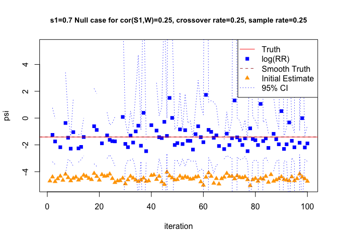

-   Null 

###### Cor(S1,W) = 0.5

Alternative 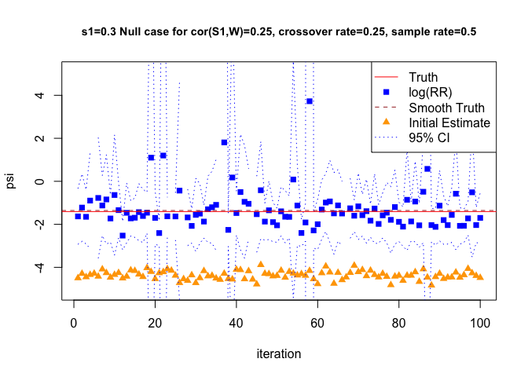

-   Null 

###### Cor(S1,W) = 0.75

Alternative 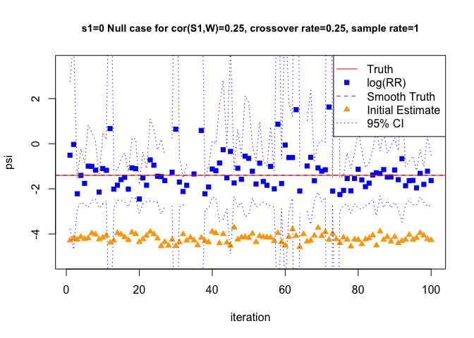

-   Null 

##### Crossover rate = 0.5

###### Cor(S1,W) = 0.25

Alternative 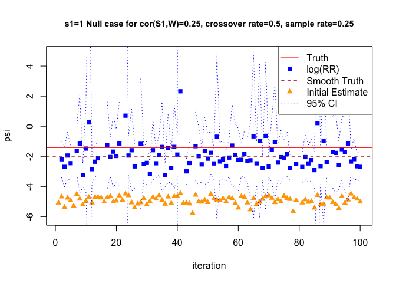

-   Null 

###### Cor(S1,W) = 0.5

Alternative 

-   Null 

###### Cor(S1,W) = 0.75

Alternative 

-   Null 

##### Crossover rate = 1

###### Cor(S1,W) = 0.25

Alternative 

-   Null 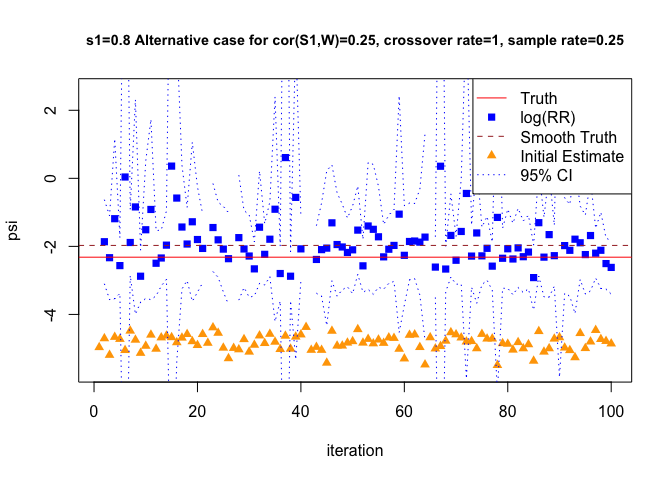

###### Cor(S1,W) = 0.5

Alternative 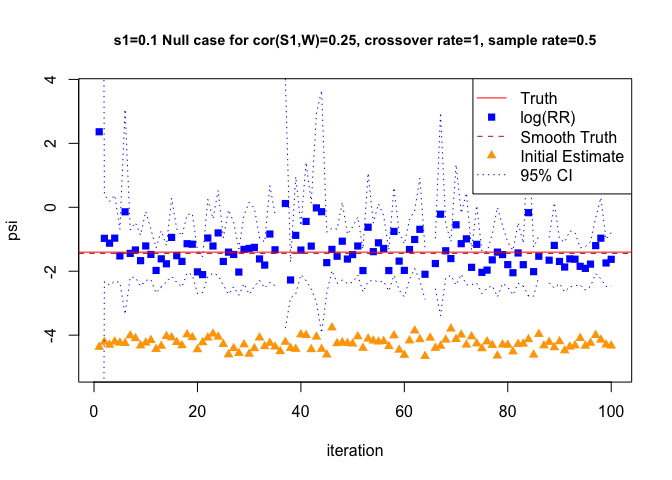

-   Null 

###### Cor(S1,W) = 0.75

Alternative 

-   Null 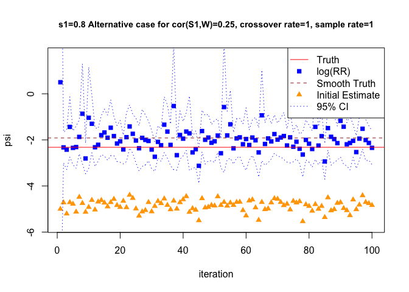

#### Vaccines cohort inclusion probability = 0.5

##### Crossover rate = 0.25

###### Cor(S1,W) = 0.25

Alternative 

-   Null 

###### Cor(S1,W) = 0.5

Alternative 

-   Null 

###### Cor(S1,W) = 0.75

Alternative 

-   Null 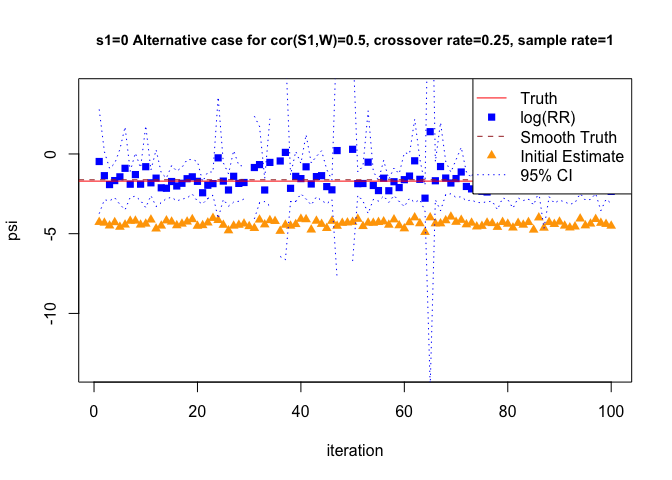

##### Crossover rate = 0.5

###### Cor(S1,W) = 0.25

Alternative 

-   Null 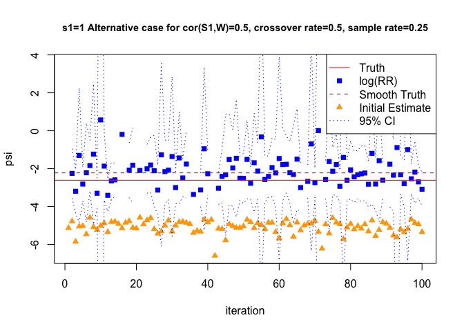

###### Cor(S1,W) = 0.5

Alternative 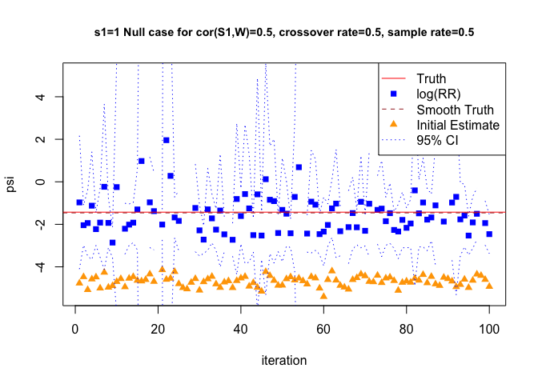

-   Null 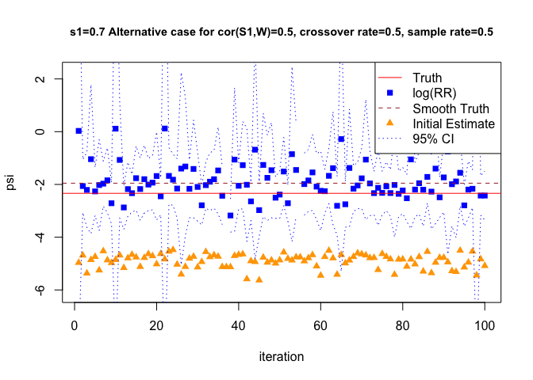

###### Cor(S1,W) = 0.75

Alternative 

-   Null 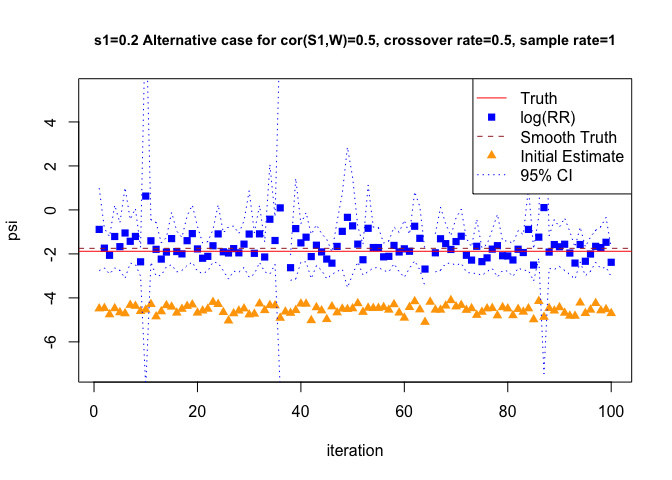

##### Crossover rate = 1

###### Cor(S1,W) = 0.25

Alternative 

-   Null 

###### Cor(S1,W) = 0.5

Alternative 

-   Null 

###### Cor(S1,W) = 0.75

Alternative 

-   Null 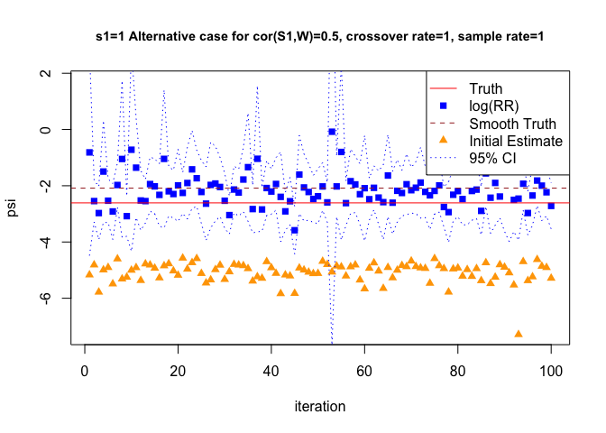

#### Vaccines cohort inclusion probability = 1

##### Crossover rate = 0.25

###### Cor(S1,W) = 0.25

Alternative 

-   Null 

###### Cor(S1,W) = 0.5

Alternative 

-   Null 

###### Cor(S1,W) = 0.75

Alternative 

-   Null 

##### Crossover rate = 0.5

###### Cor(S1,W) = 0.25

Alternative 

-   Null 

###### Cor(S1,W) = 0.5

Alternative 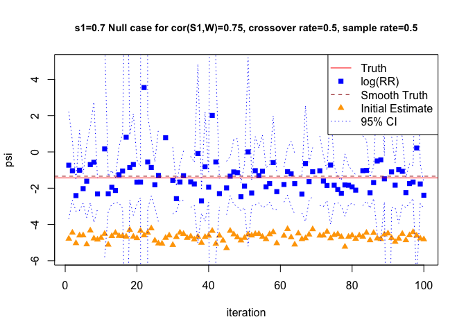

-   Null 

###### Cor(S1,W) = 0.75

Alternative 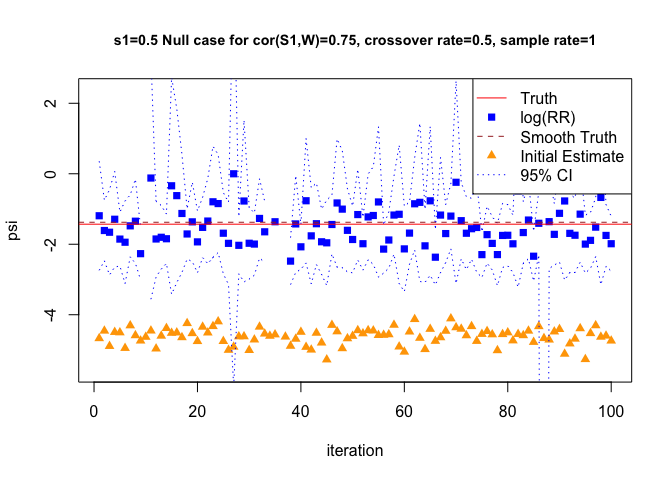

-   Null 

##### Crossover rate = 1

###### Cor(S1,W) = 0.25

Alternative 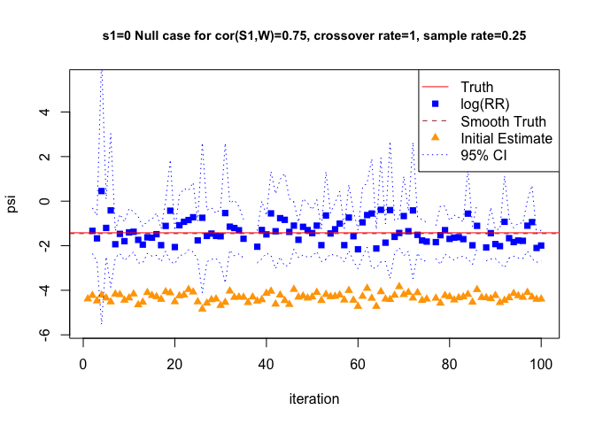

-   Null 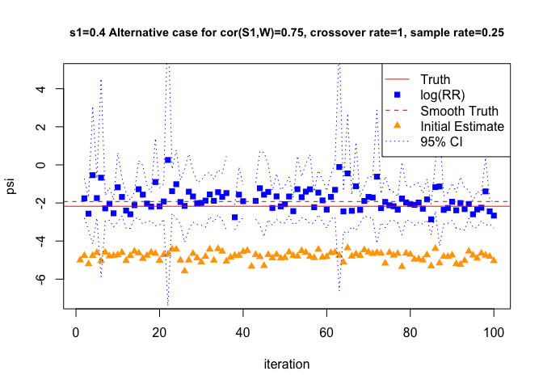

###### Cor(S1,W) = 0.5

Alternative 

-   Null 

###### Cor(S1,W) = 0.75

Alternative 

-   Null 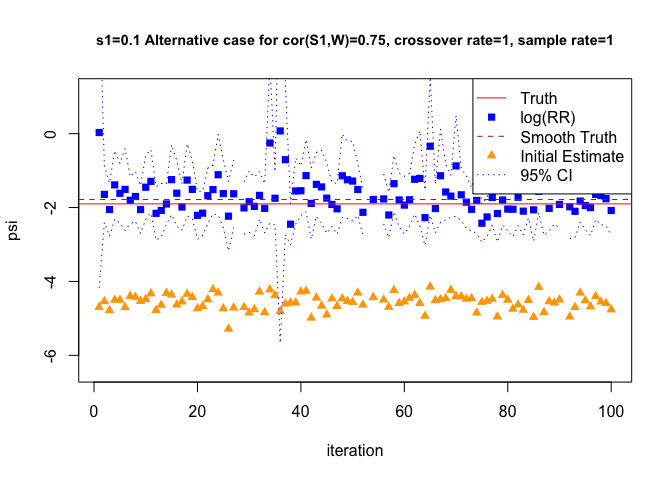
